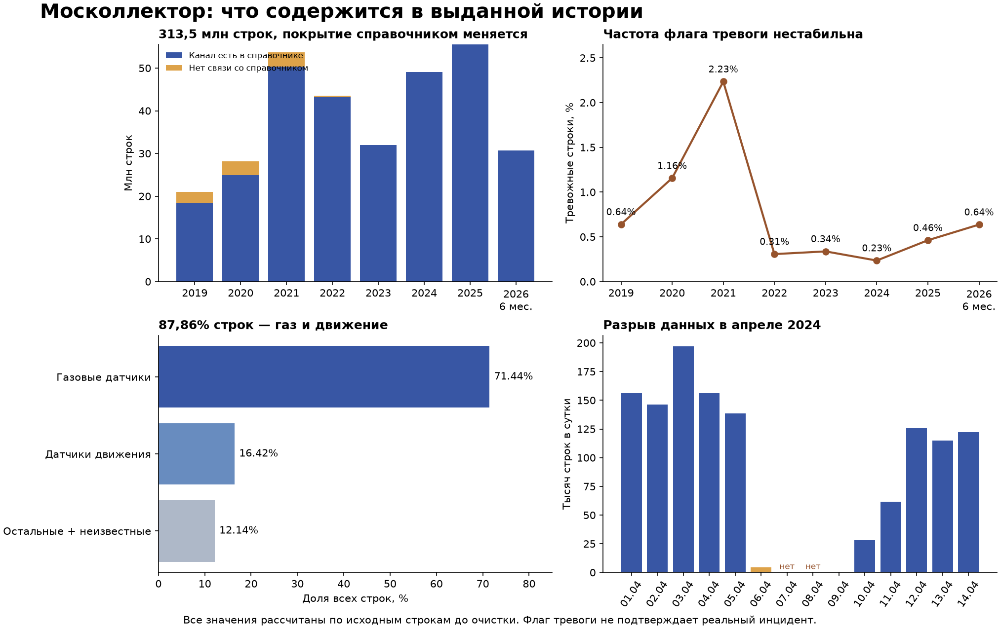

# Результаты аудита

Основной документ: [ANALYSIS_AND_PLAN.md](ANALYSIS_AND_PLAN.md). В нём требования ТЗ, полный профиль данных, обнаруженные проблемы, постановка ML-задачи, планы минимум/максимум, архитектура и вопросы организаторам.

Ревью реализации: [подтверждённые ошибки MVP и приоритеты исправлений](REVIEW_OTHER_IMPLEMENTATION.md).
Обзор относится к коммиту `550ed9e`; результаты исправлений описываются отдельно, чтобы сохранить исходные свидетельства.



## Как читать измерения

- `annual_profiles.json`: полный профиль по каждому году, даты, объёмы, каналы, значения, тревоги.
- `global_types.json`, `global_values.json`: распределения по типам и исходным значениям.
- `deep_audit.json`: дубли/конфликты ID, пропущенные даты, крайние значения, неизвестные каналы, пересечение с примером, неоднозначные состояния.
- `final_checks.json`: примеры одновременных состояний, концентрация тревог, глобальная проверка ID после запуска `check_global_ids.py`.
- `archive_manifest.json`, `zip_identity.json`: состав архивов и сравнение с содержимым ZIP по размерам и CRC32.
- `small_csv_profile.json`: полная проверка отдельно выданных CSV.
- `catalog_update_audit.json`: проверка справочников, опубликованных 16–23 сентября, и точных совпадений состояний с полной историей.
- `gas_threshold_2026_audit.json`: сопоставление порога метана 1% с текстом `Обнаружен газ` в журнале 2026 года.
- `experiments/availability-risk/`: исследование PR #9 — прогноз пропуска телеметрии на следующие сутки, две метки, три полугодовых теста и 20% каналов вне обучения. Отчёты скопированы без изменений; код остался на ветке PR и из main не воспроизводится.

Числа относятся к исходным строкам до дедупликации. Одна строка внутри годового CSV — повторный заголовок. Неизвестный канал — отсутствие связи с текущим каталогом, не доказательство неисправности. Подсчёты `state_onsets` в `deep_audit.json` исследовательские: технический порядок при одинаковом timestamp не отражает подтверждённую последовательность событий.

## Воспроизведение

Запускать из корня репозитория, последовательно, в отдельном окружении Python 3.11+.
Версии библиотек исходного аудита зафиксированы в `analysis/requirements.txt`:

```bash
python -m pip install -r analysis/requirements.txt
```

Положить восемь годовых `.7z` и три CSV в `data/raw/`, как для приложения.
Другой каталог можно задать переменной окружения `MOSCOLLECTOR_DATA_DIR`.
Исходные архивы, CSV, PDF ТЗ, извлечённые файлы, зависимости и аналитическая БД
не входят в коммит. В репозитории сохранены результаты, скрипты, извлечённый текст ТЗ
и обзор страниц. `analysis/deps` — необязательное локальное расположение библиотек.

1. `analysis/extract_archives.py` — распаковка восьми архивов в `analysis/extracted`.
2. `analysis/profile_data.py` — полный проход по CSV и создание аналитической копии DuckDB.
3. `analysis/deep_audit.py` — проверки ключей, семантики и покрытия.
4. `analysis/final_checks.py` — дополнительные проверки контекста.
5. `analysis/check_global_ids.py` — глобальная проверка ID по 16 непересекающимся остаткам от деления ID. Так ограничивается память.
6. `analysis/finish_report.py` — таблица по годам и статический график.

`profile_data.py` и следующие скрипты пересоздают результаты аудита. Не запускать одновременно процессы записи в `audit.duckdb`. Исходные архивы и CSV не изменяются. Аналитическая БД занимает около 4,7 GB, извлечённые CSV — 15,9 GB; дополнительно нужно место для временной обработки. Это исследовательские файлы, не готовый сервис и не очищенный тренировочный датасет.

Модель в рамках исходного аудита не обучалась. Обновление связей с объектами и ограничения нового справочника состояний описаны в [UPDATED_CATALOG_AUDIT_2026-09-24.md](UPDATED_CATALOG_AUDIT_2026-09-24.md). Для его воспроизведения нужны два новых справочника из папки организаторов; `audit_catalog_update.py` сравнивает их со старым каталогом и агрегатом `global_values.json`, а `audit_gas_threshold_2026.py` однократно читает годовой CSV 2026 года.

## Эксперименты веток до монорепозитория

В `experiments/` лежат отчёты из PR, которые в main не вливались (решение D8). Код этих веток не перенесён и числа в main не пересчитываются, если в строке отчёта не сказано иное; как повторить прогон на замороженном коммите ветки, написано в каждом отчёте.

- [experiments/pump-signal-v1](experiments/pump-signal-v1/README.md) — PR #3: запись «Неисправен» у насоса в следующие сутки. На 01–06.2026 Precision 0,368 при Recall 0,226, цель 0,7 / 0,5 не достигнута.
- [experiments/pump-validation-review](experiments/pump-validation-review/README.md) — PR #6: побайтное воспроизведение PR #3; сигнал через 24–48 ч без сигнала в первые сутки (Precision 0,103, Recall 0,147); аудит совместных состояний насосов: в 41 851 из 41 952 секунд с «Неисправен» у канала есть и другое значение.
- [experiments/annual-ingestion](experiments/annual-ingestion/README.md) — PR #4: импорт годовых CSV в DuckDB. Хранилище не перенесено; что в parquet приёма за каждый год столько же событий, проверяет `ml/scripts/verify_ingest.py`. В отчёте есть карта колонок хранилища для переноса PR #5–#9.
- [experiments/deep-data-audit](experiments/deep-data-audit/README.md) — PR #7: семантика датчиков, десять дневных целей, отрицательные бэктесты фаз, температуры, дыма и газа, ревью `feat/ml-pipeline`. Аудит датчиков и целей пересчитан на `main` (`ml/scripts/audit_sensor_semantics.py`), бэктесты — нет.
