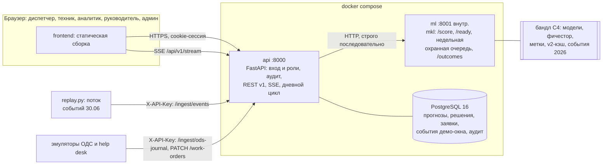

# Архитектура

Три сервиса в одном compose. Фронт ходит только в `api`, `api` — в `ml` (решение D3 плана
команды): расчёт дня в ML занимает 9,08 с по медиане и до 10,63 с (замер 29.09 по четырём головам,
`docs/submission/08-performance.md`), поэтому интерфейс читает прогнозы из PostgreSQL, а ML
вызывает только дневной цикл, строго последовательно.

| Сервис | Код | Контракт | Образ |
|---|---|---|---|
| `api` | `backend/app`, сборка `frontend/` в `backend/app/static` | C2 для фронта, клиент C1 | корневой `Dockerfile` |
| `ml` | `ml/src/mkl/product_api.py`: `ML_MODE=stub` — `product_stub.py`, `real` — `mkl.service` | C1 | `ml/Dockerfile` |
| `db` | схема BE-02, миграция `backend/app/migrations/versions/0001_initial.py` | — | `postgres:16-alpine` |

Старт `api` (`backend/entrypoint.sh`): `alembic upgrade head` → `python -m app.seed` →
uvicorn. Seed при каждом старте создаёт причины решений и настройки и сверяет справочник
объектов и каналов с CSV из `<бандл>/Materials`, если их монтирует `compose.real.yaml`. При
`SEED_DEMO=1` он создаёт демо-пользователей, а без настоящего справочника и при пустых
таблицах кладёт синтетический (`backend/app/seed.py`). Прогнозов seed не создаёт.

## Дневной цикл

`services/daily_run.run_daily(asof)`; точки входа — `POST /api/v1/admin/run-daily`,
`python -m app.services.daily_run --asof YYYY-MM-DD` и `scripts/preload_demo.py` по дням окна.

1. `api` собирает журнал выданного из `issued_log` за 7 дней до `asof` и вызывает
   `POST ml/api/v1/score` для голов A_link, D, B и E.
2. По понедельникам — `GET ml/api/v1/guard-weekly-inspections?asof=` и черновик заявки
   «Проверка охранной сигнализации объекта» на каждую рекомендацию со сроком `valid_to`.
   Тело `{"asof": …, "weekly_only": true}` считает только недельную очередь: так
   прелоад проходит понедельники января–мая.
3. Ответ сохраняется: строка `forecast_runs` со статусом каждой головы, upsert `forecasts`
   по `alert_id` или `recommendation_id`, строка `forecast_versions` на каждый прогон,
   записи `issued_log`, черновики `work_orders`.
4. После commit уведомления `alert.new` и `run.finished` сохраняются в БД и уходят в SSE.
5. ML недоступен или ответ нарушает C1 — прогон записывается с головами в статусе `error`,
   `api` отвечает 200, фронт показывает состояние через `StateView`.

Автоматический факт рассчитывается ML только после созревания окна прогноза; до этого
исход остаётся `unknown`. Ручной исход диспетчера хранится независимо и не стирает историю
решений. Журнала решений ОДС в данных нет, поэтому прелоад засевает решения и итоги проверки
по факту через `POST /api/v1/admin/emulate-decisions` (`services/emulation.py`) с
`source=emulated` и двигает заявки окна вслед за решениями (#36); прогнозы и заявки, где
действовал человек, эмуляция не трогает. Полное описание демо-режимов стенда — раздел 3
плана команды, устройство системы на `main` — `docs/submission/02-architecture.md`.

## Где подробности

- [Спецификация исходного каркаса](superpowers/specs/2026-09-25-skeleton-design.md):
  исторический дизайн, обработка ошибок, тесты и CI.
- [OpenAPI и ручная проверка](openapi.md): авторизация и сквозной сценарий через Swagger.
- [План команды](superpowers/plans/2026-09-25-team-plan-to-submission.md): решения D1–D13,
  контракты C1–C5, задачи по ролям.
- [Владельцы кода](OWNERSHIP.md).
- Сигнатуры сервисов backend: [`backend/app/services/signatures.md`](../backend/app/services/signatures.md).
