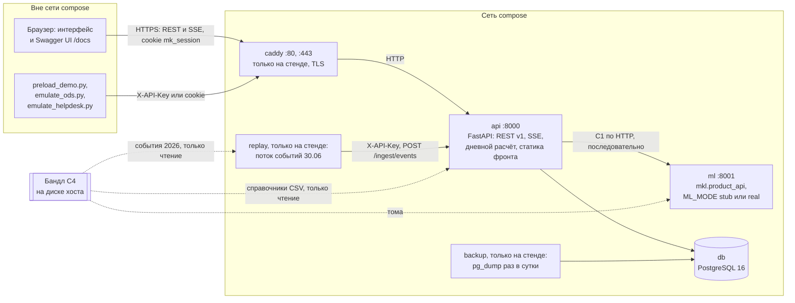
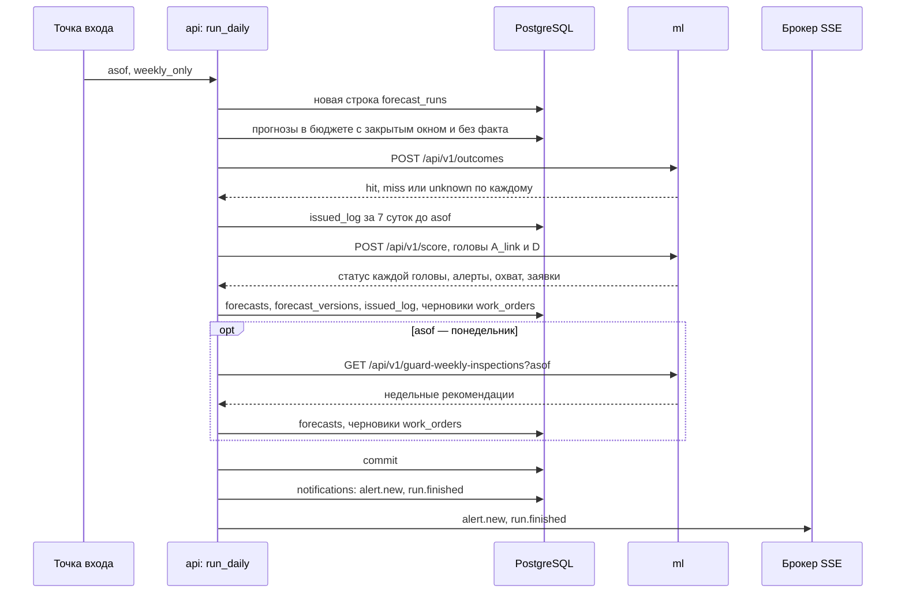
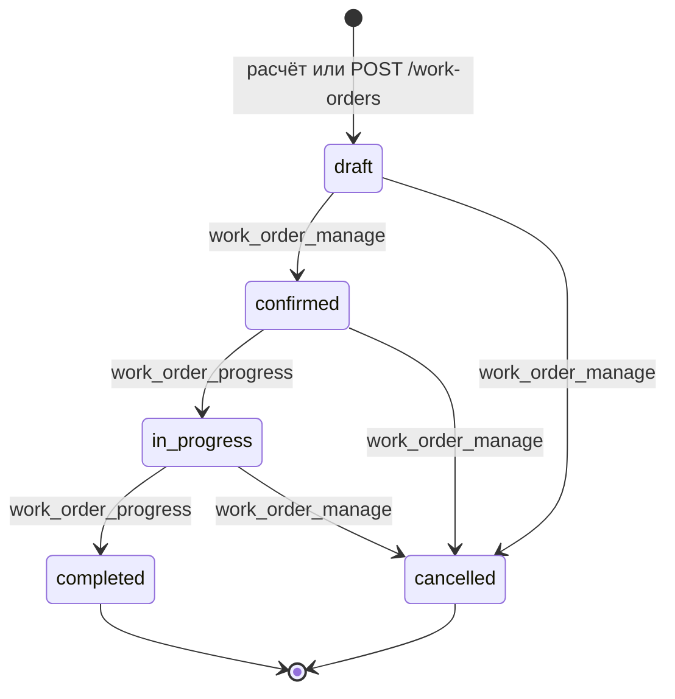
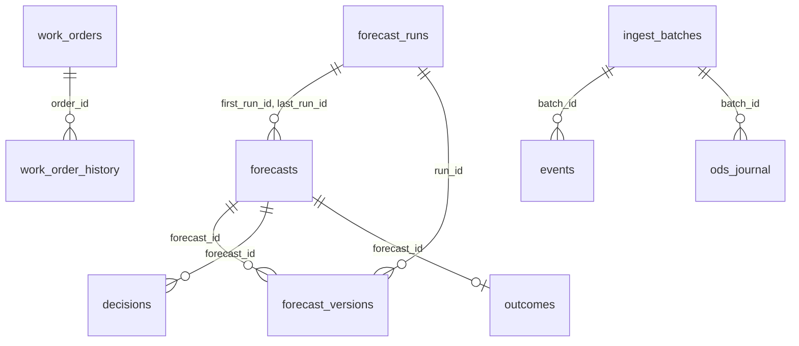

# Функциональная и компонентная архитектура

Описание сверено с кодом `main` на коммите `b4af088` (28.09.2026, после PR #44), раздел 8 «Форматы JSON и XML» — с #56; рядом с утверждениями указаны файлы, в которых их можно проверить. Номер вида #37 — pull request в репозитории `Bitmann0/moscollector-predict`. Пути даны от корня репозитория. Пометка «замер 28.09» относится к сборке на машине разработчика: Windows, Docker Desktop, стек `compose.yaml` + `compose.real.yaml` из `main`, ML-сервис в режиме `real` на бандле `bundle-20260928-3` с моделями A_link 0,70 (PR #30). Условия замеров — `docs/submission/08-performance.md`, сырые результаты — `docs/submission/perf/`. Число, снятое раньше, на моделях 0,50, помечено на месте.

## Главное

1. **Интерфейс не ждёт расчёта ML.** Экраны читают PostgreSQL. Расчёт в ML запускает только дневной прогон внутри `api` (решение D3 плана команды; `backend/app/services/ml_client.py`). Из запросов интерфейса в ML уходит один: `GET /api/v1/system/status` спрашивает `/ready` с таймаутом 5 с, а ML отвечает на `/ready`, не дожидаясь замка расчёта (`ml/src/mkl/product_api.py`). Порт `ml` наружу не опубликован: в `compose.yaml` у сервиса только `expose: 8001`.
2. **Прогноз — одна строка `forecasts` с идентификатором из ML.** `id` равен `alert_id` или `recommendation_id` из ответа ML, поэтому повторный расчёт того же дня обновляет строку и дописывает версию в `forecast_versions` (`backend/app/models.py`; `_Saver.upsert` в `backend/app/services/daily_run.py`).
3. **Права задаёт один файл** — матрица `permissions` в `contracts/vocabularies.json`. Backend загружает её при первом обращении (`backend/app/vocab.py`) и проверяет право на маршрутах (`require_perm` в `backend/app/security.py`); без права открыты только вход, выход, `/health` и `/me`, которому нужна лишь сессия или ключ. Фронт получает права пользователя в ответе `GET /api/v1/me` и по ним скрывает пункты меню и кнопки (`frontend/src/auth/AuthContext.tsx`); запрет ставит сервер.
4. **«Сегодня» продукта — 30.06.2026**, последний день телеметрии заказчика (решение D6). От этой даты считаются открытые прогнозы, показатели дашборда, недели экрана качества и граница приёма событий (раздел 3).
5. **Сбой ML виден, но не останавливает продукт.** Если ML не ответил или нарушил контракт C1, прогон записывается со статусом головы `error` и текстом ошибки, `api` отвечает 200, прежние прогнозы остаются в журнале (`_score` в `backend/app/services/daily_run.py`).
6. **Автоматически создаётся только черновик заявки.** Подтверждает его человек; на стенде заявки окна прелоада подтвердила или отменила эмуляция решений (п. 4.5). Дальше статус меняется по закрытому графу, и каждый переход сверяет статус, который видел пользователь. Сверка и запись — один `UPDATE … WHERE status = expected_status`: из двух одновременных переходов проходит один, второй получает 409 (`transition` в `backend/app/services/work_orders.py`, #37).
7. **Факт и итог проверки хранятся раздельно.** `outcome_auto` рассчитывает ML по данным СМВУ, `outcome_manual` вводит человек. `unknown` означает «наблюдений не хватило», а не «событие не наступило» (класс `Outcome` в `backend/app/models.py`; описание API в `backend/app/main.py`).

## Термины

| Термин | Значение |
|---|---|
| СМВУ | система мониторинга и высокоуровневого управления, источник событий датчиков (ТЗ, раздел 1) |
| ОДС | объединённая диспетчерская служба (ТЗ, раздел 1) |
| Сценарий | направление прогноза в интерфейсе; коды `sensor_link`, `equipment_diag`, `guard_weekly` (`contracts/vocabularies.json`) |
| Голова | расчётный модуль ML за сценарием: `A_link`, `D`, `guard_weekly` |
| Бюджет | предел выдачи головы: `A_link` — 20 каналов в сутки, `D` — 3 в сутки, недельная очередь — 4 объекта в неделю (`ml/configs/heads.yaml`, `ml/src/mkl/guard_weekly.py`). Строка в пределах бюджета несёт `in_budget=true` |
| Прогон | один вызов дневного расчёта за дату `asof`; строка таблицы `forecast_runs` |
| Журнал выданного | таблица `issued_log`: что дневные головы `A_link` и `D` выдали в бюджете, по дням. Выдача за 7 суток до `asof` уходит в ML, и ML не выдаёт тот же канал повторно раньше паузы |
| Демо-дата | `demo_today`, «сегодня» стенда |
| Бандл | архив данных и моделей для ML в режиме `real` (контракт C4) |
| `stub`, `real` | режимы ML-сервиса: детерминированные ответы по синтетическому справочнику без данных заказчика; модели и признаки из бандла |

## 1. Компоненты



*Рисунок 1. Браузер и внешние системы обращаются только к `api`; `ml` и `db` из-за пределов сети compose недоступны.* Без стенда (`compose.yaml` или `compose.yaml` + `compose.real.yaml`) сервисов `caddy`, `replay` и `backup` нет, и клиенты обращаются к `api` напрямую на порт 8000.

| Компонент | Код и образ | Что делает | Порт |
|---|---|---|---|
| `frontend` | `frontend/src`; React 18.3.1, React Router 6.30.6, TypeScript 5.9.3, Vite 6.4.3 (`frontend/package.json`). Собирается стадией `node:22-slim` корневого `Dockerfile` и копируется в `backend/app/static` | 10 экранов в `frontend/src/pages` (раздел 2). REST-клиент — `openapi-fetch` с типами, сгенерированными из `contracts/api_v1.openapi.json` (`frontend/src/api/client.ts`); одно SSE-соединение на вкладку (`frontend/src/stream/useStream.ts`). Схема сети рисуется в SVG по `GET /api/v1/schema.geojson` (`frontend/src/pages/Schema.tsx`) | раздаёт `api` |
| `api` | `backend/app`; FastAPI, SQLAlchemy 2, Alembic, psycopg 3, itsdangerous, openpyxl, fpdf2, httpx (`pyproject.toml`). Образ — корневой `Dockerfile` на `python:3.12-slim`, процесс под непривилегированным пользователем `app` | вход и роли, аудит, REST v1, SSE, приём событий, дневной расчёт. Путь вне `/api`, которому не соответствует файл сборки фронта, получает `index.html`, маршруты экранов ведёт React Router (`backend/app/main.py`). Старт контейнера: `alembic upgrade head` → `python -m app.seed` → uvicorn (`backend/entrypoint.sh`) | 8000; на стенде закрыт (`ports: !reset []` в `compose.stand.yaml`) |
| `ml` | `ml/src/mkl/product_api.py`; образ `ml/Dockerfile` на `python:3.12-slim` с `libgomp1` | контракт C1. `ML_MODE=stub` (по умолчанию в `compose.yaml`) отдаёт детерминированные ответы по синтетическому справочнику `contracts/synthetic_reference.json` (`ml/src/mkl/product_stub.py`). `ML_MODE=real` (`compose.real.yaml`) читает модели и признаки из бандла, смонтированного томами в `/srv/ml/data`, `/srv/ml/models` и поштучно в `configs/features.yaml`, `reports/intrusion_eventtime_v2_build.json`. Расчёты идут под одним `threading.Lock`; `/ready` замок не ждёт | 8001, только внутри сети |
| `db` | `postgres:16-alpine`, том `pgdata` | 18 таблиц: схему создаёт миграция `backend/app/migrations/versions/0001_initial.py`, колонку `events.incident_group` добавляет `0002_event_incident_group.py` (раздел 7) | наружу не открыт |
| `caddy` | `caddy:2-alpine`, `deploy/Caddyfile`; только в `compose.stand.yaml` | TLS с сертификатом ACME для домена `STAND_DOMAIN`. Директивы `tls` в `deploy/Caddyfile` нет, поэтому действуют версии Caddy по умолчанию — TLS 1.2 и 1.3 (документация директивы `tls`, <https://caddyserver.com/docs/caddyfile/directives/tls>); ТЗ §11 требует TLS 1.2 и выше. Заголовки `Strict-Transport-Security`, `X-Content-Type-Options`, `X-Frame-Options: DENY`, `Referrer-Policy`, `Permissions-Policy`; журнал доступа в JSON; предел тела запроса 200 МБ; проксирование на `api:8000` без буферизации (`flush_interval -1`), чтобы события SSE уходили сразу | 80, 443 |
| `replay` | образ `ml/Dockerfile` (в нём есть duckdb для чтения parquet), `scripts/replay.py`; только в `compose.stand.yaml` | поток событий 30.06 из `events_year=2026.parquet` бандла: на старте догружает события с 00:00 до текущего времени МСК без уведомлений, дальше шлёт их в темпе часов, в полночь удаляет день через `DELETE /api/v1/ingest/day/{day}` и начинает заново. Задержку «событие → БД» пишет в `./state/replay/latency.csv` | — |
| `backup` | `postgres:16-alpine`; только в `compose.stand.yaml` | раз в сутки `pg_dump -Fc` в `./state/backups/`, хранит 7 последних файлов; восстановление через `pg_restore` описано в `README.md`, раздел «Стенд» | — |

На стенде `compose.stand.yaml` ограничивает память контейнеров: `ml` 6 ГБ, `db` 3 ГБ, `api` 2 ГБ, `replay` 1 ГБ, `backup` 512 МБ, `caddy` 256 МБ. Там же `api` получает `DEMO_SETTINGS_LOCKED=1`, `COOKIE_SECURE=1` и `FORWARDED_ALLOW_IPS="*"`: последнее нужно, чтобы `api` брал адрес клиента из `X-Forwarded-For` от Caddy. Файл рассчитан на ВМ 4 vCPU / 16 ГБ без GPU (решение D9).

`ml/src/mkl/api.py` — прежний REST-интерфейс ML-проекта; продукт его не запускает: `CMD` в `ml/Dockerfile` поднимает `mkl.product_api:app`.

### Головы ML за сценариями

| Сценарий | Голова и метод | Что выдаёт | Горизонт | Бюджет и пауза | Оценка |
|---|---|---|---|---|---|
| Отказ датчика: риск потери связи (`sensor_link`) | `A_link`, модель градиентного бустинга; порог выбран при минимуме точности 0,70 (`operating_min_precision` в `ml/configs/heads.yaml`, #30). Для даты расчёта берётся артефакт `models/A_link@{конец окна порога}.pkl`, у которого окно порога кончилось за 1…8 суток до неё (`serve.artifact_path` в `ml/src/mkl/serve.py`) | канал, который в следующие сутки, вероятно, пропустит отчёт | 24 ч | до 20 в сутки, пауза 7 суток (`ml/configs/heads.yaml`) | вероятность |
| Износ: плановая диагностика оборудования (`equipment_diag`) | `D`, правило `n_bad_w7`; порог пересчитывается по понедельникам (`ml/src/mkl/rule_head.py`) | канал оборудования: насос, вентилятор, ИБП, датчик затопления, люк (`EQUIPMENT_STYPES` в `ml/src/mkl/config.py`) | 168 ч | до 3 в сутки с отсечкой внутри объекта, пауза 7 суток | относительный приоритет |
| НСД: проверка объектов с хроническими охранными тревогами (`guard_weekly`) | правило `weekly_recurrence_rule_v1` (`ml/src/mkl/guard_weekly.py`) | объект с охранной тревогой не меньше чем в 4 из 7 последних суток. Это продолжение записанной тревожной активности, а не прогноз проникновения | окно D+2…D+8, расчёт по понедельникам | до 4 объектов, пауза 14 суток | относительный приоритет |

Модели `A_link` обучает `ml/scripts/train_latest.py`, по умолчанию на LightGBM (`--backend lgbm`); замер 28.09: 185–193 с на одну датированную модель. Точность голов и способ её оценки описаны в `docs/submission/04-ml.md`.

### Ограничение: `api` работает одним процессом

`backend/entrypoint.sh` запускает uvicorn без `--workers`. На одном процессе держатся три механизма: замок дневного расчёта `_RUN_LOCK` (`backend/app/services/daily_run.py`), брокер SSE в памяти (`Broker` в `backend/app/services/notifications.py`) и счётчик неудачных входов (`LoginThrottle` в `backend/app/routers/auth.py`). При нескольких процессах каждый получит свою копию всех трёх. Для горизонтального масштабирования `api` их нужно перенести в PostgreSQL или во внешний брокер. Это вывод из кода; запуск в несколько процессов не проверялся.

## 2. Роли и функции

Роли диспетчера (`dispatcher`), технического персонала (`technician`) и руководителя (`manager`) взяты из ТЗ §3, аналитика (`analyst`) — из сценариев ТЗ §12; организаторы ответили, что следует руководствоваться ролями из ТЗ (чат задачи, сообщение [421]). Роль `admin` команда добавила для демо-настроек, аудита и запуска расчёта, `integration` — служебная роль машинных клиентов (`contracts/vocabularies.json`, словарь `roles`). По демо-пользователю на каждую роль людей создаёт `backend/app/seed.py` при старте `api` с `SEED_DEMO=1`. Учётные данные в этом разделе не приводятся (решение D13): они выдаются отдельно.

| Право | Что разрешает | dispatcher | technician | analyst | manager | admin | integration |
|---|---|:-:|:-:|:-:|:-:|:-:|:-:|
| `view` | экраны, журналы, карточки, схема, уведомления, поток SSE | ✓ | ✓ | ✓ | ✓ | ✓ | |
| `decide` | решение по прогнозу | ✓ | | | | ✓ | |
| `outcome` | итог проверки | ✓ | ✓ | ✓ | | ✓ | |
| `work_order_manage` | создать, подтвердить или отменить заявку | ✓ | | | ✓ | ✓ | |
| `work_order_progress` | перевести заявку в работу или в выполненные | | ✓ | | | ✓ | ✓ |
| `ingest` | загрузить журнал СМВУ или ОДС, история загрузок | | | ✓ | | ✓ | ✓ |
| `export` | выгрузка журнала прогнозов в XLSX | ✓ | | ✓ | ✓ | ✓ | |
| `admin` | аудит, демо-настройки, дневной расчёт, эмуляция решений, синхронизация справочника | | | | | ✓ | |
| `integration` | сброс дня событий для проигрывателя | | | | | | ✓ |

Маршрут пропускает запрос, если у роли есть хотя бы одно из перечисленных для него прав (`require_perm` в `backend/app/security.py`). Право на конкретный переход заявки зависит от целевого статуса, поэтому его проверяет сервис по словарю `work_order_transition_perm` (раздел 4.4).

### Экраны

Все экраны, кроме входа, открываются только вошедшему пользователю с правом `view` (`frontend/src/App.tsx`). Кнопки действий фронт показывает по правам из `GET /api/v1/me`.

| Экран и адрес | Что показывает | Действия и право |
|---|---|---|
| Вход, `/login` | форма входа | — |
| Центр управления, `/` | открытые прогнозы и охват по сценариям; заявки по статусам; тревожные сообщения за сутки демо-даты и сколько из них похожи на ППР или ТО; статус голов; ряды за 14 суток — прогнозов в бюджете по дням и охват (`backend/app/services/dashboard.py`) | — |
| Журнал прогнозов, `/forecasts` | прогнозы в бюджете с фильтрами по сценарию, датам, решению, факту, объекту и группировкой по объекту или `case_key` | выгрузка XLSX (`export`); общая заявка на несколько прогнозов одного сценария и объекта (`work_order_manage`) |
| Карточка прогноза, `/forecasts/:id` | адрес, окно, оценка, факторы модели, у недельной очереди — счётчики тревог за 7 и 30 суток; тревоги и неисправности канала по дням за 30 суток; день недели и праздник; охват расчёта; версии; история решений | решение «действие + причина из справочника + комментарий» (`decide`); итог проверки (`outcome`); черновик заявки (`work_order_manage`) |
| Заявки, `/work-orders` | список с фильтрами по статусу, приоритету, сценарию; карточка с основаниями и историей переходов | переходы, разрешённые графом и правом роли на целевой статус (раздел 4.4) |
| Журнал событий, `/events` | события СМВУ с фильтрами по датам, объекту, типу датчика, классу, группе аварии, тексту; штатные показания газовых датчиков по умолчанию скрыты, фильтр считает сервер (`hide_normal_gas`, #31); автообновление по событиям потока | — |
| Схема сети, `/schema` | условная схема комплексов и объектов с числом открытых прогнозов; масштаб по пикетам 100–800 %, поиск по названию, паспорт объекта или комплекса (#41) | — |
| Состояние сценария, `/scenarios/:scenario` | статус головы по последнему прогону, в котором она считалась; задержка модели, осуществимость порога, текст ошибки | — |
| Уведомления, `/notifications` | лента уведомлений и состояние потока SSE | отметка прочтения (`view`) |
| Качество прогноза, `/quality` | по 4 неделям до понедельника демо-недели: выдано, попало, мимо, неизвестно, точность; рядом — базовая частота и точность простого правила из `contracts/quality_reference.json`, копии блока реестра метрик (`backend/app/services/quality.py`, #35) | — |

### Что роль делает сверх чтения

| Роль | В интерфейсе | Только через API (Swagger UI) |
|---|---|---|
| Диспетчер ОДС (`dispatcher`) | решение по прогнозу, итог проверки, черновик заявки из карточки или общая заявка из журнала, подтверждение и отмена заявок, выгрузка XLSX | — |
| Технический персонал (`technician`) | итог проверки; перевод подтверждённой заявки в работу и в выполненные | — |
| Аналитик (`analyst`) | итог проверки; выгрузка XLSX | загрузка журнала СМВУ (JSON, CSV, XLSX) и журнала ОДС, история загрузок: экрана загрузки в интерфейсе нет |
| Руководитель подразделения (`manager`) | создание, подтверждение и отмена заявок; выгрузка XLSX. Права `decide` у роли нет | — |
| Администратор (`admin`) | всё, что доступно ролям выше | дневной расчёт за дату, очистка журнала выданного, эмуляция решений, синхронизация справочника из CSV, журнал аудита, демо-настройки, сброс дня событий |
| Внешняя система (`integration`) | интерфейса нет | приём событий СМВУ и записей ОДС, сброс дня, переходы заявок в `in_progress` и `completed`. Права `view` нет: журналы роль не читает, поток SSE отвечает ей 403 (`backend/app/routers/stream.py`), поэтому эмуляторы читают данные под демо-пользователем (`scripts/_emulation.py`) |

**Журнал действий.** `AuditMiddleware` (`backend/app/audit.py`) пишет в `audit_log` каждый изменяющий запрос (POST, PUT, PATCH, DELETE) и выгрузки `GET /api/v1/export/…` и `GET /api/v1/audit`: время, логин, роль, метод, путь, код ответа, первый параметр пути. Запись идёт в отдельной сессии БД, поэтому откат транзакции запроса не стирает след попытки. Необработанное исключение записывается с кодом 500. Анонимные ответы 404 и 405 не пишутся, чтобы перебор несуществующих путей не забивал журнал. Вход и выход попадают в журнал как POST-запросы.

## 3. Демо-время

«Сегодня» на стенде — 30.06.2026. Значение по умолчанию задаёт `DEMO_TODAY` (`backend/app/config.py`), текущее хранится в таблице `settings`. Администратор меняет его через `PUT /api/v1/settings` только в пределах 01.06–30.06.2026 (`DEMO_START`, `DEMO_END` в `backend/app/services/settings_store.py`); на стенде `DEMO_SETTINGS_LOCKED=1`, и изменение получает 403 `settings_locked`.

**Почему не настоящая дата (решение D6).** Последний день телеметрии заказчика — 30.06.2026 (`ml/reports/ML_PRODUCTION_STATUS.md`). При «сегодня» = 25.09 выдача была бы пустой; этот вариант план команды отверг в D6. ML сам проверяет свежесть данных: `/ready` без даты отвечает `stale_source`, если последние данные старше двух суток (`_real_ready` в `ml/src/mkl/product_api.py`), а пилотная модель принимается для даты расчёта, только если её окно порога кончилось за 1…8 суток (`A_link`) или 1…14 суток (`D`) до этой даты (`ml/README.md`, раздел «Модели для исторических дней: окно демо»). Поэтому `/system/status` спрашивает готовность ML на демо-дату (`ml_ready` в `backend/app/services/system.py`), а для июня обучены четыре датированные модели `A_link` с отсечками данных 31.05, 08.06, 16.06 и 24.06 и концами окна порога 30.05, 07.06, 15.06 и 23.06; вместе они покрывают даты расчёта 31.05–01.07 (`docs/submission/06-build-install.md`, раздел «Обучение датированных моделей»; имена файлов `models/A_link@*.pkl` в бандле `bundle-20260928-3`). Таблица отсечек в `ml/README.md` (01.06, 09.06, 17.06, 25.06) посчитана без учёта того, что 01.06 в журнале пуст.

**Что считается от демо-даты:**

- открытый прогноз — в бюджете, без решения, окно не кончилось к полуночи демо-даты; одно правило для дашборда и схемы сети (`open_forecast_clauses` в `backend/app/services/helpers.py`);
- тревоги за сутки и ряды за 14 суток на дашборде, 4 недели экрана качества;
- граница приёма: событие с датой позже демо-даты не сохраняется и учитывается в партии как `outside_demo_window` (`backend/app/services/ingest.py`);
- день, за который `scripts/emulate_ods.py` переносит в журнал ОДС переходы заявок.

Метки времени действий людей — решений, итогов проверки, переходов заявок, записей аудита — пишутся по настоящим часам (`now_utc()` в сервисах). В БД время хранится в UTC, наружу отдаётся со смещением +03:00; дата без часового пояса во входных данных означает Москву (`backend/app/services/helpers.py`).

**Как журнал наполняется к показу.** `scripts/preload_demo.py` под администратором:

1. очищает журнал выданного за окно и неделю до него (`DELETE /api/v1/admin/issued-log`);
2. проходит недельную очередь за понедельники с 05.01.2026 до начала окна (`POST /api/v1/admin/run-daily` с `weekly_only=true`);
3. запускает дневной расчёт за 01.06…29.06 строго по возрастанию дат; понедельники окна дают и недельную очередь, факт по закрытым окнам расчёт запрашивает сам;
4. засевает решения и итоги проверки по факту с пометкой `source=emulated` (`POST /api/v1/admin/emulate-decisions`), потому что журнала решений ОДС в данных заказчика нет; тот же вызов двигает заявки окна вслед за решениями (п. 4.5, #36).

Повторный запуск приводит журнал к тому же состоянию. Замер 28.09: прелоад занял 417 с без ошибок. В журнале 154 прогноза в бюджете: `sensor_link` — 137, `equipment_diag` — 3, `guard_weekly` — 14; у 149 есть факт, 109 эмулированных решений и 87 итогов проверки. Заявок 65: выполнено 36, отменено 8, черновиков 21; из черновика эмуляция сдвинула 44 (`docs/submission/perf/preload_demo_0928.txt`, `journal_counts_0928.txt`).

**30.06 на стенде.** Расчёт за 30.06 не запускается. Прогнозы «на сегодня» — это расчёт за 29.06: у `A_link` окно 30.06 00:00 — 01.07 00:00 МСК. События 30.06 подаёт сервис `replay` в темпе часов МСК (раздел 1). События мая и июня для журнала событий и для динамики в карточке прогноза загружаются один раз командой `scripts/replay.py --bulk` за 02.05–29.06 без уведомлений; замер 28.09: 10 277 666 строк в PostgreSQL за 2 684 с, 3 829 строк/с, ошибок 0.

## 4. Потоки данных

### 4.1. Дневной расчёт

Точки входа — `POST /api/v1/admin/run-daily` с телом `{asof, weekly_only}`, команда `python -m app.services.daily_run --asof YYYY-MM-DD` и `scripts/preload_demo.py`. Все три вызывают `run_daily` из `backend/app/services/daily_run.py`.



*Рисунок 2. Уведомления уходят только после commit: клиент не получит `alert.new` о прогнозе, которого ещё нет в БД.*

1. **Сериализация.** Два расчёта одновременно не идут: `run_daily` держит замок процесса `_RUN_LOCK`, иначе два параллельных расчёта одной даты вставили бы одинаковые прогнозы и второй упал бы на уникальном ключе. Вызовы ML последовательные, таймаут — 120 с (`ml_timeout_s` в `backend/app/config.py`).
2. **Факт.** Сначала `api` запрашивает факт по созревшим прогнозам (раздел 4.5).
3. **Запрос к ML.** Журнал выданного берётся за `[asof − 7, asof)`, `history_complete_from = asof − 7`. Порог и лимит ML backend не переопределяет.
4. **Сохранение.** Каждый алерт — upsert строки `forecasts` по `alert_id` и новая строка `forecast_versions`. Тип оценки берётся из словаря сценариев: у `A_link` значение пишется в `risk`, у `D` и недельной очереди — в `priority_score`, потому что это не вероятность. В `forecasts` сохраняются все алерты ответа, в том числе вне бюджета; журнал, дашборд и выгрузка показывают только строки с `in_budget=true` (`backend/app/services/forecasts.py`, `backend/app/services/export.py`). После прелоада таблица `forecasts` содержала 55 942 строки, из них в бюджете 154 (замер 28.09, `docs/submission/perf/journal_counts_0928.txt`). Журнал выданного за пару «голова, `asof`» заменяется только у голов, которые посчитались: голова со статусом `error` алертов не вернула, и если стереть её прежнюю выдачу, пропадёт 7-дневная пауза. Заявки из ответа ML сохраняются черновиками; заявку, которая уже вышла из статуса `draft`, расчёт не меняет.
5. **Недельная очередь.** По понедельникам тот же прогон вызывает недельную очередь. Её ответ заявок не несёт, поэтому черновик «Проверка охранной сигнализации объекта» с приоритетом `planned` и сроком `valid_to` рекомендации собирает backend. С `weekly_only=true` вызов `/score` пропускается и журнал выданного не меняется: так прелоад проходит понедельники января–мая.
6. **Ответ.** `RunDailyOut`: номер прогона, статус и число выдач в бюджете по каждой голове, число обновлённых прогнозов и заявок. Статус головы — `ok`, `empty_valid` (расчёт выполнен, кандидатов нет), `no_data`, `stale` или `error`. Шапка интерфейса показывает его по последнему прогону, в котором голова считалась, иначе статус недельной очереди пропадал бы со вторника по воскресенье (`head_states` в `backend/app/services/system.py`).

Замер 28.09, `/score` за каждый день 01–30.06: 7,61 с по медиане, не больше 10,57 с; недельная очередь — до 0,23 с (`docs/submission/08-performance.md`). В прелоаде за 01.06–29.06 `A_link` ответила `ok` на 13 днях, `empty_valid` — на 15, `no_data` — на 01.06: за этот день в журнале нет событий. `D` — `ok` на 29.06, `empty_valid` на остальных днях с данными; недельная очередь — `ok` на 13 понедельниках из 26 (`docs/submission/perf/preload_demo_0928.txt`).

### 4.2. Приём событий СМВУ и журнала ОДС

Признаки для ML берутся из предрасчитанного фичестора бандла, а не из пришедших событий: инкрементального расчёта признаков нет (план команды, раздел 3, «Ограничение»). Поток событий наполняет журнал событий, уведомления о тревогах и динамику в карточке прогноза; прогнозы от него не меняются.

1. **Вход.** `POST /api/v1/ingest/events` принимает JSON-пачку до 5 000 строк — так шлёт `scripts/replay.py`. `POST /api/v1/ingest/events/upload` принимает файл: CSV в формате `журнал_событий_пример.csv` или XLSX (первый лист), до 200 МБ. Поля строки: `ид_события`, `ид_канала_данных`, `дата`, `время`, `тревожное`, `значение_датчика` (`EventRowIn` в `backend/app/schemas/events.py`). Нужно право `ingest`. Та же пачка принимается в XML: `Content-Type: application/xml`, корень `EventRowInList`, строки `EventRowIn` с теми же именами полей (раздел 8, «Форматы JSON и XML»). Файл — только CSV или XLSX.
2. **Отсев до разбора.** `BodyLimitMiddleware` (`backend/app/limits.py`) стоит самым внешним слоем: запрос к `/api/v1/ingest/` без cookie сессии и без `X-API-Key` получает 401 до чтения тела, тело больше предела — 413.
3. **Разбор строки.** Время без пояса — МСК. `тревожное` принимает `t`, `f`, `true`, `false`, `1`, `0`, `да`, `нет` без учёта регистра. Значение сохраняется строкой и числом, запятая читается как десятичный разделитель. Строка, которую не удалось разобрать, считается отклонённой; строка с датой позже демо-даты — `outside_demo_window`.
4. **Дедупликация** — по SHA-256 кортежа «ид события | канал | время | флаг | значение» после нормализации, уникальный столбец `events.row_hash`. По одному `ид_события` дубли не ищутся: в 2021–2023 годах идентификатор переиспользуется, и такая дедупликация удаляла 1 669 268 настоящих событий (план команды, контракт C5). Повторная загрузка того же файла безопасна: все строки уйдут в `duplicates`.
5. **Классификация** — `classify` в `backend/app/services/semantics.py` по типу датчика канала из справочника, значению и флагу; термины и группы — из ответов заказчика 28.09 (`analysis/qa_customer_2026-09-28.md`). Правила по порядку: значение-дата `01.01.1970 03:00:0x` → `fault`; у газового датчика метан вне 0…327,67 → `fault`, от 5 % → `critical`, от 1 % → `alarm` (проверенные пороги; меняет администратор, `docs/submission/05-user-guide.md`, раздел 8.1); температура вне −60…150 → `fault`; текст с «неисправ», «ошиб» → `fault`; тревожное сообщение (флаг `тревожное`) из группы аварий → `critical` и `incident_group`; «пожар», «затоп» без флага → `critical` без группы; остальные тревожные сообщения → `alarm`; «Обнаружен дым», «Обнаружен газ» или «Температура выше 40ºC» без флага → `warning` с подсказкой «в СМВУ без признака тревоги» (#42). Остальное — `normal`. Группы аварий — угроза жизни по ответу 2: пожар (`fire`: «Обнаружен дым», «Рычаг сдернут», «Не замкнут» у теплового датчика и ручного извещателя), наводнение (`flood`: «Затоплен», «Не замкнут» у датчика затопления), газ (`gas`: «Обнаружен газ»), проникновение (`intrusion`: «Не замкнут» у КД Дверь, КД Люк, КД АВ, Стекло, «Обнаружено движение»), аномальная температура (`temperature`: «Температура выше 40ºC», «Температура ниже 3ºC»). «Обесточен», «Отключено устройство», «Питание от батарей» заказчик отнёс к инцидентам, а не авариям: они остаются `alarm`. «Обнаружен газ» в будни с 9:00 до 14:59 МСК получает подсказку «вероятно, ППР или ТО: газ в будни с 9:00 до 14:59».
6. **Серии ППР и ТО.** Серии срабатываний заказчик назвал планово-предупредительными работами или техническим обслуживанием (ответ 5). Сервис считает серией 5 и более пожарных извещателей одного объекта или 4 и более газоанализатора одного комплекса за 10 минут, если окно началось в будни с 8:00 до 17:59; порог газа и часы — замер. Серию видно, только когда пришло N-е событие, поэтому `mark_series` в `backend/app/services/ingest.py` одним запросом на пачку читает события тех же групп и объектов за ±20 минут и в той же транзакции ставит подсказку «вероятно, ППР или ТО: серия из N извещателей за 10 минут» всем событиям серии, в том числе принятым раньше. Пороги и часы выбраны замером `analysis/incident_series_audit.py` (обоснование — в комментариях `semantics.py`). Подсказка класс не меняет: диспетчер проверяет событие сам (ответ 1). Её видно в журнале событий, а показатель дашборда «похожи на ППР или ТО» считает тревожные сообщения, чья подсказка начинается с «вероятно, ППР или ТО» (`backend/app/services/dashboard.py`).
7. **Сохранение и уведомление.** На каждое событие `alarm` или `critical`, чей класс и группа аварии включены в параметрах продукта (по умолчанию все, `backend/app/services/parameters.py`), в той же транзакции создаётся уведомление `event.alarm` с `event_id`, `channel_id`, `event_class` и `incident_group` в `payload`; у `warning` уведомления нет; после commit оно уходит в SSE. С `?notify=false` (загрузка истории, догрузка дня при старте `replay`) события сохраняются, классифицируются и размечаются сериями без уведомлений: иначе прошлые тревоги пришли бы диспетчеру как новые. События, загруженные до этих правил, пересчитывает `scripts/reclassify_events.py` (раздел 7).
8. **Итог партии** — строка `ingest_batches`: всего строк, принято, дублей, отклонено, вне окна; статус `accepted`, если отклонённых нет, `partial`, если есть и принятые, и отклонённые, `rejected`, если есть отклонённые и не принято ничего (`backend/app/services/ingest.py`). Партия, где все строки оказались дублями, получает `accepted`.

Журнал ОДС принимает `POST /api/v1/ingest/ods-journal`: массив в JSON или XML (корень `OdsRowInList`) до 5 000 записей с временем, объектом, типом записи, решением и причиной; точный повтор записи считается дублем (`ingest_ods`). `DELETE /api/v1/ingest/day/{day}` удаляет события одних суток МСК — так `replay` начинает день заново.

### 4.3. Уведомления и поток SSE

`GET /api/v1/stream` отдаёт `text/event-stream`. Браузер входит той же cookie, что и в REST: `EventSource` не умеет ставить заголовки, поэтому токен в заголовке здесь не подходит (`backend/app/security.py`). Нужно право `view`. Кадр — `event: <вид>` и `data: {kind, severity, title, ts, payload}`; первый кадр — `hello`, при тишине каждые 15 с приходит `ping`, клиенту задан `retry: 5000` (`backend/app/routers/stream.py`).

| Вид | Кто создаёт | Когда |
|---|---|---|
| `alert.new` | `daily_run` | новый прогноз в бюджете, после commit прогона |
| `run.finished` | `daily_run` | конец прогона; `warning`, если хотя бы одна голова в `error` |
| `event.alarm` | `ingest` | тревожное сообщение класса `alarm` (`warning`) или событие `critical` (`critical`); группа аварии — в `payload.incident_group`, по ней уведомление и тост показывают метку группы и открывают журнал событий с этим фильтром |
| `workorder.changed` | `work_orders` | переход статуса заявки |

Каждое уведомление сначала записывается в таблицу `notifications`, потом рассылается. Рассылку ведёт брокер в памяти процесса `api`: у каждого подписчика очередь на 1 000 событий, при переполнении новые события этому подписчику не доставляются. Пропущенное в потоке клиент видит в ленте `GET /api/v1/notifications`, где прочтение отмечается по логину (`read_by`). Сбой рассылки после commit не откатывает записанное: `publish_safe` пишет ошибку в лог.

Фронт держит одно соединение на вкладку. Если сервер закрыл поток окончательно, клиент ждёт с нарастающей паузой до 30 с, проверяет сессию через `/api/v1/me` и подключается снова (`frontend/src/stream/useStream.ts`). По событию показывается всплывающее уведомление и растёт счётчик на колокольчике; шапка и центр управления перечитывают данные по `run.finished` и `alert.new`, журнал событий с включённым автообновлением — по `alert.new` и `event.alarm`.

### 4.4. Заявки

Черновик появляется тремя путями:

- из ответа `/score`: ML группирует алерты в бюджете по направлению, объекту и дате (`build` в `ml/src/mkl/workorders.py`) и присылает номер `WO-` + первые 12 символов SHA-256 от строки «дата|направление|объект». `api` сохраняет заявку под этим номером, поэтому повтор расчёта дня обновляет тот же черновик;
- из недельной очереди: черновик на каждую рекомендацию собирает `api`, номер считается по той же формуле (`_order_id` в `backend/app/services/daily_run.py`; раздел 4.1);
- вручную: `POST /api/v1/work-orders` со списком `forecast_ids`. Прогнозы должны относиться к одному сценарию и одному объекту, иначе 422. На прогноз допускается одна незакрытая заявка (`draft`, `confirmed`, `in_progress`): если хотя бы один прогноз уже входит в такую, в том числе в черновик из расчёта, запрос возвращает её. Иначе номер считается от отсортированного списка и номера цикла: у первой заявки суффикса нет, после закрытия прежней следующая получает `-2`, `-3`. Два одновременных запроса выбирают один номер; второй упирается в первичный ключ, ловит `IntegrityError` и возвращает уже вставленную заявку (`create` в `backend/app/services/work_orders.py`, #37). Поле `work_order_id` прогноза показывает самую раннюю заявку, поэтому второй цикл доступен только через API (`docs/openapi.md`, раздел «Жизненный цикл заявки»).



*Рисунок 3. Из `completed` и `cancelled` переходов нет, а внешняя система с правом `work_order_progress` не может ни подтвердить черновик, ни отменить заявку.* Граф и права переходов — словари `work_order_transitions` и `work_order_transition_perm` в `contracts/vocabularies.json`.

Переход — `PATCH /api/v1/work-orders/{order_id}` с телом `{expected_status, status, reason}`. Сервис проверяет по порядку: заявка существует (иначе 404); текущий статус равен `expected_status` (иначе 409 с `current_status`); переход есть в графе (иначе 422); у роли есть право на целевой статус (иначе 403). Эти проверки читают строку до записи, и между ними статус мог сменить другой запрос. Поэтому сравнение и запись — один `UPDATE … WHERE id = order_id AND status = expected_status`: если он изменил не одну строку, ответ тот же 409 с текущим статусом, и история не пополняется. На PostgreSQL второй из двух одновременных `UPDATE` ждёт блокировку строки и после commit первого меняет 0 строк (комментарий в `transition`, `backend/app/services/work_orders.py`; тест `tests/test_work_orders.py::test_stale_read_transition_returns_409`). После записи сервис добавляет строку `work_order_history` с автором и причиной и рассылает `workorder.changed`. На 409 интерфейс называет текущий статус заявки (`frontend/src/pages/WorkOrders.tsx`). Учётную систему эксплуатации на демо изображает `scripts/emulate_helpdesk.py`: ключом `integration` он проводит подтверждённые заявки через `in_progress` в `completed`. Заявки окна прелоада двигает эмуляция решений (п. 4.5).

### 4.5. Факт и итог проверки

По каждому прогнозу в таблице `outcomes` одна строка; автоматический факт и итог человека лежат в разных полях.

| Поле | Кто пишет | Когда | Значения |
|---|---|---|---|
| `outcome_auto` | `api` по ответу `POST /api/v1/outcomes` сервиса `ml` | в начале каждого прогона: для прогнозов в бюджете, у которых окно закрылось к полуночи после `asof` прогона и факта ещё нет. Факт считается по меткам бандла и после закрытия окна не меняется | `hit`, `miss`, `unknown` |
| `outcome_manual`, `comment`, `event_at`, `channel_id` | человек через `POST /api/v1/forecasts/{forecast_id}/outcome`, право `outcome` | в любой момент | `confirmed_event`, `sensor_fault`, `normal_activation`, `no_event`, `unknown` |
| `source` | `api` | при первом факте — происхождение прогноза (`live` или `stub`); при итоге человека — `live`; при засеве `POST /api/v1/admin/emulate-decisions` во время прелоада — `emulated` | `live`, `emulated`, `stub` |

ML возвращает `unknown`, если день нельзя было наблюдать: отсутствие события не считается отрицательной меткой, пока цель не могла быть наблюдаема (`ml/src/mkl/outcomes.py`). Эмуляция (`backend/app/services/emulation.py`) выбирает хешем id долю прогнозов с фактом — по умолчанию 0,7 — и ставит: `hit` → выезд или удалённая проверка с итогом `confirmed_event`; `miss` → отклонение с причиной `false_alarm` и итогом `no_event`; `unknown` → «отложить, ждём данных» без итога. Прогноз, по которому решал или вводил итог человек, эмуляция не трогает. Тем же вызовом заявки окна идут за решениями (#36): если среди прогнозов заявки есть выезд или удалённая проверка, она подтверждена в момент решения, через час — в работе, через 3 ч — выполнена; если все прогнозы отклонены — отменена; иначе остаётся черновиком. Переходы пишутся в `work_order_history` с автором `emulator` и причиной «эмуляция…»; заявку, которую двигал человек или учётная система, эмуляция не трогает (`_order_steps`, `_emulate_orders` в `backend/app/services/emulation.py`). Без этого к демо-дню в списке висели бы одни черновики: `emulate_helpdesk.py` двигает только подтверждённые заявки и ставит настоящее время, а не демо-время. В интерфейсе эмулированные записи помечены (`SourceBadge` в `frontend/src/components/common.tsx`).

Решения хранятся отдельно, в `decisions`, и копятся историей. Причина обязана подходить к действию по словарю `reason_code` (поле `actions`), иначе 422 `reason_code_not_allowed_for_action` (`backend/app/services/decisions.py`).

### 4.6. Путь одного прогноза

Прогноз `A_link` за дату D проходит продукт так. Прогон за D получает от ML алерт по каналу в бюджете. `api` создаёт строку `forecasts` с id, равным `alert_id`, окном D+1 00:00 — D+2 00:00 МСК и типом оценки «вероятность», первую строку `forecast_versions` и запись в `issued_log`, по которой ML следующие 7 суток не выдаст этот канал повторно. Если ML собрал по объекту заявку, появляется черновик. После commit уведомление `alert.new` записывается в `notifications` и уходит в поток; у диспетчера всплывает уведомление, растёт счётчик, центр управления перечитывает показатели. Диспетчер открывает карточку: факторы модели, события канала за 30 суток из журнала событий, день недели окна. Он фиксирует решение, например `remote_check` с причиной `confirmed_by_readings`, и подтверждает черновик заявки. Техник переводит заявку в работу и в выполненные; каждый шаг пишется в `work_order_history` и в `audit_log`. В прогоне за D+1 окно прогноза уже закрыто, и `api` запрашивает у ML факт: `outcome_auto` становится `hit`, `miss` или `unknown`, и на экране «Качество прогноза» прогноз прибавляется к попаданиям, промахам или неизвестным недели своего `asof`. На стенде последний прогон — за 29.06, поэтому у прогнозов с окном на 30.06 факта нет.

## 5. Контракты C1–C5

Черновики контрактов записаны в разделе 4 плана команды (`docs/superpowers/plans/2026-09-25-team-plan-to-submission.md`). Где черновик и код расходятся, действуют код и выгруженные из него файлы `contracts/`. Примеры расхождений: у сценария `equipment_diag` в словаре тип оценки `relative_priority`, а не `probability`, потому что модель головы `D` заменило правило; эндпоинт ML `/api/v1/reference/channels` из черновика C1 не реализован; файл журнала СМВУ принимает отдельный `POST /api/v1/ingest/events/upload`, а не `POST /api/v1/ingest/events`, как в черновике C2. Выгрузку пересобирает `scripts/export_contracts.py`; job `contracts` в `.github/workflows/ci.yml` падает, если после пересборки `git diff contracts/` не пуст или в `contracts/` появились незакоммиченные файлы.

| Контракт | Стороны | Где лежит | Что ловит расхождение |
|---|---|---|---|
| C1. ML → backend | `ml` → дневной расчёт `api` | `ml/src/mkl/product_contract.py` (pydantic, `SCHEMA_VERSION = "1.0"`) → `contracts/ml_v1.schema.json`; зеркало на стороне backend — `backend/app/schemas/ml.py`; фикстуры `contracts/fixtures/ml_score_2026-06-15.json`, `ml_guard_weekly_2026-06-15.json`, `ml_outcomes.json` | `tests/test_contract_layer.py`: `test_ml_mirror_matches_ml_contract`, `test_ml_fixtures_validate_against_mirror` |
| C2. Backend → frontend и внешние клиенты | `api` → браузер, скрипты, интеграции | pydantic-модели `backend/app/schemas/` → `contracts/api_v1.openapi.json`, 36 операций; типы фронта `frontend/src/api/schema.d.ts` (`npm run gen:api`); фикстуры `contracts/fixtures/api_*.json`; XSD ответов и приёма в XML — `contracts/xml/api_v1_responses.xsd`, `contracts/xml/api_v1_ingest.xsd` | job `contracts`; job `frontend` падает, если `schema.d.ts` не совпадает с `api_v1.openapi.json`; `tests/test_contract_layer.py::test_openapi_documents_cookie_and_integration_auth`; `tests/test_xml_api.py::test_committed_xsd_match_models` |
| C3. Словари | все | `contracts/vocabularies.json`: 17 словарей — сценарии, виды записей, типы оценки, источники, действия, причины, итоги ручные и автоматические, статусы расчёта, статусы заявок, граф и права переходов, приоритеты заявок, классы событий, группы аварий, роли, права. Читают `backend/app/vocab.py` и `frontend/src/vocab.ts` (импорт при сборке); причины `seed` переносит в таблицу `reason_codes` | `tests/test_contract_layer.py`: коды словарей совпадают с перечислениями схем, права ссылаются на известные роли, причины — на известные действия, граф переходов замкнут |
| C4. Бандл данных | сборка ML → `ml`, `replay`, `api` | состав: модель `A_link`, фичестор, метки для факта, v2-кэш охранной очереди, события 2026 года, справочники объектов и каналов. Обязательные файлы — словарь `REQUIRED`, необязательные — `OPTIONAL` и шаблон датированных моделей `models/A_link@*.pkl` в `ml/scripts/build_bundle.py`; контрольные суммы — `MANIFEST.sha256`; проверка и распаковка — `scripts/fetch_bundle.sh` и `scripts/fetch_bundle.ps1`; раскладка томов — `compose.real.yaml`, `compose.stand.yaml` | `fetch_bundle` сверяет `MANIFEST.sha256` и раскладку каталогов; `build_bundle.py` отказывается собирать бандл без v2-кэша (`version` 2 в `reports/intrusion_eventtime_v2_build.json`). Замер 28.09: `build_bundle.py` собрал 15 файлов на 2 128 МБ, `fetch_bundle.sh` подтвердил 15 контрольных сумм; сборка v2-кэша заняла 7 с, счётчики совпали с `ml/reports/intrusion_eventtime_v2_build.json` |
| C5. Приём событий и семантика | СМВУ или `replay` → `api` | формат строки — `EventRowIn` в `backend/app/schemas/events.py`; дедупликация — `backend/app/services/ingest.py`; классы событий, группы аварий и серии ППР/ТО — `backend/app/services/semantics.py` | `tests/test_backend_flows.py::test_gas_ppr_hint_only_in_weekday_window`, `tests/test_incident_groups.py`, `tests/test_endpoints_shape.py::test_upload_rejects_only_bad_rows_and_deduplicates` |

Правила C1, на которые опирается дневной расчёт:

- каждая голова считается отдельно и получает свой статус `ok | empty_valid | no_data | stale | error`; отказ одной головы не уничтожает выдачу другой (`_real_score` в `ml/src/mkl/product_api.py`);
- `threshold_feasible = false` означает, что при заданной точности порог не найден и голова молчит; это не ошибка, и экран состояния сценария показывает его отдельно от `empty_valid` (`frontend/src/components/StateView.tsx`);
- дата без часового пояса — Москва; у дневных голов `valid_from = asof + 1 сутки 00:00`, у недельной очереди `valid_from = D+2`, `valid_to = D+9`, граница не входит;
- у недельной очереди `score_type = relative_priority_not_probability`; `api` приводит его к коду словаря `relative_priority`;
- приоритеты заявок ML присылает по-русски («срочная», «плановая», «наблюдение»), соответствие кодам `urgent`, `planned`, `watch` задаёт словарь `work_order_priority`.

## 6. Модули backend

Роутеры `backend/app/routers/` (16 файлов) проверяют права, разбирают параметры и вызывают функции сервисов; собственную логику держат `auth.py` (вход, cookie, счётчик неудачных входов) и `stream.py` (цикл SSE); сигнатуры сервисов перечислены в `backend/app/services/signatures.md`.

| Модуль `backend/app/services/` | Назначение |
|---|---|
| `daily_run.py` | дневной расчёт: факт, `/score`, недельная очередь, upsert прогнозов и версий, журнал выданного, черновики заявок, уведомления; очистка журнала выданного за период |
| `ml_client.py` | HTTP-клиент C1; любой сбой ML превращает в `MlUnavailable`, текст которого попадает в статус прогона; `/ready` — с таймаутом 5 с |
| `emulation.py` | эмулированные решения и итоги проверки по факту (`source=emulated`) и статусы заявок окна вслед за ними |
| `forecasts.py` | журнал прогнозов с фильтрами и группировкой; карточка: факторы, версии, решения, динамика канала за 30 суток, календарь, охват |
| `decisions.py` | решение по прогнозу с проверкой причины; ручной итог проверки |
| `work_orders.py` | список и карточка заявки; ручной черновик — одна незакрытая заявка на прогноз, новый цикл после закрытия; переходы по графу с проверкой ожидаемого статуса одним `UPDATE` и права |
| `ingest.py` | приём СМВУ (JSON, CSV, XLSX) и ОДС, дедупликация, разметка серий ППР/ТО по пачке, сброс дня, история загрузок |
| `semantics.py` | класс события, группа аварии и подсказки «вероятно, ППР или ТО»: газ в рабочие часы и серии срабатываний (C5) |
| `events.py` | журнал событий с фильтрами по датам, объекту (id или часть названия), типу датчика (подстрока), классу, группе аварии, тексту и скрытием штатных показаний газа |
| `notifications.py` | брокер SSE в памяти процесса, запись уведомлений, лента и отметка прочтения |
| `dashboard.py` | показатели центра управления и ряды за 14 суток |
| `quality.py` | выдано, попало, мимо, неизвестно и точность по 4 неделям для сценария; опорные базовая частота и точность правила из `contracts/quality_reference.json` |
| `system.py` | состояние для шапки: демо-дата, готовность ML на демо-дату, статус голов, последний прогон |
| `geo.py` | условная схема в GeoJSON и WKT: комплекс — линия, объект — точка в середине диапазона пикетов, канал — точка на пикете; система координат условная, координат заказчик не дал |
| `reference.py` | справочник причин; дерево «район → комплекс → объект» с числом каналов и диапазоном пикетов; синхронизация справочников из CSV с отчётом о добавленных, изменённых и удалённых строках |
| `export.py` | выгрузка журнала прогнозов в XLSX, время в МСК |
| `audit_query.py` | чтение журнала действий с фильтрами по логину и датам |
| `settings_store.py` | демо-дата, режим и скорость воспроизведения; запрет изменения при `DEMO_SETTINGS_LOCKED=1` |
| `helpers.py` | время (UTC в БД, +03:00 наружу), страницы, ссылки на объект и канал, правило «открытый прогноз» |

Режим и скорость воспроизведения из `settings_store.py` только хранятся и отдаются; темп проигрывателя задаёт ключ `--speed` у `scripts/replay.py`, настройки скрипт не читает.

| Модуль вне `services/` | Назначение |
|---|---|
| `backend/app/main.py` | сборка приложения: 16 роутеров под `/api/v1`, схемы безопасности в OpenAPI, `/api/v1/health`, раздача фронта |
| `backend/app/security.py` | хеш пароля PBKDF2-SHA256 (200 000 итераций), подписанная cookie сессии, ключ `X-API-Key`, проверка происхождения изменяющих запросов, `require_perm` |
| `backend/app/audit.py` | журнал действий пользователей |
| `backend/app/limits.py` | предел размера тела запроса |
| `backend/app/vocab.py` | чтение словарей C3 |
| `backend/app/seed.py` | начальное наполнение при каждом старте: причины, настройки. Если в `RAW_DATA_DIR` лежат настоящие справочники (их монтирует `compose.real.yaml` из бандла), seed сверяет с ними таблицы. С `SEED_DEMO=1` — ещё демо-пользователи, а при пустых таблицах и без настоящих справочников — синтетический справочник |
| `backend/app/config.py`, `backend/app/db.py` | настройки из окружения; подключение к PostgreSQL; SQLite — в тестах и в режиме разработки без Docker (`README.md`, раздел «Режим разработки») |

## 7. Модель данных



*Рисунок 4. К прогнозу внешними ключами привязаны версии, решения и исход, а заявка ссылается на прогнозы списком id в поле JSON: заявка на объект объединяет несколько прогнозов.* Внешние ключи — `backend/app/models.py`.

| Таблица | Назначение | Ключ и главные поля |
|---|---|---|
| `users` | пользователи | `login`; `name`, `role`, `password_hash` |
| `ref_objects` | район → комплекс → объект | `id`; `level`, `parent_id`, `kind`, `name` |
| `ref_channels` | каналы датчиков | `id`; `obj_id`, `system`, `sensor_type`, `tag`, `name`, `picket` (пикет из названия датчика по шаблону `ПК<число>`) |
| `reason_codes` | справочник причин решения | `code`; `title`, `actions` — к каким действиям причина допустима |
| `settings` | демо-дата, режим, скорость воспроизведения | `key`; `value` |
| `forecast_runs` | прогоны расчёта | `id`; `asof`, `kind` (`daily` или `weekly_guard`), статус каждой головы в `heads`, ответ ML без алертов и заявок в `raw` |
| `forecasts` | прогнозы и недельные рекомендации, все алерты ответа ML | `id` = `alert_id` или `recommendation_id`; `scenario`, `head`, `asof`, `valid_from`, `valid_to`, `score_type`, `risk` или `priority_score`, `rank`, `in_budget`, адрес, факторы, `case_key`, `source` (`live` или `stub`) |
| `forecast_versions` | история изменений прогноза: строка на каждый прогон | `forecast_id`, `run_id`, `risk`, `rank`, `payload` |
| `issued_log` | журнал выданного для пауз ML | уникально `(head, asof, entity_key)`; `entity_key` вида `channel:<id>` или `obj:<id>` |
| `decisions` | решения по прогнозам, историей | `forecast_id`; `action`, `reason_code`, `comment`, `author`, `source` (`live` или `emulated`) |
| `outcomes` | факт и итог проверки | `forecast_id`; `outcome_auto`, `outcome_manual`, `event_at`, `channel_id`, `author`, `source` |
| `work_orders` | заявки | `id`; `forecast_ids`, `scenario`, `obj_id`, `priority`, `work_type`, `due_by`, `status`, `rationale`, `pickets`, `channels`, `source` |
| `work_order_history` | переходы статусов | `order_id`; `from_status`, `to_status`, `author`, `reason`, `at` |
| `events` | журнал событий СМВУ | `id`; `event_id`, `channel_id`, `ts`, `alarm`, `val_raw`, `val_num`, `event_class`, `hint`, `incident_group` (частичный индекс по строкам с группой); уникальный `row_hash` |
| `ingest_batches` | партии загрузки | `id`; `kind` (`smvu`, `ods`, `reset`), счётчики строк, `status` |
| `ods_journal` | записи журнала ОДС | `id`; `ts`, `obj_id`, `record_type`, `decision`, `reason` |
| `notifications` | уведомления | `id`; `kind`, `severity`, `title`, `payload`, `read_by` |
| `audit_log` | журнал действий | `id`; `ts`, `user_login`, `role`, `method`, `path`, `status`, `entity` |

Моменты времени во всех таблицах — `timestamp with time zone`, значения в UTC; даты расчёта (`asof`) — тип `date`. Вложенные структуры (адрес, факторы, состав заявки) хранятся в JSON: их форму фиксирует контракт C1, а связь «прогноз → заявка» `work_order_ids` в `backend/app/services/forecasts.py` собирает в Python, без SQL-выборки по полю JSON. Реальный справочник заказчика даёт 16 комплексов, 78 объектов и 11 485 каналов (`backend/app/services/geo.py`); синтетический для запуска без данных — 1 район, 2 комплекса, 6 объектов, 30 каналов (`contracts/synthetic_reference.json`).

## 8. REST API

Все маршруты — под префиксом `/api/v1`. Интерактивная документация Swagger UI — `/docs`, машиночитаемая спецификация — `/openapi.json`; обе раздаёт `api` без входа (на стенде — через Caddy по HTTPS). Выгруженная копия спецификации — `contracts/api_v1.openapi.json`.

### Аутентификация

- **Люди** выполняют `POST /api/v1/auth/login` с логином и паролем. Ответ ставит cookie `mk_session`: HttpOnly, SameSite=Lax, срок — `SESSION_HOURS` (по умолчанию 12 ч), на стенде с флагом Secure (`COOKIE_SECURE=1`). В cookie лежит подписанный ключом `SECRET_KEY` логин и отпечаток хеша пароля, самого пароля нет; смена пароля гасит выданные сессии. В Swagger UI после входа браузер отправляет cookie сам, и все запросы через **Try it out** идут от имени вошедшей роли.
- **Машинные клиенты** передают заголовок `X-API-Key` со значением `INTEGRATION_API_KEY` из окружения и получают роль `integration`. В Swagger UI ключ вводится кнопкой **Authorize**, схема `apiKeyAuth`. Если заголовок передан, cookie не проверяется: неверный ключ даёт 401 и при живой сессии (`authenticate` в `backend/app/security.py`).
- **Защита входа и сессии.** После 10 неудачных входов с одного адреса на один логин за 5 минут `api` отвечает 429 до конца окна (`backend/app/routers/auth.py`). Изменяющий запрос по cookie со страницы чужого сайта отклоняется с 403 `csrf_rejected` по заголовку `Sec-Fetch-Site`, а без него — по `Origin` (`backend/app/security.py`).
- **Не сделано.** `POST /api/v1/auth/logout` удаляет cookie в браузере, но на сервере сессия не отзывается: подписанная cookie, сохранённая до выхода, действует до конца срока. Для отзыва нужен счётчик версии сессии в `users` (комментарий в `backend/app/security.py`).

Без аутентификации доступны только `GET /api/v1/health`, `POST /api/v1/auth/login` и `POST /api/v1/auth/logout`; остальные операции помечены в OpenAPI схемами `cookieAuth` и `apiKeyAuth` (`custom_openapi` в `backend/app/main.py`).

### Ответы и ограничения

Списки возвращаются страницей `{items, total, page, page_size}`: у журнала прогнозов, заявок, уведомлений и истории загрузок `page_size` по умолчанию 50, не больше 500; у журнала событий и аудита — 100 и 1 000 (`backend/app/routers/`). Ошибка — `{"detail": …}`; у 409 `detail` — объект `{code, current_status}`.

| Код | Когда |
|---|---|
| 401 | нет сессии, сессия истекла или недействительна, неверный `X-API-Key` |
| 403 | у роли нет права; изменяющий запрос с чужого сайта; изменение демо-настроек на стенде |
| 404 | нет прогноза, заявки или уведомления |
| 409 | статус заявки уже сменил другой пользователь или параллельный запрос |
| 413 | тело больше предела: 200 МБ для `POST /api/v1/ingest/events/upload`, 10 МБ для остальных (`backend/app/limits.py`); на стенде общий предел 200 МБ повторяет Caddy |
| 422 | ошибка валидации; причина не подходит к действию; недопустимый переход заявки; прогнозы ручной заявки из разных сценариев или объектов; демо-дата вне 01.06–30.06 |
| 429 | превышен предел неудачных входов |

### Форматы JSON и XML

JSON — формат по умолчанию. XML (ТЗ §7) отдают и принимают маршруты из таблицы ниже. Выбор формата, запись и разбор XML — один слой `XmlMiddleware` в `backend/app/xml_api.py`, роутеры о XML не знают; перечень маршрутов — словарь `XML_ROUTES` там же.

| Направление | Маршруты | Заголовок |
|---|---|---|
| ответ | `GET /api/v1/forecasts`, `/forecasts/summary`, `/forecasts/{forecast_id}`, `/work-orders`, `/work-orders/{order_id}`, `/events`, `/system/status`, `/quality`; ответ 201 обоих маршрутов приёма | `Accept: application/xml` или `text/xml` |
| запрос | `POST /api/v1/ingest/events`, `POST /api/v1/ingest/ods-journal` | `Content-Type: application/xml` или `text/xml` |

- **Выбор формата.** XML уходит, если в `Accept` у `application/xml` или `text/xml` вес больше, чем у явно названного `application/json`. Без `Accept`, с `*/*` и при равных весах ответ — JSON, байт в байт прежний: `tests/test_xml_api.py::test_json_stays_default_and_unchanged` сверяет его с приложением без слоя XML. Ответы этих маршрутов несут `Vary: Accept`. Ошибки (коды не 2xx) остаются JSON `{"detail": …}`.
- **Отображение.** Слой берёт готовый JSON-ответ FastAPI и перекладывает его в элементы, поэтому значения совпадают с JSON по построению: даты и время — те же строки ISO 8601, числа — те же лексемы. Корень — имя схемы модели в OpenAPI (`Page_ForecastItem_`, `ForecastCard`, `SystemStatus`); поле — дочерний элемент с именем поля, в порядке полей модели; список — элемент с именем поля, повторённый по разу на значение; `null` — пустой элемент с `xsi:nil="true"`. Кодировка UTF-8, кириллица записана символами, а не ссылками `&#…;`. Управляющие символы, кроме табуляции, перевода строки и возврата каретки, в XML 1.0 запрещены и заменяются на U+FFFD.
- **Приём.** Корень `EventRowInList` или `OdsRowInList`, в нём до 5 000 элементов `EventRowIn` или `OdsRowIn`, внутри — элементы с именами ключей JSON; у событий это `ид_события`, `ид_канала_данных`, `дата`, `время`, `тревожное`, `значение_датчика`. Слой превращает строки в JSON-массив, и дальше запрос идёт путём JSON: та же проверка pydantic с пределом `Body(max_length=5000)`, та же дедупликация в `backend/app/services/ingest.py`. Отпечаток строки от формата не зависит: те же строки, повторённые в JSON после XML, уходят в дубли (`test_xml_events_give_json_counters_and_same_rows`).
- **Защита разбора.** Тело разбирает `defusedxml` с запретом DTD, сущностей и внешних ссылок: XXE, внешний DTD, параметрическая сущность и «billion laughs» получают 400 `xml_forbidden`, партия приёма не создаётся. Неразборчивый XML — 400 `xml_malformed`; чужой корень, вложенное поле, повтор поля — 422 с кодом `xml_…`. Предел 10 МБ держит `BodyLimitMiddleware` до разбора: тело больше — 413. Разбор идёт раньше проверки ключа, как разбор JSON в FastAPI, поэтому отклонённая попытка попадает в аудит с кодом ответа, но без логина.
- **Схемы.** XSD ответов — `contracts/xml/api_v1_responses.xsd`, приёма — `contracts/xml/api_v1_ingest.xsd`. Обе собирает из pydantic-моделей `scripts/export_contracts.py`, и job `contracts` сверяет их с кодом, как OpenAPI. В OpenAPI у этих маршрутов `application/xml` стоит рядом с `application/json`.
- **Замер 28.09 на данных стенда**: uvicorn из ветки на той же БД, что и `api` из образа `main` (`docs/submission/perf/xml_stand_0928.txt`). Каждый из 10 запросов в XML прошёл проверку по XSD и совпал с JSON поле за полем, а JSON совпал с ответом образа `main` байт в байт. Журнал событий на 1 000 строк — 465 599 байт в JSON и 769 748 в XML.

Пачка событий из `scripts/examples/ingest_events.xml` с ответом в XML:

```bash
curl -X POST "http://127.0.0.1:8000/api/v1/ingest/events?notify=false" \
  -H "X-API-Key: $INTEGRATION_API_KEY" -H "Content-Type: application/xml" \
  -H "Accept: application/xml" --data-binary @scripts/examples/ingest_events.xml
```

### Сводная таблица эндпоинтов

40 операций `contracts/api_v1.openapi.json`. В столбце «Право» — право из матрицы раздела 2; «—» — без аутентификации.

| Метод | Путь | Право | Назначение |
|---|---|---|---|
| POST | `/api/v1/auth/login` | — | вход, ставит cookie `mk_session`; ответ — логин, имя, роль, права |
| POST | `/api/v1/auth/logout` | — | удаляет cookie в браузере |
| GET | `/api/v1/me` | любая роль, включая `integration` | текущий пользователь и его права; фронт строит по ним меню |
| GET | `/api/v1/health` | — | живость процесса `api` |
| GET | `/api/v1/system/status` | `view` | демо-дата, режим, блокировка настроек, готовность ML на демо-дату, статус каждой головы, последний прогон |
| GET | `/api/v1/dashboard/summary` | `view` | показатели центра управления и ряды за 14 суток |
| GET | `/api/v1/forecasts` | `view` | журнал прогнозов в бюджете: фильтры `scenario`, `from`, `to`, `decision` (`none`, `any` или код действия), `outcome`, `obj`, группировка `group_by` (`obj` или `case_key`), страницы |
| GET | `/api/v1/forecasts/{forecast_id}` | `view` | карточка прогноза |
| POST | `/api/v1/forecasts/{forecast_id}/decisions` | `decide` | решение: действие, причина из справочника, комментарий |
| POST | `/api/v1/forecasts/{forecast_id}/outcome` | `outcome` | итог проверки; `event_at` и `channel` — уточнение для будущей разметки |
| GET | `/api/v1/reason-codes` | `view` | справочник причин с допустимыми действиями |
| GET | `/api/v1/reference/tree` | `view` | дерево «район → комплекс → объект» с числом каналов и диапазоном пикетов |
| POST | `/api/v1/reference/sync` | `admin` | повторный импорт справочников из CSV с отчётом о расхождениях |
| GET | `/api/v1/work-orders` | `view` | заявки: фильтры по статусу, приоритету, сценарию |
| GET | `/api/v1/work-orders/{order_id}` | `view` | карточка заявки с историей переходов |
| POST | `/api/v1/work-orders` | `work_order_manage` | черновик заявки по списку прогнозов одного сценария и объекта; если прогноз уже в незакрытой заявке — возвращает её |
| PATCH | `/api/v1/work-orders/{order_id}` | `work_order_manage` или `work_order_progress` по целевому статусу | переход статуса с `expected_status`; 409, если статус уже сменили |
| GET | `/api/v1/events` | `view` | журнал событий: фильтры `from`, `to`, `obj` (id или часть названия), `sensor_type` (подстрока), `event_class`, `q`, `hide_normal_gas` |
| POST | `/api/v1/ingest/events` | `ingest` | пачка журнала СМВУ до 5 000 строк в JSON или XML; `?notify=false` — без уведомлений |
| POST | `/api/v1/ingest/events/upload` | `ingest` | файл журнала СМВУ, CSV или XLSX, до 200 МБ; `?notify=false` — без уведомлений |
| DELETE | `/api/v1/ingest/day/{day}` | `integration` или `admin` | удалить события одних суток МСК |
| POST | `/api/v1/ingest/ods-journal` | `ingest` | записи журнала ОДС в JSON или XML, до 5 000 в запросе |
| GET | `/api/v1/ingest/batches` | `ingest` | история загрузок со счётчиками |
| GET | `/api/v1/schema.geojson` | `view` | условная схема в GeoJSON; каналы — только с фильтром `complex` |
| GET | `/api/v1/schema.wkt` | `view` | та же схема в WKT |
| GET | `/api/v1/quality` | `view` | качество выданного по неделям для `scenario`, базовая частота и точность простого правила |
| GET | `/api/v1/stream` | `view` | поток SSE |
| GET | `/api/v1/notifications` | `view` | лента уведомлений с отметкой прочтения |
| POST | `/api/v1/notifications/{notification_id}/read` | `view` | отметить прочтённым |
| GET | `/api/v1/export/forecasts.xlsx` | `export` | журнал прогнозов в XLSX за `from`–`to` |
| GET | `/api/v1/export/report.pdf` | `export` | отчёт руководству в PDF за `from`–`to`, по умолчанию — семь суток по демо-дату |
| GET | `/api/v1/audit` | `admin` | журнал действий: фильтры `user`, `from`, `to` |
| GET | `/api/v1/settings` | `admin` | демо-настройки |
| PUT | `/api/v1/settings` | `admin` | изменить демо-дату, режим, скорость; на стенде 403 `settings_locked` |
| GET | `/api/v1/settings/parameters` | `admin` | параметры продукта (ML2-13): действующие, проверенные, диапазоны полей, версия |
| PUT | `/api/v1/settings/parameters` | `admin` | сохранить параметры с `expected_version`: 422 вне диапазона и при лимите выше проверенного, 409 при чужой версии, на стенде 403 `settings_locked` |
| POST | `/api/v1/admin/reclassify-events` | `admin` | пересчитать класс, подсказку и группу событий за `date_from`–`date_to`, до 31 суток; 409, если пересчёт уже идёт |
| POST | `/api/v1/admin/run-daily` | `admin` | дневной расчёт за `asof`; `weekly_only` — только недельная очередь, `asof` — понедельник |
| DELETE | `/api/v1/admin/issued-log` | `admin` | очистить журнал выданного за `from`–`to` |
| POST | `/api/v1/admin/emulate-decisions` | `admin` | эмулированные решения и итоги по факту за `date_from`–`date_to`, доля `share`; статусы заявок окна; в ответе `work_orders` — число сдвинутых заявок |
