# Руководство пользователя

Раздел описывает работу в веб-интерфейсе «Москоллектор — рабочее место ОДС» и действия, доступные только через REST API. Поведение описано по коду `frontend/src` и `backend/app`, пути даны от корня репозитория. Устройство системы и полная матрица прав — в `docs/submission/02-architecture.md`, точность сценариев — в `docs/submission/04-ml.md`.

Снимки экранов сняты 28.09 после прелоада на моделях A_link 0,70 под пользователем `admin`, поэтому на них видны все кнопки. Числа на снимках зависят от состояния демо-журнала и характеристиками решения не являются.

## 1. Роли и что они видят

Интерфейсом пользуются пять ролей из словаря `roles` в `contracts/vocabularies.json`. Всем пяти открыты девять рабочих экранов: маршруты требуют только права `view` (`frontend/src/App.tsx`). Роли различаются кнопками и формами. Интерфейс прячет недоступные элементы по правам из `GET /api/v1/me`, а запрет ставит сервер: запрос в обход интерфейса получит 403 (`docs/submission/02-architecture.md`, раздел 2).

| Элемент интерфейса | Диспетчер ОДС | Технический персонал | Аналитик | Руководитель | Администратор |
|---|:-:|:-:|:-:|:-:|:-:|
| Все экраны, уведомления, отметка прочтения | ✓ | ✓ | ✓ | ✓ | ✓ |
| «Экспорт Excel» в журнале прогнозов | ✓ | | ✓ | ✓ | ✓ |
| Форма «Решение» в карточке прогноза | ✓ | | | | ✓ |
| Форма «Результат проверки» в карточке прогноза | ✓ | ✓ | ✓ | | ✓ |
| «Создать черновик заявки», «Создать общую заявку» | ✓ | | | ✓ | ✓ |
| «Подтвердить», «Отменить заявку» | ✓ | | | ✓ | ✓ |
| «Взять в работу», «Отметить выполненной» | | ✓ | | | ✓ |
| Загрузка журналов СМВУ и ОДС (только API) | | | ✓ | | ✓ |
| Дневной расчёт, справочник, аудит, демо-настройки (только API) | | | | | ✓ |

Таблица собрана из матрицы `permissions` в `contracts/vocabularies.json` и условий показа в `frontend/src/pages/ForecastCard.tsx`, `Forecasts.tsx` и `WorkOrders.tsx`. Без права `decide` карточка вместо формы решения пишет «Решение по прогнозу принимает диспетчер.»; без права на следующий шаг заявки — какие роли его выполняют. Шестая роль, `integration`, принадлежит внешним системам с ключом `X-API-Key` и интерфейса не имеет.

## 2. Вход и выход

При `SEED_DEMO=1` сервис создаёт по пользователю на роль: логин совпадает с кодом роли, имя в профиле — с названием роли (`backend/app/seed.py`).

| Логин | Роль | Для чего входить |
|---|---|---|
| `dispatcher` | Диспетчер ОДС | очередь прогнозов, решения, заявки |
| `technician` | Технический персонал | итог проверки, перевод заявок в работу и в выполненные |
| `analyst` | Аналитик | итог проверки, выгрузка, загрузка журналов через API |
| `manager` | Руководитель подразделения | создание, подтверждение и отмена заявок, выгрузка |
| `admin` | Администратор | всё перечисленное и служебные операции (раздел 8) |

Паролей в документе нет (решение D13, `docs/superpowers/plans/2026-09-25-team-plan-to-submission.md`): экспертам их передают в отдельном разделе PDF-документации. При собственном развёртывании общий пароль демо-пользователей задаёт `DEMO_PASSWORD` в `.env` (`docs/submission/06-build-install.md`, раздел «Файл `.env`»).

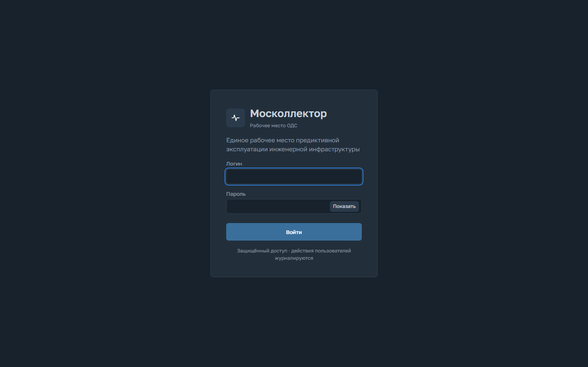

*Рисунок 1. Экран входа.*

1. Откройте адрес стенда из формы сдачи; при локальном запуске — `http://localhost:8000`.
2. Введите логин и пароль, нажмите «Войти». Кнопка «Показать» открывает введённый пароль.
3. Откроется центр управления, а если до входа был открыт другой адрес — он (`frontend/src/pages/Login.tsx`).

Возможные сбои:

- «Неверный логин или пароль» — данные не подошли.
- «Слишком много неудачных попыток входа. Повторите через 5 минут.» — 10 неудачных попыток с одного адреса на один логин за 5 минут; сервер отвечает 429 `too_many_attempts`, пока старейшая неудача не выйдет из пятиминутного окна (`backend/app/routers/auth.py`, текст — `frontend/src/api/client.ts`).
- Возврат на экран входа посреди работы — сессия истекла; по умолчанию она живёт 12 часов (`SESSION_HOURS`, `backend/app/config.py`). После входа интерфейс вернёт на тот же экран.

Выход — кнопка со стрелкой в профиле внизу меню, на телефоне — крайняя правая в верхней панели. Выход удаляет cookie в этом браузере; на сервере сессия не отзывается (`docs/submission/02-architecture.md`, раздел 8).

## 3. Общие элементы интерфейса

**Меню** (`frontend/src/components/Layout.tsx`): «Центр управления», «Прогнозы», «Заявки», «События», «Схема сети», «Качество модели» — последний пункт открывает экран «Качество прогноза». Уведомления открывает колокольчик, состояние сценария — чипы в строке состояния. Внизу меню — индикатор потока и профиль.

**Строка состояния** над каждым экраном: «Демо-контур» и демо-дата, «Историческое воспроизведение», состояние ML («ML на связи», «ML на связи · заглушка», «ML недоступна») и чипы «Датчики», «Износ», «НСД» со статусом последнего расчёта: «готов», «без кандидатов», «нет данных», «устарели», «ошибка», «молчит», «не запускался» (раздел 7.1). Справа — кнопка темы и колокольчик со счётчиком уведомлений за время работы вкладки.

**Индикатор потока**: «Поток данных подключён» — уведомления приходят; «Поток данных переподключается» — связь прервалась, клиент подключается снова; «Статус системы недоступен» — сервер не ответил.

**Всплывающие уведомления** появляются в правом нижнем углу поверх любого экрана, не больше трёх сразу; срочное держится 10 с, остальные 6,5 с (`frontend/src/components/ToastCenter.tsx`). Щелчок открывает карточку прогноза, карточку заявки или журнал событий, «×» закрывает.

**Тема** переключается по кругу: как в системе, светлая, тёмная. Выбор хранится в браузере.

**Фильтры в адресе.** Журнал прогнозов, заявки, журнал событий и экран качества пишут фильтры в адрес страницы: ссылку можно сохранить или передать, «Назад» браузера возвращает прежний набор.

**Телефон.** Меню заменяет нижняя панель «Обзор», «Прогнозы», «Заявки», «События», «Ещё»; в «Ещё» — схема сети, качество и уведомления. Колокольчик, тема и выход — в верхней панели. Фильтры журнала прогнозов свёрнуты за кнопкой «Фильтры» с числом заданных.

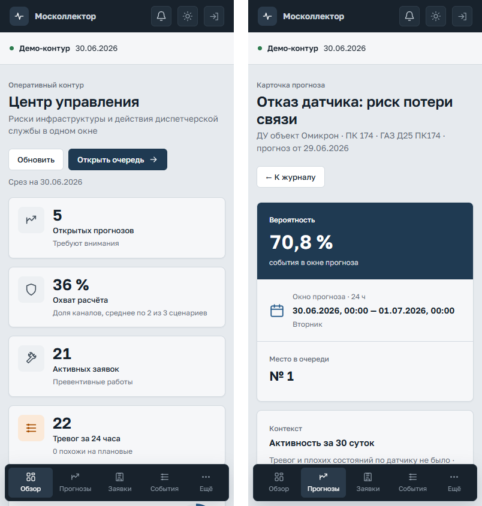

*Рисунок 2. Ширина 390 px: центр управления и карточка прогноза, внизу — панель разделов.*

## 4. Демо-режим

Стенд воспроизводит историю заказчика; настоящая дата в логике не участвует (решение D6).

- **«Сегодня» — 30.06.2026**, последний день телеметрии. От этой даты считаются открытые прогнозы, тревоги за сутки, ряды за 14 суток и недели экрана качества (`docs/submission/02-architecture.md`, раздел 3).
- **Прогнозы «на сегодня» дал расчёт за 29.06.** Расчёт за 30.06 на стенде не выполняется, поэтому прогнозы с окном на 30.06 автоматического факта не получат. Журнал заполнен расчётами за 01.06–29.06, недельная очередь НСД — за понедельники с 05.01.2026.
- **События 30.06 идут по часам МСК**: событие, записанное 30.06 в 07:32, появляется в журнале в 07:32 МСК, в полночь день начинается заново. События 02.05–29.06 загружены заранее как история.
- **Решения и итоги проверки за 05.01–29.06.2026 эмулированы**: журнала решений ОДС заказчик не предоставил. Решение получает доля 0,7 прогнозов с фактом, выбранная по хешу идентификатора; после прелоада 28.09 — 109 из 149 (`docs/submission/perf/preload_demo_0928.txt`). Попадание даёт выезд или удалённую проверку с итогом «Событие подтвердилось», промах — отклонение как ложное срабатывание, неизвестный исход — «Отложить» без итога (`backend/app/services/emulation.py`). В истории решений такая запись помечена «эмуляция», автор — `emulator`. Эмуляция провела и часть заявок: причины их переходов начинаются со слова «эмуляция». Совпадение эмулированных решений с фактом получено построением и качество модели не подтверждает.
- **Время действий людей — настоящее.** Решения, итоги, переходы заявок и пересчёты пишутся по часам сервера, поэтому у прогноза от 29.06.2026 в пересчётах стоит, например, «Записано 28.09.2026».
- **Демо-настройки закреплены**: изменить демо-дату на стенде нельзя.

Метка «заглушка каркаса» у записей означает, что сервис запущен с ML-заглушкой без данных заказчика (`docs/submission/06-build-install.md`, «Способ 1»).

## 5. Экраны

### 5.1. Центр управления

Экран показывает, что требует внимания на демо-дату (`frontend/src/pages/Dashboard.tsx`).

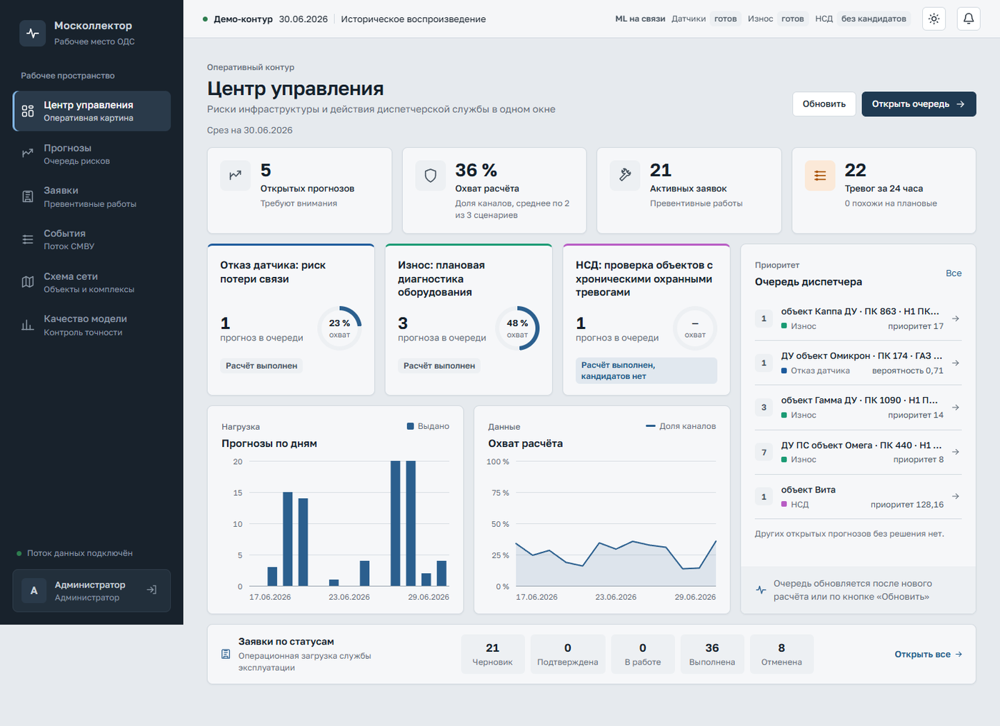

*Рисунок 3. Центр управления: показатели, сценарии, графики за 14 суток, очередь диспетчера, заявки по статусам.*

- **«Открытых прогнозов»** — в пределах лимита сценария, без решения, окно не кончилось к полуночи демо-даты.
- **«Охват расчёта»** — средняя по сценариям доля каналов, получивших оценку в последнем дневном расчёте. Недельная очередь охват не считает, подпись говорит, по скольким сценариям взято среднее.
- **«Активных заявок»** — во всех статусах, кроме «Выполнена» и «Отменена».
- **«Тревог за 24 часа»** — события с тревожным признаком СМВУ за сутки демо-даты по МСК и сколько из них похожи на плановую проверку газовых датчиков (раздел 5.5).
- **Карточки сценариев**: прогнозов в очереди, кольцо охвата, статус расчёта. Заголовок открывает экран состояния сценария.
- **Графики за 14 суток**: выдача и охват по дням. День без расчёта пропущен, а не нарисован нулём.
- **«Очередь диспетчера»** — до шести открытых прогнозов без решения, с последней даты расчёта, по месту в выдаче; щелчок открывает карточку, «Все» — журнал.
- **«Заявки по статусам»** — щелчок по статусу открывает список заявок с этим фильтром.

«Обновить» перечитывает экран, «Открыть очередь» ведёт в журнал прогнозов. Сам экран перечитывается после конца расчёта, нового прогноза и смены статуса заявки.

### 5.2. Журнал прогнозов

Реестр прогнозов в пределах лимита с решением, фактом СМВУ и итогом проверки (`frontend/src/pages/Forecasts.tsx`). Прогнозы сверх лимита сервис хранит, но в журнал, на центр управления и в выгрузку они не попадают.

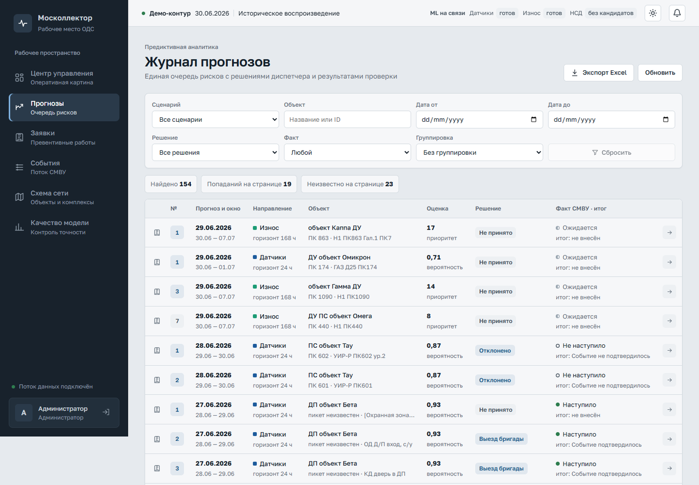

*Рисунок 4. Журнал прогнозов: фильтры, счётчики, строки с решением и фактом.*

**Колонки.** Первая — значок заявки, если прогноз в неё входит, или флажок для общей заявки. «№» — место в выдаче сценария за день расчёта, первые три выделены. «Прогноз и окно» — дата расчёта и окно. «Направление» — сценарий и горизонт. «Объект» — название, пикет и канал; у недельной рекомендации — «объект целиком». «Оценка» — число и тип: «вероятность» или «приоритет» (раздел 5.3). «Решение» — последнее решение или «Не принято». «Факт СМВУ · итог» — «Наступило», «Не наступило», «Неизвестно» или, до закрытия окна, «Ожидается»; ниже — итог проверки. Стрелка открывает карточку.

**Фильтры**: «Сценарий»; «Объект» — название или идентификатор с подсказками, применяется по Enter или при уходе из поля; «Дата от» и «Дата до» — по дате расчёта; «Решение» — «Без решения», «Решение принято» или действие; «Факт»; «Группировка». «Сбросить» очищает всё. Если название подходит к нескольким объектам, журнал их перечислит.

**Группировка.** «По объекту» оставляет последний прогноз на объект. «По случаю» оставляет последний прогноз на случай: код случая одинаков у прогнозов одного сценария по одному каналу или объекту за разные дни (`make_case_key` в `ml/src/mkl/contract.py`), и повторы одного риска сворачиваются.

**Счётчики**: «Найдено» — всего строк; «Попаданий на странице» и «Неизвестно на странице» — по текущей странице из 50 строк.

**Экспорт Excel** скачивает `forecasts.xlsx`, лист «Прогнозы»: все прогнозы в пределах лимита за период из полей «Дата от» и «Дата до». Остальные фильтры в файл не переносятся. 22 колонки — от идентификатора, окна и оценки до последнего решения, причины, итогов и заявки; сценарий, решение, причина и итоги записаны кодами словаря, время — по МСК (`backend/app/services/export.py`).

**Общая заявка.** Отметьте прогнозы одного сценария и объекта; несовместимые флажки становятся недоступны. На панели «Выбрано: N» нажмите «Создать общую заявку», появится «Черновик WO-… сформирован» и ссылка «Открыть заявку». Если на эти прогнозы уже есть незакрытая заявка, сервер вернёт её (`backend/app/services/work_orders.py`).

Журнал сам не обновляется: новые записи других пользователей покажет кнопка «Обновить».

### 5.3. Карточка прогноза

Карточка собирает всё для решения по одному прогнозу (`frontend/src/pages/ForecastCard.tsx`). Открывается из журнала, очереди, уведомления, заявки и паспорта объекта на схеме; «← К журналу» возвращает назад. В заголовке — сценарий, место (объект · пикет · канал) и дата расчёта.

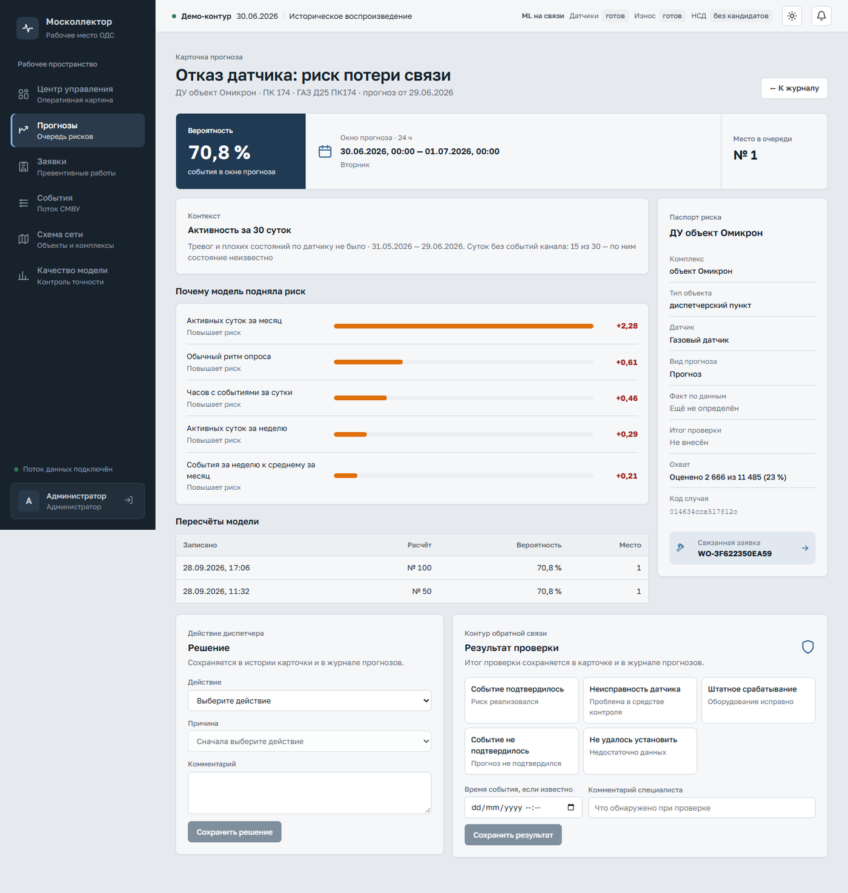

*Рисунок 5. Карточка «Отказ датчика: риск потери связи»: вероятность, окно, контекст, факторы, паспорт, формы решения и проверки.*

**Оценка.** Тип написан над числом:

- **«Вероятность»** (сценарий «Отказ датчика») — вероятность, что канал в окне замолчит дольше своего обычного ритма; в карточке в процентах, в журнале долей.
- **«Относительный приоритет, не вероятность»** («Износ», «НСД») задаёт порядок в очереди: чем больше, тем выше. У износа приоритет равен значению правила `n_bad_w7` (`ml/src/mkl/rule_head.py`), то же число стоит в факторе «Неисправности за неделю». У НСД приоритет = 32 × дни с охранной тревогой за 7 суток + дни за 30 суток / 32 + поправка на давность меньше 0,001 (`priority_score` в `ml/src/mkl/guard_queue.py`): 4 дня из 7 и 5 из 30 дают 128,16.

**Окно и горизонт.** «Окно прогноза · 24 ч» или «· 168 ч», границы по МСК, правая граница в окно не входит. «Отказ датчика» — сутки после даты расчёта, «Износ» — 7 суток после неё, НСД — с 00:00 дня D+2 до 00:00 дня D+9: рекомендация от 22.06 действует с 24.06 00:00 до 01.07 00:00. Под окном — день недели и праздник, если есть. «Место в очереди» — ранг в выдаче сценария за день.

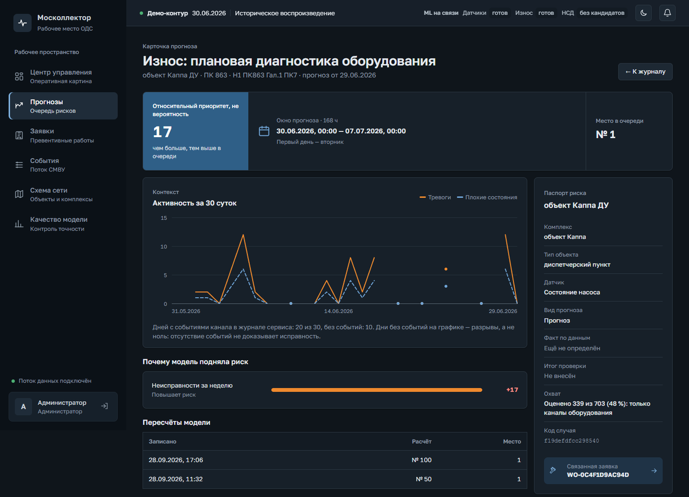

*Рисунок 6. Карточка «Износ» в тёмной теме: приоритет, окно 168 ч, тревоги и плохие состояния за 30 суток с разрывами.*

**Активность за 30 суток** — тревоги (сплошная линия) и плохие состояния (пунктир) канала за 30 суток по дату расчёта включительно. День без событий канала — разрыв, а не ноль: у потери связи молчание и есть симптом. Если тревог и плохих состояний не было, вместо графика стоит строка с числом суток без событий.

**«Почему модель подняла риск»** — признак, «Повышает риск» или «Снижает риск», вклад со знаком. У «Отказа датчика» вклад измеряется в логарифме шансов, а не в процентах (`FactorOut` в `ml/src/mkl/product_contract.py`): с процентом оценки его не складывают. У недельной рекомендации факторов нет.

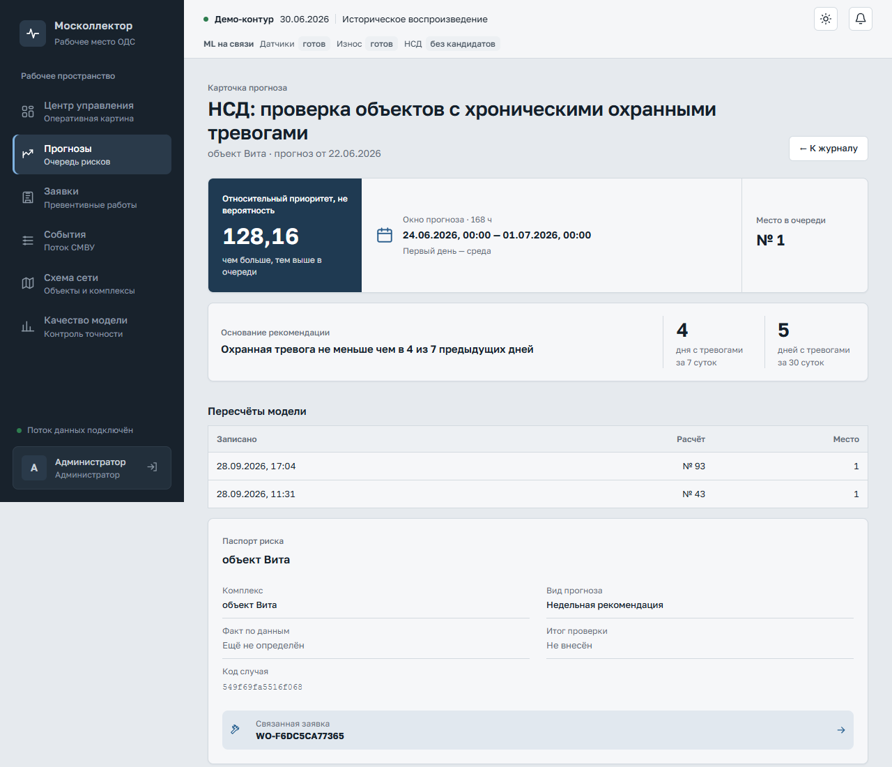

*Рисунок 7. Недельная рекомендация НСД: основание и дни с тревогами за 7 и 30 суток.*

**Основание рекомендации** (только НСД) — правило словами и дни с тревогами за 7 и 30 суток. Рекомендация прогнозирует продолжение записанной охранной активности, а не проникновение (`docs/submission/01-overview.md`).

**Паспорт риска**: комплекс, тип объекта, датчик, вид прогноза, «Факт по данным», «Итог проверки», охват расчёта, код случая, связанная заявка. Факт сервис ставит после закрытия окна: «Наступило по данным СМВУ», «Не наступило по данным СМВУ» или «Неизвестно: день не наблюдаем»; до того — «Ещё не определён».

**Пересчёты модели** — версии прогноза: время записи, номер расчёта, место, у «Отказа датчика» — вероятность. **История решений** — все решения, новые сверху, эмулированные помечены «эмуляция»; журнал показывает последнее.

**Решение** (диспетчер, администратор):

1. Выберите «Действие»: «Выезд бригады», «Удалённая проверка / мониторинг», «Отложить» или «Отклонить».
2. Выберите «Причина» — список зависит от действия; при смене действия неподходящая причина сбрасывается.
3. При необходимости заполните «Комментарий», до 2 000 знаков.
4. Нажмите «Сохранить решение». Появится «Решение сохранено», запись встанет в историю и в журнал.

| Действие | Причины |
|---|---|
| Выезд бригады, Удалённая проверка / мониторинг | Подтверждено показаниями; Подтверждено камерами; Профилактика по рекомендации |
| Отложить | Нет свободной бригады; Ждём новых данных |
| Отклонить | Ложное срабатывание; Плановые работы (ППР, поверка, огневые работы); Неисправность датчика; Уже отработано |

Соответствие задаёт поле `actions` словаря `reason_code`; неподходящую причину сервер отклонит с кодом 422.

**Результат проверки** (диспетчер, технический персонал, аналитик, администратор). Исходы: «Событие подтвердилось», «Неисправность датчика», «Штатное срабатывание», «Событие не подтвердилось», «Не удалось установить»; можно указать время события и комментарий. «Сохранить результат» выводит «Результат проверки сохранён». Итог у прогноза один, повторное сохранение его заменяет. Автоматический факт он не меняет и на экран качества не влияет (`backend/app/services/quality.py`).

**Черновик заявки.** Если прогноз не входит в заявку, а роль управляет заявками, над формами стоит кнопка «Создать черновик заявки». После создания — строка «Черновик заявки WO-… сформирован» со ссылкой, в паспорте — «Связанная заявка». Ручная заявка получает приоритет «Плановая», вид работ «Проверка по прогнозу: <сценарий>» и срок — конец окна.

### 5.4. Заявки

Экран «Заявки на работы» ведёт заявку от черновика до выполнения (`frontend/src/pages/WorkOrders.tsx`).

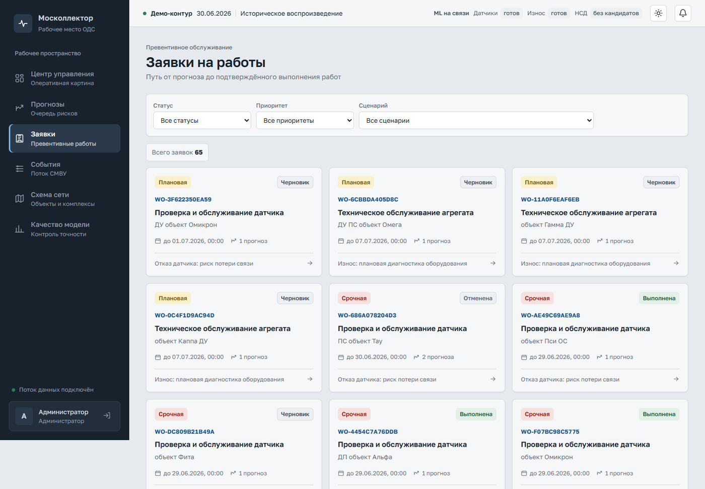

*Рисунок 8. Список заявок с фильтрами по статусу, приоритету и сценарию.*

**Список.** Фильтры «Статус», «Приоритет» («Срочная», «Плановая», «Наблюдение»), «Сценарий». Карточка в списке: приоритет, статус, номер, вид работ, объект, срок, число прогнозов, сценарий; щелчок открывает панель заявки. Изменения других пользователей список покажет после смены фильтра или перезагрузки страницы.

**Откуда заявки.** Черновики создаёт дневной расчёт: ML группирует прогнозы сценария по объекту и дате, для недельной очереди черновик собирает сервис. Вручную — из карточки или журнала. Любой путь даёт только черновик, подтверждает человек (`docs/submission/02-architecture.md`, п. 4.4); на стенде часть заявок провела эмуляция (раздел 4).

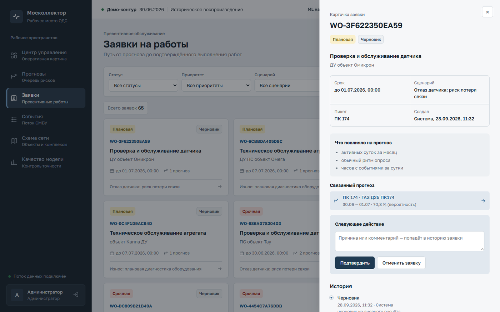

*Рисунок 9. Панель заявки в статусе «Черновик» с кнопками «Подтвердить» и «Отменить заявку».*

**Панель заявки**: срок, сценарий, пикеты, «Создал» (расчёт записан как «Система»), «Что повлияло на прогноз», связанные прогнозы со ссылками на карточки (больше шести — показаны пять и «Показать ещё N») и «История» с временем, автором и причиной каждого статуса. Закрывается «×», клавишей Esc или щелчком по затемнению. Адрес `/work-orders?open=WO-…` открывает панель сразу.

**Жизненный цикл**:

| Из статуса | Кнопка | В статус | Кто может |
|---|---|---|---|
| Черновик | «Подтвердить» | Подтверждена | диспетчер, руководитель, администратор |
| Черновик, Подтверждена, В работе | «Отменить заявку» | Отменена | диспетчер, руководитель, администратор |
| Подтверждена | «Взять в работу» | В работе | технический персонал, администратор, внешняя система |
| В работе | «Отметить выполненной» | Выполнена | технический персонал, администратор, внешняя система |

Из «Выполнена» и «Отменена» переходов нет (`work_order_transitions`, `work_order_transition_perm` в `contracts/vocabularies.json`).

**Переход с причиной.** Впишите причину в поле «Следующее действие» (необязательно, до 2 000 знаков) и нажмите кнопку перехода. Появится «Статус изменён: <статус>», причина встанет в историю рядом с новым статусом.

**Конфликт 409.** Кнопка передаёт статус, который видел пользователь. Если заявку уже перевёл другой, сервер отвечает 409, а панель пишет: «Заявку уже изменил другой пользователь: сейчас она в статусе «…». Карточка обновлена — проверьте, нужно ли ещё действие.» Панель и список перечитываются сами.

### 5.5. Журнал событий

События СМВУ с классом, который им присвоил сервис (`frontend/src/pages/Events.tsx`, `backend/app/services/semantics.py`). Прогнозы от потока не меняются: признаки ML берутся из предрасчёта (`docs/submission/02-architecture.md`, п. 4.2).

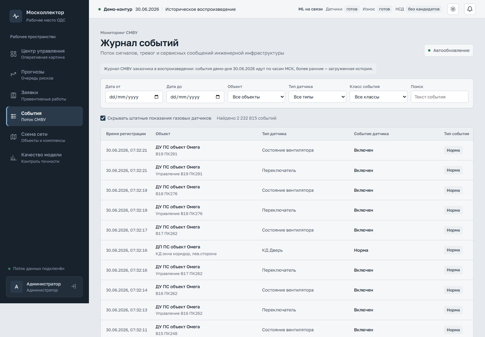

*Рисунок 10. Журнал событий 30.06.2026 с автообновлением и скрытием штатного газа; во фрагменте все события — «Норма».*

**Колонки**: время по МСК с секундами; объект и канал; тип датчика; значение (газ — в «% об.», температура — в °C; дата `01.01.1970 03:00:0x` вместо значения — «Дата вместо значения»); класс.

**Фильтры**: даты; «Объект» — список по комплексам; «Тип датчика» — 19 типов; «Класс события»; «Поиск» по тексту, по Enter или при уходе из поля. На странице 100 событий.

**Классы и цвета** — полоса слева и метка класса (`frontend/src/theme.css`, цвета — `frontend/src/tokens.css`). Правила применяются по порядку, решает первое сработавшее (`classify` в `semantics.py`).

| Класс | Цвет | Когда |
|---|---|---|
| Норма | без полосы | ни одно правило не сработало |
| Предупреждение | жёлтый | «Обнаружен дым», «Обнаружен газ», «Температура выше…» без тревожного признака СМВУ |
| Тревога | оранжевый | тревожный признак СМВУ; метан от 1 % объёма |
| Критическое | красный | метан от 5 %; текст с «пожар» или «затоп» |
| Неисправность | фиолетовый | дата 1970 года вместо значения; метан вне 0…327,67; температура вне −60…150 °C; текст с «неисправ» или «ошиб» |
| Служебное | серый | есть в словаре, правила его не присваивают |

Уведомление создают только «Тревога» и «Критическое».

**Подсказки под значением.** «вероятно, плановая проверка» — «Обнаружен газ» в будни с 9:00 до 14:59 МСК: на это окно приходится 88,6 % таких записей, заказчик подтвердил поверки баллонами (комментарий в `semantics.py`). Класс подсказка не меняет, тревога с ней попадает в «похожи на плановые» на центре управления. «в СМВУ без признака тревоги» — у остальных предупреждений.

**Скрытие штатного газа.** Флажок включён по умолчанию и убирает «Норму» газовых датчиков — по комментарию в `backend/app/services/events.py`, 80,5 % событий 2026 года. Отбор делает сервер, поэтому «Найдено» считается без них. При выбранном типе датчика или классе, отличном от «Норма», флажок не действует, и рядом написано почему.

**Автообновление** перечитывает журнал на каждую тревогу и новый прогноз; выключенное подписано «Обновление выключено». Переключатель и флажок запоминаются в браузере.

### 5.6. Схема сети

Комплексы и объекты с открытыми прогнозами (`frontend/src/pages/Schema.tsx`). Координат заказчик не предоставил; схема условная, о чём говорит надпись.

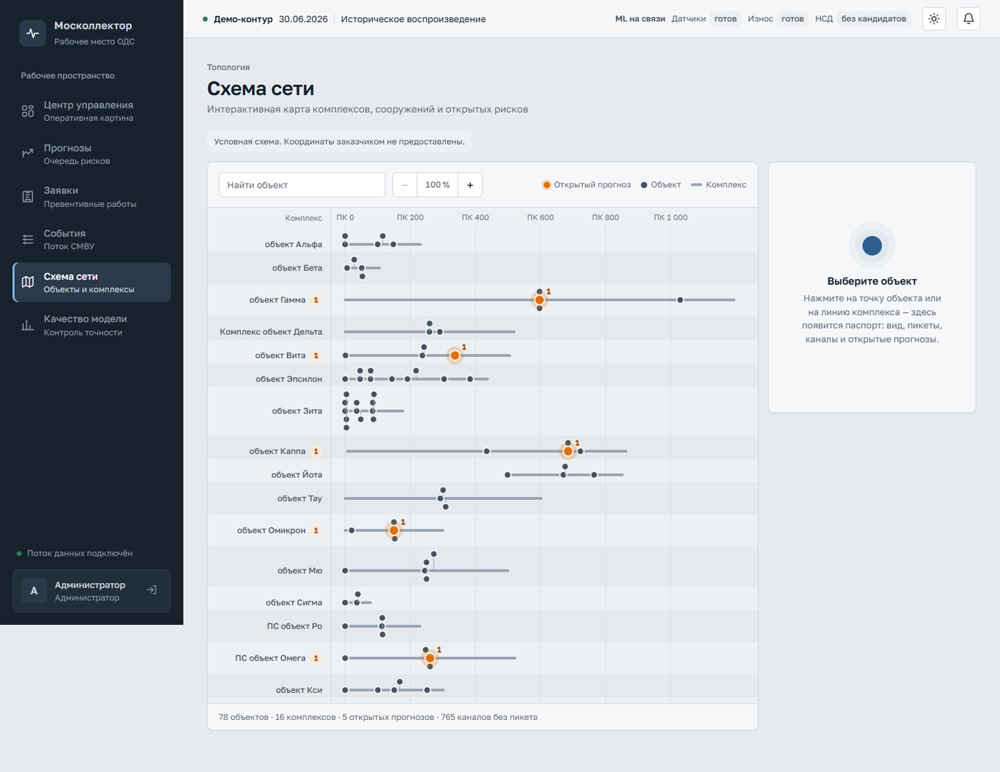

*Рисунок 11. Условная схема: строка — комплекс, по горизонтали — пикеты, оранжевые точки — объекты с открытыми прогнозами.*

Линия в строке — протяжённость комплекса по пикетам, точка — объект. Оранжевая точка с числом — объект с открытыми прогнозами, число у названия — открытые прогнозы комплекса; правило то же, что на центре управления. Под схемой — объекты, комплексы, открытые прогнозы и каналы без пикета, которые к месту не привязаны.

- «Найти объект» ищет объект или комплекс; Enter выбирает первый найденный.
- «−», «+» меняют масштаб по пикетам, кнопка с процентом возвращает ширину окна.
- Щелчок по точке или линии (с клавиатуры — Enter или пробел) открывает паспорт: вид, комплекс, пикеты, каналы, открытые прогнозы и до пяти ссылок на них. «История прогнозов» открывает журнал с фильтром по объекту.

### 5.7. Состояние сценария

Почему по сценарию прогнозы выданы или не выданы (`frontend/src/pages/ScenarioStatus.tsx`). Открывается чипом в строке состояния или заголовком карточки сценария; переключатель «Датчики», «Износ», «НСД» меняет сценарий.

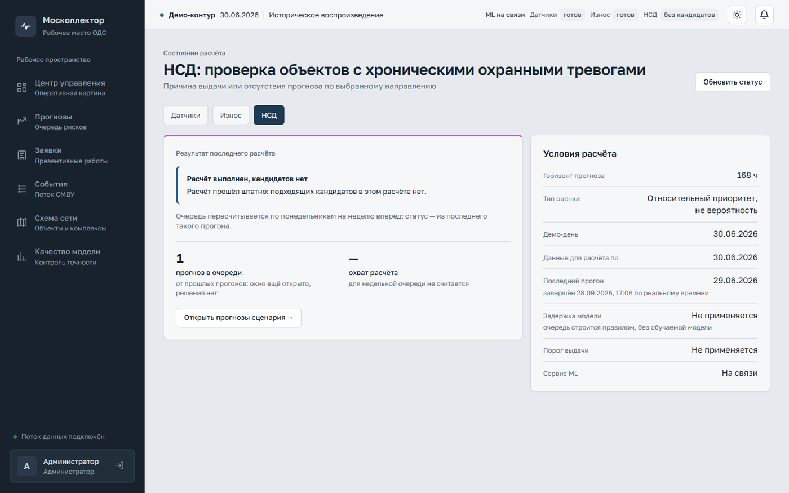

*Рисунок 12. НСД: «Расчёт выполнен, кандидатов нет», прогноз в очереди от прошлых прогонов, условия расчёта.*

**Результат последнего расчёта** — состояние из раздела 7.1. Текст ошибки сервера спрятан под «Технические подробности». Ниже — прогнозы в очереди и охват; если расчёт ничего не выдал, а очередь не пуста, подпись поясняет: «от прошлых прогонов: окно ещё открыто, решения нет». «Открыть прогнозы сценария →» ведёт в журнал с фильтром.

**Условия расчёта**: горизонт, тип оценки, демо-день, последний день данных ML, последний прогон — дата расчёта и время завершения по реальным часам, задержка модели от конца данных порога до даты расчёта, порог выдачи («Подобран», «Недостижим — прогнозы не выдаются», у НСД — «Не применяется»), состояние сервиса ML. «Обновить статус» перечитывает экран.

### 5.8. Уведомления

«Центр уведомлений» хранит всё, что приходило по потоку, в том числе пока пользователь не был в системе (`frontend/src/pages/Notifications.tsx`).

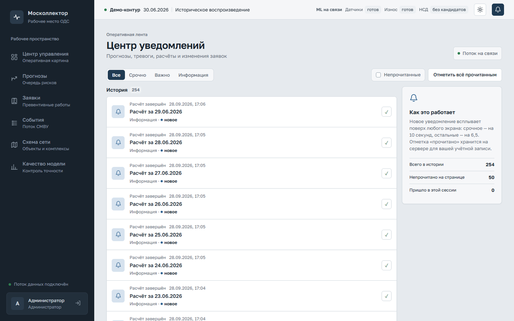

*Рисунок 13. Центр уведомлений: фильтр важности, «Непрочитанные», история.*

| Вид | Заголовок | Важность | Куда ведёт |
|---|---|---|---|
| Новый прогноз | «<сценарий>: <объект>» | Важно | карточка прогноза |
| Тревожное событие | «Тревожное событие СМВУ» | Важно; для критического — Срочно | журнал событий |
| Расчёт завершён | «Расчёт за ДД.ММ.ГГГГ», при ошибке — «… с ошибкой» | Информация; при ошибке — Важно | — |
| Заявка изменена | «Заявка WO-…» | Информация | карточка заявки |

Фильтр «Все», «Срочно», «Важно», «Информация» и кнопка «Непрочитанные» просматривают последние 500 уведомлений. Галочка справа или щелчок по заголовку отмечает прочтение; «Отметить всё прочитанным» — все сразу. Отметка хранится на сервере для учётной записи. Открытие экрана обнуляет счётчик колокольчика, но прочтения не ставит.

### 5.9. Качество прогноза

Сколько выданных прогнозов подтвердилось за четыре полные недели до понедельника демо-недели (`frontend/src/pages/Quality.tsx`, `backend/app/services/quality.py`). Сценарий — в поле «Сценарий».

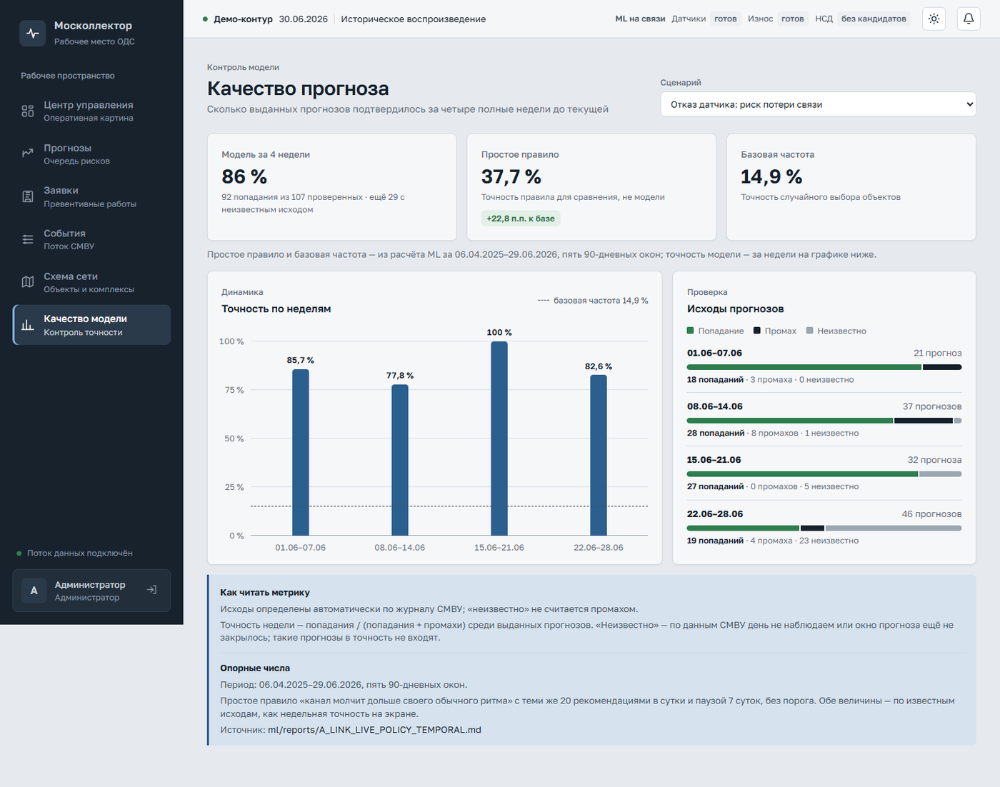

*Рисунок 14. Качество сценария «Отказ датчика»: модель, простое правило, базовая частота, недели.*

- **«Модель за 4 недели»** — попадания / (попадания + промахи) и число исходов, оставшихся неизвестными.
- **«Простое правило»** и **«Базовая частота»** — опорные числа из расчёта ML за период под карточками; разница подписана в процентных пунктах. Где в продукте работает само правило, стоит «Сравнения нет».
- **«Точность по неделям»** со штриховой линией базовой частоты и **«Исходы прогнозов»** — попадания, промахи, неизвестные по неделям.

Исход берётся только из автоматического факта СМВУ, неделя — по дате расчёта, «неизвестно» в точность не входит. Экран показывает точность по известным исходам; нижняя граница с неизвестными в знаменателе — в `docs/submission/01-overview.md`.

## 6. Сквозной путь диспетчера (ТЗ §12)

ТЗ §12 описывает путь «анализ данных → прогноз → уведомление → верификация → решение с причиной из справочника → журнал». Первые два шага выполняет дневной расчёт (`docs/submission/02-architecture.md`, п. 4.1).

1. **Уведомление.** Новый прогноз всплывает уведомлением «Новый прогноз» со сценарием и объектом, счётчик колокольчика растёт. На стенде расчёт за 29.06 выполнен заранее и новых прогнозов днём нет: начните с «Очереди диспетчера» или с записи «Новый прогноз» в центре уведомлений. Живые уведомления на стенде дают тревоги из потока 30.06.
2. **Карточка.** Прочитайте тип и значение оценки, окно и место: объект, пикет, канал.
3. **Проверка.** Посмотрите активность за 30 суток, факторы и паспорт; для подробностей откройте журнал событий с фильтром по объекту и датам окна. Камеры и другие внешние источники проверяются вне системы, их подтверждение фиксирует причина «Подтверждено камерами».
4. **Решение.** Выберите действие и причину, добавьте комментарий, нажмите «Сохранить решение».
5. **Журнал.** «← К журналу»: в колонке «Решение» стоит принятое действие; фильтр «Решение» → «Решение принято» собирает обработанные прогнозы, «Экспорт Excel» выгружает их с причинами.
6. **Заявка.** Откройте «Связанную заявку» в паспорте и нажмите «Подтвердить» с причиной; если заявки нет — «Создать черновик заявки», затем «Открыть заявку» и «Подтвердить». Дальше технический персонал нажимает «Взять в работу» и «Отметить выполненной»; каждое изменение приходит уведомлением «Заявка изменена».
7. **Итог.** После проверки на месте внесите «Результат проверки». Автоматический факт сервис добавит в первом расчёте после закрытия окна.

Решения, итоги и переходы хранятся с автором и временем, журнал действий пишет каждый изменяющий запрос (`docs/submission/07-security.md`, раздел 3). Это материал «для последующего анализа и дообучения модели», которого требует шаг «Завершение» ТЗ §12.

## 7. Состояния и сообщения

### 7.1. Состояние расчёта сценария

Тексты — `frontend/src/components/StateView.tsx`, краткие подписи — `Layout.tsx`.

| Заголовок | В строке состояния | Что значит | Что делать |
|---|---|---|---|
| Расчёт выполнен | готов | прогнозы выданы в очередь | работать с очередью |
| Расчёт выполнен, кандидатов нет | без кандидатов | расчёт штатный, подходящих кандидатов нет | ничего; прогнозы прошлых расчётов остаются |
| Нет данных за сутки | нет данных | не хватило наблюдений, прогноз не строился | сообщить администратору, если так несколько дней |
| Данные устарели | устарели | данные или модель старше даты расчёта | сообщить администратору |
| Ошибка расчёта | ошибка | расчёт завершился ошибкой, прежние прогнозы на месте | сообщить администратору, текст — в «Технических подробностях» |
| Порог недостижим | молчит | на истории нет порога с достаточной точностью, сценарий молчит; это не сбой | ничего |
| Расчёт ещё не запускался | не запускался | результата нет; отсутствие прогноза не означает отсутствие риска | запустить расчёт (раздел 8.1) |

Ошибка, нехватка данных и устаревание показываются раньше сведений о пороге, чтобы порог не скрыл сбой (`headState` в `StateView.tsx`). Тот же блок стоит над оценкой в карточке, если данные прогноза не в состоянии «Расчёт выполнен». Рядом бывают строки «Сервис ML сейчас не отвечает. Показан результат прошлого прогона; новый завершится ошибкой, пока связь не восстановится.» и «Сейчас подключена заглушка ML: результат демонстрационный, не эксплуатационный.»

### 7.2. Состояния экрана и сообщения

| Что видно | Что значит и что делать |
|---|---|
| «Загрузка…», «Обновление…» | данные запрошены или перечитываются |
| «Не удалось получить данные» и «Повторить» | сервер не ответил или вернул ошибку; нажать «Повторить» |
| «Записей нет» | под условия ничего нет; строка ниже называет причину — изменить фильтры |
| «Нет доступа» | раздел недоступен для роли |
| «Страница не найдена» | адреса нет; «Перейти в центр управления» |
| «Ожидается», «Ещё не определён» | окно прогноза не закрылось, факта нет |
| «Неизвестно» | день по данным СМВУ не наблюдаем; это не промах |
| «Сеанс завершён, войдите снова» | 401, интерфейс переходит на вход |
| «Для вашей роли это действие недоступно» | 403 |
| «Запрос отклонён: страница открыта с другого адреса. Обновите страницу.» | 403 `csrf_rejected`: изменяющий запрос пришёл не со страницы сервиса |
| «Прогноз не найден», «Заявка не найдена», «Уведомление не найдено», «Запись не найдена» | 404 |
| «Запись уже изменил другой пользователь. Обновите страницу.» | 409; у заявки — сообщение из раздела 5.4 |
| «Такой переход статуса заявки не предусмотрен», «В одну заявку можно объединить прогнозы только одного сценария и одного объекта», «Эта причина не подходит к выбранному действию», «Демо-дата вне окна, за которое есть данные» | 422 с кодом ошибки |
| «Проверьте заполнение полей» | 422 без известного кода |
| «Файл больше допустимых 200 МБ» | 413 |
| «Слишком много неудачных попыток входа. Повторите через 5 минут.» | 429 на входе (раздел 2) |
| «Слишком много запросов. Повторите немного позже.» | 429 без кода |
| «Ошибка сервера (N). Повторите позже.» | 500 и выше |
| «Сервер недоступен. Проверьте соединение и повторите.» | ответа нет |
| «Настройки демо на стенде закреплены и не меняются» | попытка сменить демо-настройки на стенде |

Тексты ошибок — `DETAIL_TEXT` и `errorText` в `frontend/src/api/client.ts` (#44): сначала ищется текст для кода `detail` из ответа, затем для кода состояния.

## 8. Администратор

Экрана администратора нет: служебные операции выполняются через REST API, удобнее всего — в Swagger UI по адресу `/docs`.

1. Откройте `/docs`, выполните `POST /api/v1/auth/login` через **Try it out** с логином `admin`. Сервер поставит cookie, и дальнейшие запросы пойдут от имени администратора. Если в этом браузере уже выполнен вход в интерфейс, cookie уже есть.
2. Выберите операцию, **Try it out**, заполните параметры, **Execute**.

Изменяющие запросы пишутся в журнал действий с логином и кодом ответа (`docs/submission/07-security.md`, раздел 3).

### 8.1. Дневной расчёт

`POST /api/v1/admin/run-daily`, тело `{"asof": "ГГГГ-ММ-ДД", "weekly_only": false}`.

- `asof` — дата расчёта; окна прогнозов начинаются после неё. В понедельник тот же прогон пересчитывает недельную очередь НСД.
- `weekly_only: true` — только недельная очередь; `asof` должен быть понедельником, иначе 422 (`RunDailyIn` в `backend/app/schemas/misc.py`).
- Расчёты идут по одному. Повтор той же даты обновляет те же прогнозы и добавляет строку в «Пересчёты модели»; заявку, вышедшую из черновика, он не меняет.
- Ответ — номер прогона, статус и число выдач по каждому сценарию, число обновлённых прогнозов и заявок. Если ML не ответил, ответ всё равно 200, а сценарий получает «Ошибка расчёта».
- По уведомлению «Расчёт завершён» строка состояния, центр управления и состояние сценария перечитываются сами.

Наполнение журнала с нуля — `scripts/preload_demo.py` (`docs/submission/06-build-install.md`).

### 8.2. Загрузка журнала событий файлом

`POST /api/v1/ingest/events/upload`, аналитик или администратор, поле `file`.

- **Формат**: CSV в UTF-8 с запятой и строкой заголовка, как `журнал_событий_пример.csv`, или XLSX — первый лист, первая строка — заголовок. Колонки `ид_события`, `ид_канала_данных`, `дата` (ГГГГ-ММ-ДД), `время` (ЧЧ:ММ:СС, МСК), `тревожное` (`t`, `f`, `true`, `false`, `1`, `0`, `да`, `нет`), `значение_датчика` (`EventRowIn` в `backend/app/schemas/events.py`). XML не принимается.
- **Размер** — до 200 МБ (200 × 1 024 × 1 024 байт, `UPLOAD_MAX_BYTES` в `backend/app/limits.py`), больше — 413. Остальные запросы ограничены 10 МБ; на стенде предел 200 МБ повторяет Caddy.
- **`notify`** по умолчанию `true`: каждая тревога и критическое событие создадут уведомление. Историю грузите с `notify=false`, иначе старые тревоги придут диспетчерам как новые.
- **Повтор безопасен**: строки сверяются по отпечатку «ид события, канал, время, признак, значение», повтор уйдёт в дубли.
- **Результат** — партия: всего строк, принято, дублей, отклонено, вне демо-окна (позже демо-даты не сохраняется) и статус `accepted`, `partial` или `rejected`. История — `GET /api/v1/ingest/batches`.

Пачку до 5 000 строк без файла принимает `POST /api/v1/ingest/events`, журнал ОДС — `POST /api/v1/ingest/ods-journal`.

### 8.3. Синхронизация справочника

`POST /api/v1/reference/sync`, без параметров. Сервер перечитывает `справочник_объектов_диспетчер.csv` и `справочник_каналов_датчиков.csv` из `RAW_DATA_DIR` (в сборке с `compose.real.yaml`, в том числе на стенде, — каталог `Materials` бандла) и приводит к ним таблицы объектов и каналов (`backend/app/services/reference.py`). Ответ — число объектов и каналов и сколько записей добавлено, изменено, удалено. Без файлов сервер ничего не меняет и возвращает нули в счётчиках изменений. Та же сверка идёт при каждом старте.

### 8.4. Другие операции

| Операция | Назначение |
|---|---|
| `GET /api/v1/audit` | журнал действий с фильтрами по пользователю и датам |
| `GET`, `PUT /api/v1/settings` | демо-настройки; на стенде изменение даёт 403 `settings_locked` |
| `DELETE /api/v1/admin/issued-log` | очистить журнал выданного за период |
| `POST /api/v1/admin/emulate-decisions` | засеять эмулированные решения и итоги за период |
| `DELETE /api/v1/ingest/day/{day}` | удалить события одних суток МСК |

Все 36 операций — в `docs/submission/02-architecture.md`, раздел 8, и в `contracts/api_v1.openapi.json`.
