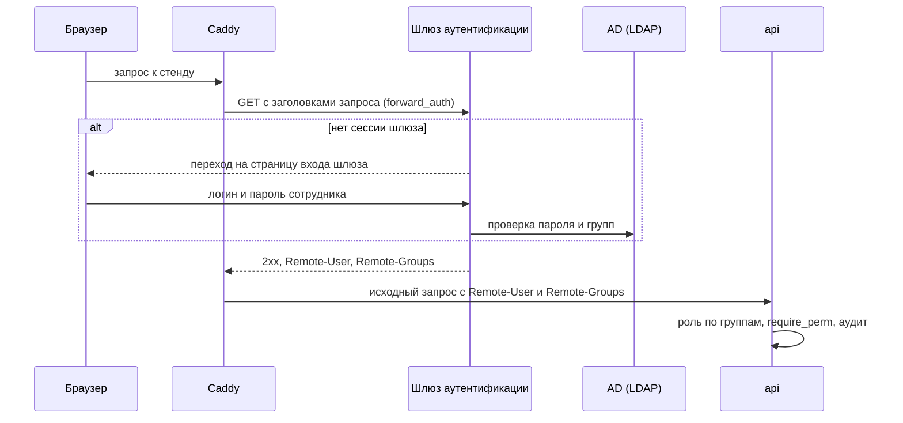

# Безопасность и соответствие требованиям

Раздел сверен с кодом `main` на коммите `8f8ada7` (28.09.2026, после PR #42), включая конфигурацию стенда (`compose.stand.yaml`, `deploy/Caddyfile`). Номер вида #37 — pull request в репозитории `Bitmann0/moscollector-predict`. Пути даны от корня репозитория.

Поведение проверено двумя способами. Тесты `tests/test_auth.py`, `tests/test_audit.py`, `tests/test_hardening.py` и `tests/test_stand.py` (110 тестов) прошли 28.09 на машине разработчика на SQLite. Отдельные случаи, которых в тестах нет, проверены запросами через тестовый клиент FastAPI к тому же приложению; в тексте они помечены «проба 28.09». Номера вида О1 ссылаются на таблицу ограничений в разделе 8.

Логины и пароль демо-пользователей здесь не приводятся: экспертам их передают в отдельном разделе PDF-документации (решение D13 плана команды, `docs/superpowers/plans/2026-09-25-team-plan-to-submission.md`).

## Требования и статус

| Требование | Источник | Статус | Раздел |
|---|---|---|---|
| Разграничение прав на основе ролевой модели (RBAC) | ТЗ §11 | сделано: 6 ролей, 9 прав, проверка на сервере в каждом защищённом маршруте | 1 |
| Аутентификация пользователей | ТЗ §11 | сделано на локальных учётных записях: логин, пароль, подписанная cookie; внешние системы входят по ключу | 2 |
| Интеграция с корпоративной службой каталогов (LDAP/AD) | ТЗ §11 | не сделано; описан проект подключения через reverse proxy | 5 |
| Журналирование всех действий пользователей | ТЗ §11 | сделано для изменений, входов и выгрузок; запросы на чтение пишет только журнал доступа Caddy на стенде, без логина | 3 |
| Шифрование при передаче, TLS 1.2 и выше | ТЗ §11 | на стенде: Caddy, TLS 1.2–1.3 по умолчанию; локальный запуск — HTTP | 4 |
| Интеграция с системами заказчика только на чтение | ТЗ §13 | соблюдено: продукт принимает данные и ничего не пишет в системы заказчика | 6 |
| 149-ФЗ, 152-ФЗ | ТЗ §14 | меры в коде перечислены; юридическая оценка соответствия не проводилась | 7 |

## 1. Роли и права

Роли и права задаёт один файл, `contracts/vocabularies.json`: список `roles` и матрица `permissions` вида «право → роли». Backend читает его в `backend/app/vocab.py`, фронт — при сборке (`frontend/src/vocab.ts`). Менять файл можно только через PR с аппрувом PM, ML-1, BE и FE (поле `_note` в том же файле).

| Код роли | Название в интерфейсе | Как входит |
|---|---|---|
| `dispatcher` | Диспетчер ОДС | логин и пароль |
| `technician` | Технический персонал | логин и пароль |
| `analyst` | Аналитик | логин и пароль |
| `manager` | Руководитель подразделения | логин и пароль |
| `admin` | Администратор | логин и пароль |
| `integration` | Внешняя система (X-API-Key) | ключ в заголовке `X-API-Key`; строки в таблице `users` нет |

### 1.1. Матрица прав

| Право | `dispatcher` | `technician` | `analyst` | `manager` | `admin` | `integration` |
|---|---|---|---|---|---|---|
| `view` | да | да | да | да | да | — |
| `decide` | да | — | — | — | да | — |
| `outcome` | да | да | да | — | да | — |
| `work_order_manage` | да | — | — | да | да | — |
| `work_order_progress` | — | да | — | — | да | да |
| `ingest` | — | — | да | — | да | да |
| `export` | да | — | да | да | да | — |
| `admin` | — | — | — | — | да | — |
| `integration` | — | — | — | — | — | да |

### 1.2. Что открывает каждое право

Все маршруты — под префиксом `/api/v1`.

| Право | Маршруты |
|---|---|
| `view` | `GET /dashboard/summary`, `/forecasts`, `/forecasts/{id}`, `/work-orders`, `/work-orders/{id}`, `/events`, `/schema.geojson`, `/schema.wkt`, `/quality`, `/reason-codes`, `/reference/tree`, `/system/status`, `/notifications`, `/stream`; `POST /notifications/{id}/read` |
| `decide` | `POST /forecasts/{id}/decisions` — решение диспетчера с причиной |
| `outcome` | `POST /forecasts/{id}/outcome` — итог проверки |
| `work_order_manage` | `POST /work-orders`; `PATCH /work-orders/{id}` в статусы `confirmed` и `cancelled` |
| `work_order_progress` | `PATCH /work-orders/{id}` в статусы `in_progress` и `completed` |
| `ingest` | `POST /ingest/events`, `/ingest/events/upload`, `/ingest/ods-journal`; `GET /ingest/batches` |
| `export` | `GET /export/forecasts.xlsx` |
| `admin` | `GET /audit`; `GET` и `PUT /settings`; `POST /reference/sync`, `/admin/run-daily`, `/admin/emulate-decisions`; `DELETE /admin/issued-log` |
| `integration` или `admin` | `DELETE /ingest/day/{day}` — удаление событий дня из БД продукта |
| право не нужно | `GET /me` — любой вошедший; `GET /health`, `POST /auth/login`, `POST /auth/logout`, Swagger UI `/docs` и `/openapi.json` — без входа |

Спецификация API открыта без входа; её копия и так лежит в репозитории (`contracts/api_v1.openapi.json`).

### 1.3. Как проверяются права

1. У каждого защищённого маршрута стоит зависимость FastAPI `require_perm(*perms)` из `backend/app/security.py`. Она вызывает `current_user`: нет входа — 401. Затем пропускает запрос, если у роли есть хотя бы одно из перечисленных прав, иначе отвечает 403 `forbidden`.
2. Набор прав роли строит `vocab.permissions_of(role)` из матрицы. Файл читается один раз за жизнь процесса (`functools.lru_cache` у `vocab.load`), поэтому правка матрицы вступает в силу после перезапуска `api`.
3. Переход заявки проверяется второй раз в сервисе (`transition` в `backend/app/services/work_orders.py`), потому что нужное право зависит от целевого статуса: его даёт словарь `work_order_transition_perm`. Порядок проверок: заявка существует (иначе 404); статус совпадает с тем, который видел пользователь (иначе 409); переход есть в графе `work_order_transitions` (иначе 422); у роли есть право на этот переход (иначе 403). Запись статуса повторяет сверку в том же `UPDATE … WHERE status = expected_status`, поэтому из двух одновременных переходов проходит один, а второй получает 409, даже если прошёл проверки выше (#37, `tests/test_work_orders.py::test_stale_read_transition_returns_409`).
4. Поток SSE `GET /stream` проверяет вход и право `view` в самом маршруте (`backend/app/routers/stream.py`): соединение живёт долго, и держать открытой сессию БД на всё его время нельзя. Роль `integration` права `view` не имеет и получает 403.
5. Фронт прячет пункты меню и кнопки по списку `permissions` из ответа `GET /me` (`frontend/src/auth/AuthContext.tsx`, `frontend/src/components/Layout.tsx`, `frontend/src/pages/ForecastCard.tsx`). Запрет ставит только сервер.
6. В OpenAPI у каждой защищённой операции указаны схемы `cookieAuth` и `apiKeyAuth` и ответы 401 и 403 (`custom_openapi` в `backend/app/main.py`).

`tests/test_auth.py::test_permission_matrix` проходит 13 защищённых маршрутов под каждой из 6 ролей, 78 случаев, и сверяет ответ с матрицей: допущенная роль не получает 403, остальные получают.

Демо-пользователей создаёт seed, по одному на роль, кроме `integration`. Логин равен коду роли, имя — названию роли из словаря, пароль у всех общий — значение `DEMO_PASSWORD` из `.env` (`seed_users` в `backend/app/seed.py`). При `SEED_DEMO=1` и пустом `DEMO_PASSWORD` seed останавливается с ошибкой, и контейнер `api` не стартует.

## 2. Аутентификация

### 2.1. Вход по логину и паролю

`POST /api/v1/auth/login` сверяет пароль с хешем из `users` и ставит cookie `mk_session` (`backend/app/routers/auth.py`). Сессия передаётся в cookie, а не токеном в заголовке, потому что `EventSource` в браузере не умеет ставить заголовки, а уведомления приходят по SSE (докстрока `backend/app/security.py`).

| Свойство | Значение | Где в коде |
|---|---|---|
| Атрибуты cookie | `HttpOnly`, `SameSite=Lax`, `Path=/`, `Max-Age=43200`; `Secure` при `COOKIE_SECURE=1`, на стенде включено | `backend/app/routers/auth.py`, `compose.stand.yaml` |
| Срок сессии | 12 ч (`session_hours`); возраст проверяется по метке времени внутри подписи | `backend/app/config.py`, `authenticate` в `backend/app/security.py` |
| Содержимое токена | `login` и отпечаток пароля `pw`, подписанные `itsdangerous.URLSafeTimedSerializer` на ключе `SECRET_KEY` с солью `mk-session`. Токен подписан, но не зашифрован: логин и отпечаток из cookie читаются | `issue_session`, `_serializer` |
| Отпечаток пароля | первые 16 шестнадцатеричных символов HMAC-SHA256 от хеша пароля на ключе `SECRET_KEY`. После смены пароля отпечаток не совпадает, и старые сессии получают 401 | `_password_mark`; тест `test_password_change_invalidates_session` |
| Хранение пароля | PBKDF2-HMAC-SHA256, 200 000 итераций, случайная соль 16 байт; сравнение через `hmac.compare_digest` | `hash_password`, `verify_password` |
| Пустой `SECRET_KEY` | `RuntimeError` при первой выдаче или проверке сессии | `_serializer` |

На каждом запросе `authenticate` проверяет подпись и возраст токена, наличие пользователя в `users` и совпадение отпечатка. Любое расхождение даёт 401 `session_invalid`. Смена `DEMO_PASSWORD` в `.env` с перезапуском `api` гасит все сессии демо-пользователей: seed перехеширует пароль, и отпечаток меняется.

Выход (`POST /auth/logout`) удаляет cookie только в браузере. На сервере токен действует до конца 12 ч: в пробе 28.09 cookie, сохранённая до выхода, после выхода получила на `GET /me` ответ 200 (О1).

### 2.2. Внешние системы: ключ `X-API-Key`

Машинный клиент передаёт заголовок `X-API-Key`. `authenticate` сравнивает его байты с `INTEGRATION_API_KEY` через `hmac.compare_digest` и при совпадении выдаёт роль `integration` с правами `ingest`, `integration`, `work_order_progress`. Ключ проверяется раньше cookie: неверный ключ даёт 401 `bad_api_key`, даже если в запросе есть действующая cookie (проба 28.09). При пустом `INTEGRATION_API_KEY` любой ключ получает 401. Ключ с символами вне ASCII получает 401, а не 500 (`test_non_ascii_api_key_is_401_not_500`).

Ключом пользуются `scripts/replay.py` (поток событий СМВУ), `scripts/emulate_ods.py` (журнал ОДС) и `scripts/emulate_helpdesk.py` (статусы заявок). Права `view` у `integration` нет, поэтому эмуляторы пишут по ключу, а читают под демо-пользователем (докстроки `scripts/emulate_ods.py` и `scripts/emulate_helpdesk.py`). Ключ один на все внешние системы (О5).

### 2.3. Защита от межсайтовых запросов

Браузер прикладывает cookie и к запросам, которые начала чужая страница. Поэтому `authenticate`, приняв cookie защищённого маршрута, вызывает `_check_csrf` (`backend/app/security.py`). Она пропускает `GET`, `HEAD` и `OPTIONS`, остальные запросы проверяет так:

1. Есть `Sec-Fetch-Site` — допустимы только `same-origin` и `none`. `same-site` (соседний поддомен) и `cross-site` получают 403 `csrf_rejected`.
2. `Sec-Fetch-Site` нет, есть `Origin` — часть `Origin` после `://` должна совпасть с `Host`, иначе 403.
3. Нет ни одного из двух заголовков — запрос проходит.

`POST /auth/login` и `POST /auth/logout` через `authenticate` не идут, и эта проверка к ним не применяется: в пробе 28.09 вход с `Sec-Fetch-Site: cross-site` получил 200. Запросы с `X-API-Key` не проверяются: они входят по ключу, а не по cookie, и без ключа чужая страница такой запрос не подделает. Вторая линия защиты — атрибут `SameSite=Lax`: браузер не отправляет такую cookie с межсайтовыми запросами небезопасных методов (`POST`, `PUT`, `PATCH`, `DELETE`) и с межсайтовыми вызовами `fetch()` (MDN, заголовок `Set-Cookie`, атрибут `SameSite`). Пункт 3 оставляет незакрытым запрос без обоих заголовков: в пробе 28.09 `PUT /api/v1/settings` с cookie администратора и без этих заголовков получил 200 (О2).

Тесты: `test_cross_site_mutation_with_cookie_is_rejected` (варианты `cross-site`, `same-site`, чужой `Origin`) и `test_same_origin_mutation_passes_csrf` в `tests/test_hardening.py`.

### 2.4. Ограничение частоты входа

`LoginThrottle` в `backend/app/routers/auth.py` считает неудачные входы по паре «адрес клиента, логин». После 10 неудач за 300 с следующий вход этой пары получает 429 `too_many_attempts`, даже с верным паролем, пока старейшая неудача не выйдет из окна. Успешный вход обнуляет счётчик пары, другой логин с того же адреса не блокируется. `test_login_is_throttled_after_repeated_failures` в `tests/test_stand.py` проверяет последовательность: 10 ответов 401, одиннадцатый — 429; верный пароль сразу после этого — 429; вход под другим логином с того же адреса — 200. Обнуление счётчика проверяет `test_successful_login_clears_failures` там же.

Счётчик живёт в памяти процесса `api` и сбрасывается при перезапуске; на стенде процесс один (докстрока модуля). Лимит стоит в `api`, а не в Caddy, потому что в образе `caddy:2-alpine` нет модуля ограничения частоты (комментарий в `deploy/Caddyfile`).

Адрес клиента за Caddy `api` берёт из `X-Forwarded-For`: `uvicorn` запущен с `--proxy-headers --forwarded-allow-ips "${FORWARDED_ALLOW_IPS:-127.0.0.1}"` (`backend/entrypoint.sh`), на стенде `FORWARDED_ALLOW_IPS: "*"` (`compose.stand.yaml`). Подставить чужой адрес через Caddy клиент не может: присланные клиентом `X-Forwarded-*` Caddy по умолчанию игнорирует (документация Caddy, директива `reverse_proxy`). Порт 8000 на стенде наружу не опубликован (`ports: !reset []`), так что доверие ко всем адресам распространяется только на контейнеры сети compose. Перебор одного логина с многих адресов счётчик не ограничивает (О6).

### 2.5. Предел размера запроса

FastAPI читает тело запроса раньше, чем проверяет вход, поэтому без предела анонимный клиент мог бы загрузить в память и временные файлы сколько угодно данных до ответа 401 (докстрока `backend/app/limits.py`). `BodyLimitMiddleware` из этого модуля стоит самым внешним слоем ASGI, до разбора тела и до аудита:

| Условие | Ответ |
|---|---|
| `POST /api/v1/ingest/events/upload` больше 200 МБ | 413 `request_too_large` |
| любой другой запрос, кроме `GET`, `HEAD`, `OPTIONS`, больше 10 МБ | 413 `request_too_large` |
| запрос к `/api/v1/ingest/*` без `X-API-Key` и без cookie `mk_session` | 401 до чтения тела |
| JSON-пачка `/ingest/events` или `/ingest/ods-journal` больше 5 000 строк | 422 (`Body(max_length=5000)` в `backend/app/routers/ingest.py`) |

Размер проверяется сначала по `Content-Length`, а при передаче частями — по счётчику принятых байт. На стенде предел 200 МБ повторяет Caddy (`request_body { max_size 200MB }` в `deploy/Caddyfile`); предел 10 МБ держит только `api`. Тесты в `tests/test_hardening.py`: `test_anonymous_ingest_rejected_before_body`, `test_declared_body_over_limit_is_413`, `test_streamed_body_over_limit_is_413`, `test_json_batch_over_5000_rows_is_422`.

### 2.6. Демо-настройки на стенде

На стенде `DEMO_SETTINGS_LOCKED=1` (`compose.stand.yaml`): `PUT /api/v1/settings` отвечает 403 `settings_locked` и администратору тоже (`backend/app/services/settings_store.py`, тест `test_put_settings_locked_for_admin`). Решение D13 объясняет причину: после стоп-кода команда не сможет исправить стенд, если кто-то посторонний поменяет демо-дату или режим воспроизведения.

## 3. Журнал действий пользователей

### 3.1. Что пишется в `audit_log`

`AuditMiddleware` (`backend/app/audit.py`) пишет строку на каждый запрос под `/api/v1` с методом `POST`, `PUT`, `PATCH` или `DELETE`, а также на `GET` выгрузок (`/api/v1/export…`) и самого журнала (`/api/v1/audit…`).

| Колонка | Содержимое |
|---|---|
| `ts` | время ответа на запрос; в БД UTC, в ответе `GET /audit` — МСК (`+03:00`) |
| `user_login`, `role` | кто сделал запрос, из `request.state.user`; у анонимного запроса пусто |
| `method`, `path` | метод и путь; путь обрезается до 500 символов |
| `status` | код ответа; необработанное исключение записывается как 500 |
| `entity` | первый параметр пути: id прогноза, заявки или день; до 200 символов |
| `payload` | колонка есть в схеме (`backend/app/models.py`), но middleware её не заполняет: тело запроса, включая пароль при входе, в журнал не попадает |

IP-адреса в `audit_log` нет. Что попадает в журнал по случаям (`tests/test_audit.py` и проба 28.09):

| Случай | Запись |
|---|---|
| успешный вход | `POST /auth/login`, 200, логин и роль |
| неудачный вход | `POST /auth/login`, 401, без логина; какой логин пробовали, не записывается (О3) |
| выход | `POST /auth/logout`, 204, без логина: выход не читает сессию (О3) |
| изменение без входа | код 401, без логина; исключение — запросы к `/ingest/*` без ключа и cookie: их `BodyLimitMiddleware` отклоняет раньше аудита, и строки нет (проба 28.09) |
| тело больше предела, ответ 413 | не пишется, с входом и без: ответ даёт `BodyLimitMiddleware` раньше аудита (проба 28.09) |
| изменение, выгрузка или чтение журнала без права | код 403, с логином и ролью |
| решение, итог проверки, заявка, приём событий, настройки, операции администратора | метод, путь, код, логин, роль, id объекта |
| выгрузка XLSX, чтение журнала аудита | `GET`, путь, логин |
| чтение журнала прогнозов, карточек, схемы, событий, поток SSE | не пишется (`should_audit` в `backend/app/audit.py`; тест `test_reads_are_not_audited_but_export_is` проверяет журнал прогнозов и `/system/status`, проба 28.09 — карточку, схему, события, заявки) |
| анонимные ответы 404 и 405 | не пишутся, иначе перебор несуществующих путей забил бы журнал |

Запись идёт в отдельной сессии БД, чтобы откат транзакции запроса не стирал след попытки, и в пуле потоков, чтобы не останавливать цикл событий. Ошибка записи аудита попадает в лог приложения и не ломает ответ пользователю (О7).

После прелоада и загрузки истории 02.05–29.06 в `audit_log` было 2 145 строк (замер 28.09, `README.md`, раздел «Стенд»). Автоматической очистки `audit_log` в коде нет.

### 3.2. Авторы в предметных таблицах

Автора действия пишут и сами предметные таблицы (`backend/app/models.py`): `decisions.author`, `outcomes.author`, `work_orders.created_by`, `work_order_history.author` вместе со временем и комментарием перехода. Автор решения виден в истории карточки прогноза (`frontend/src/pages/ForecastCard.tsx`), автор заявки и переходов — в карточке заявки (`frontend/src/pages/WorkOrders.tsx`). Решения, засеянные эмуляцией, несут `source="emulated"` и автора `emulator`, переходы заявок, которые делает эмуляция, — автора `emulator` в `work_order_history` (`backend/app/services/emulation.py`, #36), поэтому от действий людей они отличаются.

### 3.3. Просмотр журнала

`GET /api/v1/audit` доступен только с правом `admin`. Параметры: `user` (логин), `from` и `to` — дни по МСК включительно, `page`, `page_size` (по умолчанию 100, не больше 1000). Новые записи идут первыми (`backend/app/services/audit_query.py`). Экрана журнала в интерфейсе нет: журнал читают через API или Swagger UI `/docs`.

### 3.4. Журнал доступа Caddy

На стенде Caddy пишет JSON-строку на каждый HTTP-запрос, включая чтение, в stdout контейнера (блок `log` в `deploy/Caddyfile`). Журналы контейнеров хранит драйвер `json-file`, по 5 файлов по 10 МБ на сервис (`compose.stand.yaml`). В строке есть адрес клиента, метод, URI, код ответа и заголовки запроса. Значения `Cookie`, `Set-Cookie`, `Authorization` и `Proxy-Authorization` Caddy по умолчанию заменяет на `REDACTED` (документация Caddy, глобальная опция `log_credentials`). `X-API-Key` в этот список не входит, так что ключ внешней системы, пришедший через Caddy, окажется в журнале (О4). Сервис `replay` на стенде ходит на `api:8000` напрямую внутри сети compose, мимо Caddy (`compose.stand.yaml`).

Логина в журнале Caddy нет: запрос на чтение в нём привязан к адресу, а не к пользователю.

## 4. Защита канала

### 4.1. TLS на стенде

| Что | Как устроено | Источник |
|---|---|---|
| Точка входа | сервис `caddy` (`caddy:2-alpine`) на портах 80 и 443; порт `api` наружу закрыт (`ports: !reset []`); у `ml` только `expose: 8001`; у `db` портов нет | `compose.stand.yaml`, `compose.yaml` |
| Сертификат | Caddy получает его сам по ACME для домена `STAND_DOMAIN`; при `STAND_DOMAIN=localhost` подписывает своим локальным CA | `deploy/Caddyfile`; документация Caddy, Automatic HTTPS |
| Версии TLS | блока `tls` в `deploy/Caddyfile` нет, действуют умолчания Caddy: минимум TLS 1.2, максимум TLS 1.3 | документация Caddy, директива `tls`, параметр `protocols` |
| HTTP | запросы на порт 80 Caddy перенаправляет на HTTPS | документация Caddy, Automatic HTTPS |
| Cookie | атрибут `Secure` (`COOKIE_SECURE=1`): браузер не отправит сессию по HTTP | `compose.stand.yaml` |

Заголовки ответа задаёт блок `header` в `deploy/Caddyfile`:

| Заголовок | Значение | Назначение |
|---|---|---|
| `Strict-Transport-Security` | `max-age=31536000` | браузер год обращается к домену только по HTTPS |
| `X-Content-Type-Options` | `nosniff` | браузер не угадывает тип содержимого |
| `X-Frame-Options` | `DENY` | страницу нельзя встроить во фрейм чужого сайта |
| `Referrer-Policy` | `strict-origin-when-cross-origin` | на чужой сайт уходит только origin, без пути и параметров |
| `Permissions-Policy` | `camera=(), microphone=(), geolocation=()` | странице закрыты камера, микрофон и геолокация |
| `Server` | удалён (`-Server`) | ответ не называет веб-сервер |

`Content-Security-Policy` не задан (О8).

### 4.2. Внутри сети compose и при локальном запуске

Между контейнерами (`caddy` и `api`, `api` и `ml`, `api` и `db`, `replay` и `api`, `backup` и `db`) трафик идёт без TLS внутри сети Docker одной ВМ: `reverse_proxy api:8000` (`deploy/Caddyfile`), `ML_URL: http://ml:8001` и строка подключения к PostgreSQL без параметров SSL (`compose.yaml`). Локальный запуск `compose.yaml` без стендового файла отдаёт `api` по HTTP на порту 8000; он предназначен для разработки и проверки.

### 4.3. Проверка

В замере 28.09 TLS не участвовал: стек собирался без `compose.stand.yaml`, а смоук `scripts/smoke_compose.py` прошёл 8 шагов из 8 по HTTP. На стенде тот же смоук запускается по HTTPS: `python scripts/smoke_compose.py --base-url https://$STAND_DOMAIN`; в его 8 шагов входят вход диспетчера и первое событие потока SSE. Нижнюю границу версии проверяет `openssl s_client -connect $STAND_DOMAIN:443 -tls1_1 -cipher 'DEFAULT@SECLEVEL=0'`: при минимуме TLS 1.2 сервер должен отклонить рукопожатие. Без `-cipher 'DEFAULT@SECLEVEL=0'` клиент сам отказывается от TLS 1.1 до обмена с сервером, и проверка ничего не показывает: 28.09 на машине разработчика клиент OpenSSL 3.5.7 против локального `openssl s_server` с включённым TLS 1.1 ответил `no protocols available`, а с этим параметром установил соединение TLS 1.1. Результат проверки на стенде не замерен.

## 5. LDAP/AD: проект расширения

**Не реализовано.** Подключения к службе каталогов в коде нет: пользователи хранятся в таблице `users` и входят по паролю. План команды фиксирует, что для MVP реальная интеграция LDAP/AD не требуется и её достаточно описать (раздел «Глобальные ограничения» со ссылкой на сессию вопросов экспертам 16.09, тема «MVP»).

Каталог подключается через reverse proxy, а не прямым обращением `api` к LDAP. При прямом подключении пароли сотрудников проходили бы через `api`, и блокировку учётной записи, второй фактор и выход пришлось бы писать в продукте. Через reverse proxy пароль видит только шлюз аутентификации. Так же задачу поставил план команды (задача BE-13 в `docs/MVP_TASKS.md`).

### 5.1. Схема



1. Перед `reverse_proxy api:8000` в `deploy/Caddyfile` ставится директива `forward_auth`. На каждый запрос Caddy отправляет в шлюз аутентификации `GET` с заголовками исходного запроса, без тела; исходные метод и URI передаются в `X-Forwarded-Method` и `X-Forwarded-Uri`. При ответе 2xx Caddy копирует из ответа шлюза заголовки личности (`copy_headers`) в исходный запрос и передаёт его в `api`; иначе браузер получает ответ шлюза со страницей входа (документация Caddy, директива `forward_auth`).
2. Шлюз проверяет пароль и членство в группах по LDAP. Пример шлюза — Authelia: LDAP, в том числе Active Directory, у неё штатный бэкенд первого фактора (документация Authelia, раздел First Factor, LDAP), а в документации Caddy к `forward_auth` есть готовый пример для неё. Страница входа шлюза публикуется отдельным сайтом, в примере Caddy — `auth.example.com`.
3. `api` берёт логин из `Remote-User`, группы из `Remote-Groups` и строит `CurrentUser`. Роль даёт таблица соответствия групп AD кодам ролей из `contracts/vocabularies.json`. Дальше всё работает как сейчас: `require_perm`, матрица прав и аудит берут пользователя из `request.state.user`.
4. Машинные клиенты с `X-API-Key` идут мимо шлюза; ключ, как и сейчас, проверяет `api`.

### 5.2. Набросок `deploy/Caddyfile`

Набросок не запускался, в репозитории его нет. Блоки `request_body`, `header` и `log` текущего файла сохраняются.

```caddyfile
{$STAND_DOMAIN} {
	route {
		# Заголовки личности, присланные клиентом, удаляются до проверки.
		request_header -Remote-User
		request_header -Remote-Groups

		# Запросы без X-API-Key проверяет шлюз; с ключом их проверяет api.
		@browser header !X-API-Key
		forward_auth @browser authelia:9091 {
			uri /api/authz/forward-auth
			copy_headers Remote-User Remote-Groups
		}

		reverse_proxy api:8000 {
			flush_interval -1
		}
	}
}
```

Директивы собраны в `route` из-за порядка выполнения. По умолчанию Caddy выполняет `forward_auth` раньше `request_header` (документация Caddy, раздел Directive order), и удаление заголовков вне `route` стёрло бы то, что скопировал шлюз; внутри `route` директивы выполняются в порядке записи. Присланные клиентом заголовки удаляются явно: в Caddy 2.10.0–2.11.1 `copy_headers` пропускал такой заголовок в `api`, если шлюз ответил 2xx без него (CVE-2026-30851, GHSA-7r4p-vjf4-gxv4; исправлено в 2.11.2), а тег `caddy:2-alpine` версию Caddy не фиксирует.

### 5.3. Изменения в коде

| Где | Что меняется |
|---|---|
| `backend/app/security.py`, `authenticate` | новая ветка «есть `Remote-User`» после проверки `X-API-Key`; включается настройкой режима входа, в котором ветка cookie `mk_session` выключена. `_check_csrf` вызывается и в новой ветке: браузер по-прежнему шлёт cookie, теперь cookie шлюза |
| `backend/app/config.py` | режим входа и таблица соответствия групп AD ролям |
| `backend/app/seed.py` | в режиме каталога демо-пользователи не создаются (`SEED_DEMO=0`) |
| `frontend/src/pages/Login.tsx`, `frontend/src/auth/AuthContext.tsx` | своя форма входа не нужна, вход идёт на странице шлюза; «Выйти» ведёт на выход шлюза |
| `deploy/Caddyfile`, `compose.stand.yaml` | `forward_auth` по наброску и сервис шлюза |
| `contracts/vocabularies.json` | не меняется: роли и матрица прав остаются |

Выход в этой схеме завершает сессию на шлюзе, и для людей О1 снимается. После подключения каталога логины в `audit_log` и в полях авторов станут учётными записями сотрудников (раздел 7.2).

## 6. Системы заказчика: только чтение

ТЗ §13 требует, чтобы интеграция с внутренними системами заказчика шла исключительно в режиме «только чтение». Продукт сам к системам заказчика не подключается: данные ему присылают по API или передают файлом, а в системы заказчика он ничего не пишет.

| Источник | Как данные попадают в продукт | Запись в систему заказчика |
|---|---|---|
| СМВУ, журнал событий | пачки `POST /ingest/events` по ключу (`scripts/replay.py` проигрывает события бандла) или файл CSV/XLSX через `POST /ingest/events/upload`; каталог событий бандла смонтирован в `replay` только на чтение (`:ro` в `compose.stand.yaml`) | нет |
| Журналы ОДС | `POST /ingest/ods-journal` (эмуляция `scripts/emulate_ods.py`) | нет |
| Справочники объектов и каналов | CSV читаются при старте `api` из `RAW_DATA_DIR`; каталог смонтирован только на чтение (`:ro` в `compose.real.yaml`); повторное чтение — `POST /reference/sync` | нет |
| Учётная система заявок | входящие `PATCH /work-orders/{id}` по ключу (эмуляция `scripts/emulate_helpdesk.py`) | нет: заявки продукта наружу не отправляются |
| Open-Meteo, открытый внешний API | `GET` архива погоды с координатами центра Москвы (55.75, 37.62) и диапазоном дат; запрос делает `fetch_moscow_weather` в `ml/src/mkl/features/external.py`, вызывает `ml/scripts/fetch_weather.py` | данных заказчика в запросе нет |

Исходящий HTTP-клиент в `backend/app` один — `backend/app/services/ml_client.py`, и он обращается к внутреннему сервису `ml`. Удаляющие маршруты `DELETE /ingest/day/{day}` и `DELETE /admin/issued-log` меняют только БД продукта. Тома бандла у `ml` в `compose.real.yaml` смонтированы с правом записи ради дообучения (`models/retrain`). Это копия данных в бандле, а не система заказчика, и комментарий в том же файле запрещает запускать дообучение на стенде.

## 7. 149-ФЗ и 152-ФЗ

ТЗ §14 требует, чтобы использование сервиса приоритетно отвечало требованиям Федерального закона от 27.07.2006 № 149-ФЗ «Об информации, информационных технологиях и о защите информации» и Федерального закона от 27.07.2006 № 152-ФЗ «О персональных данных». Юридической оценки соответствия, классификации системы и модели угроз в репозитории нет; это работа на этапе внедрения у заказчика. Меры по доступу, журналу и каналу описаны в разделах 1–4, резервное копирование — сервис `backup` в `compose.stand.yaml`.

### 7.1. Какие данные обрабатываются

| Набор | Поля | Сведения о людях |
|---|---|---|
| Журнал СМВУ | `ид_события`, `ид_канала_данных`, `дата`, `время`, `тревожное`, `значение_датчика` (`EventRowIn` в `backend/app/schemas/events.py`) | нет: телеметрия датчиков |
| Справочник объектов | id, уровень иерархии, родитель, вид объекта, диспетчерское название (`sync` в `backend/app/services/reference.py`) | нет; названия объектов в выгрузке заказчика обезличены (`analysis/ANALYSIS_AND_PLAN.md`) |
| Справочник каналов | тип инженерной системы, тип датчика, тег, название датчика | нет |
| Погода | суточные температура, осадки и высота снега в одной точке | нет |
| Журнал ОДС (эмуляция) | время, объект, тип записи, решение, причина — свободный текст до 2 000 символов (`OdsRowIn`) | в свободном тексте — то, что пришлёт отправитель |
| Демо-пользователи | логин (код роли), имя (название роли), хеш пароля | нет: учётные записи ролей, а не людей |
| Журнал аудита, авторы решений и заявок | логин, роль, время, путь, код ответа | логины демо-ролей; с каталогом — логины сотрудников |
| Комментарии к решению, итогу проверки, переходу заявки | свободный текст | то, что введёт пользователь; фильтра нет |
| Журнал доступа Caddy | адрес клиента, URI, заголовки запроса | IP-адрес и `User-Agent` посетителя стенда |
| Счётчик неудачных входов | адрес клиента и логин | IP-адрес того, кто входил; хранится в памяти процесса `api` до перезапуска |

### 7.2. Обезличивание

Продукт получает данные уже обезличенными: в журнале СМВУ нет полей о людях, названия объектов обезличил заказчик. Данные об эксплуатации и ремонтах организаторы не выдали как раз из-за трудностей обезличивания (ответ 456 от 23.09 в `analysis/ORGANIZER_UPDATES_2026-09-24.md`). Своего модуля обезличивания в продукте нет: во входных данных нет полей, которые нужно обезличивать.

В выгрузке XLSX 22 колонки журнала прогнозов (`COLUMNS` в `backend/app/services/export.py`); логинов авторов и свободных комментариев среди них нет.

После подключения каталога (раздел 5) логины в `audit_log`, `decisions.author`, `outcomes.author`, `work_orders.created_by` и `work_order_history.author` станут идентификаторами сотрудников. Тогда понадобятся срок хранения журнала и порядок доступа к нему; в коде их нет.

### 7.3. Хранение

| Где | Что | Срок | Защита в проекте |
|---|---|---|---|
| том `pgdata` PostgreSQL | все таблицы продукта, включая `users` и `audit_log` | автоматической очистки нет | порт `db` не публикуется; пароль БД задаётся `POSTGRES_PASSWORD` в `.env` (у `compose.yaml` есть значение по умолчанию, на стенде его нужно заменить) |
| `./state/backups/` на хосте | `pg_dump -Fc` раз в сутки | 7 последних файлов | файлы не шифруются |
| журналы контейнеров | stdout сервисов, включая журнал доступа Caddy | 5 файлов по 10 МБ на сервис | читаются на хосте через `docker compose logs` |
| бандл на диске хоста | события 2026 года в parquet, модели, справочники | не задан | вне Git; распространяется архивом `.7z` под паролем датасета организаторов (решение D10) |
| память процесса `api` | счётчик неудачных входов | до перезапуска | — |

Шифрование данных на диске в проекте не настроено (О11).

### 7.4. Что не попадает в Git

Репозиторий открывается экспертам — публичный или с гостевым доступом (план команды, «Глобальные ограничения»). Исключения задают `.gitignore`, `ml/.gitignore` и `.dockerignore`:

| Что | Правила `.gitignore` |
|---|---|
| секреты | `.env`; в `.env.example` поля `DEMO_PASSWORD`, `SECRET_KEY`, `INTEGRATION_API_KEY` оставлены пустыми (решение D13) |
| данные заказчика | `/Materials/`, `data/raw/`, `/data/`, `**/ChatExport*/`, `*.parquet` |
| архивы и базы | `*.zip`, `*.7z`, `*.duckdb`, `data/*.db`, `analysis/*.duckdb*` |
| модели и артефакты ML | `/models/`, `data/models/`, `*.pkl`, `catboost_info/` |
| бандл и состояние сервиса | `/bundle/`, `/bundle.partial/`, `/dist/`, `/state/`, `backend/state/` |

Образ `api` собирается без `.env`, `data/`, `Materials/`, `bundle/` и `state/` (`.dockerignore`). Секреты приходят в контейнер при запуске через `env_file: .env` (`compose.yaml`), данные — томами. `CONTRIBUTING.md` запрещает добавлять исходные выгрузки, архивы, базы, пароли и персональные данные. Значений паролей и ключей нет ни в `README.md`, ни в других файлах репозитория (поиск по рабочему дереву 28.09); учётные данные для экспертов передаются только в PDF-документации (решение D13).

## 8. Ограничения

| № | Ограничение | Последствие | Что сделать |
|---|---|---|---|
| О1 | Выход не отзывает сессию на сервере | cookie, скопированная до выхода, действует до 12 ч | колонка `users.session_version`: выход её увеличивает, `authenticate` сверяет (задача BE-09 в `docs/MVP_TASKS.md`) |
| О2 | Изменяющий запрос с cookie без `Sec-Fetch-Site` и без `Origin` проходит `_check_csrf` | в этом случае межсайтовый запрос останавливает только `SameSite=Lax` | отклонять такой запрос, если он пришёл с cookie (BE-09) |
| О3 | Выход пишется в `audit_log` без логина; у неудачного входа не сохраняется, какой логин пробовали | по журналу не видно, кто вышел и какую учётную запись перебирали | в `logout` читать сессию до удаления cookie; писать логин неудачной попытки |
| О4 | `X-API-Key` не скрывается в журнале доступа Caddy | ключ внешней системы, пришедший через Caddy, хранится в журналах контейнера | `format filter` с `wrap json` и `request>headers>X-Api-Key delete` в блоке `log`; без `wrap` Caddy выбирает кодировщик сам (документация Caddy, директива `log`) |
| О5 | Один ключ на все внешние системы, без срока действия | в аудите все внешние системы записаны как `integration`; смена ключа требует перезапуска `api` | свой ключ и свой логин для каждой системы |
| О6 | Счётчик входов ведётся по паре «адрес, логин» в памяти процесса | перебор одного логина с многих адресов не ограничен; перезапуск обнуляет счётчик | общий лимит на логин, счётчик в БД; с каталогом — блокировка учётной записи в AD |
| О7 | Сбой записи аудита не отменяет действие | действие может пройти без строки в `audit_log` | писать аудит в той же транзакции, что и изменение |
| О8 | Нет `Content-Security-Policy` | нет второй линии защиты от внедрённого скрипта | заголовок CSP в `deploy/Caddyfile` под фактические источники фронта |
| О9 | Поток SSE проверяет вход один раз, при подключении | открытое соединение не замечает истечения сессии и смены пароля | проверять сессию повторно, например перед каждым `ping`: его поток шлёт после 15 с без событий (`HEARTBEAT_S` в `backend/app/routers/stream.py`) |
| О10 | Общий пароль у пяти демо-пользователей | кто знает пароль одной роли, может войти под любой | отдельные пароли или каталог (раздел 5) |
| О11 | Нет шифрования на диске: БД, бэкапы, журналы | доступ к диску ВМ даёт доступ к данным | шифрование тома или бэкапов средствами площадки |
| О12 | LDAP/AD не подключён | вход только по локальным учётным записям | раздел 5 |
