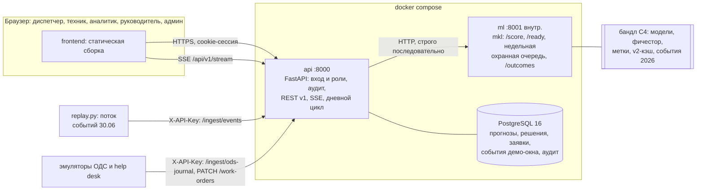

# План команды «Москоллектор»: единый продукт к 29.09 23:59 МСК

Составлен 25.09.2026 и проверен четырьмя независимыми ревью: покрытие ТЗ, реализуемость, контракты против кода, сверка фактов.

**Источники и обозначения в тексте**

| Источник | Обозначение |
|---|---|
| `Materials/ТЗ.txt` | — |
| Полное ТЗ на 16 страниц (`git show origin/main:analysis/tz_extracted.txt`) | «ТЗ §N» |
| Чат задачи `Materials/ChatExport_2026-09-25`: 224 сообщения, последнее от 25.09 11:34 | «[id]» |
| `reports/qa_experts.csv` — таблица с сессии вопросов 16.09 | «QA, тема …» |
| Ветка `origin/feature/catalog-aware-ml` | «CAML» |

Кроме того, использованы данные в `data/` и все 12 веток `origin`.

**Цель.** К 29.09 23:59 заполнить пять полей формы сдачи ([443]): репозиторий, документация, презентация, прототип, доп. материалы. Все пять ведут на один продукт — веб-сервис диспетчера, развёрнутый на стенде. В продукте есть:
- ML-прогноз по трём сценариям;
- журнал прогнозов с фактом наступления;
- решения диспетчера с причиной из справочника;
- черновики заявок и их жизненный цикл;
- журнал событий с потоком;
- уведомления;
- условная схема объектов;
- роли и аудит;
- REST API.

**Архитектура.** Монорепозиторий `Bitmann0/moscollector-predict`, ветка `main`.
- **backend** — FastAPI + PostgreSQL. Публичный API и раздача фронта. Остаётся на своём месте в корне, как сейчас на `main`.
- **`frontend/`** — статическая сборка, её раздаёт backend.
- **`ml/`** — весь ML-проект из CAML, отдельный внутренний сервис.

Фронт ходит только в backend, backend — в ML.

**Стек:** Python 3.12, FastAPI, PostgreSQL 16, LightGBM/XGBoost на CPU, Parquet/DuckDB, Docker Compose, GitHub Actions, Leaflet для условной схемы. Стек фронта выбирает FE (D11).

## Глобальные ограничения

Действуют для каждой задачи плана.

- **Стоп-код 29.09 23:59 МСК** ([443]). После него нельзя пушить в сданные ветки, обновлять стенд, править документы и презентацию по ссылкам. Нарушение — дисквалификация; таймштампы проверяют.
- **Репозиторий** публичный или с гостевым доступом. В корне — `README.md` с инструкцией локального запуска ([443]).
- **Документация** в `.docx` или `.pdf` (ТЗ §19). Разделы по ТЗ §14:
  - методы обработки данных;
  - условия и ограничения;
  - компиляция, сборка, установка;
  - функциональная и компонентная архитектура;
  - перечень всех библиотек и компонентов;
  - комментарии к сложным местам кода.
- **Презентация** в pptx или pdf (ТЗ §15). Слайды 7–11 — строго в дизайне и структуре шаблона. На слайде 10 лишние карточки удалить ([156], [460]).
- **Сервис автономный**, не встраиваемый ([455]).
- **Окружение** (ТЗ §11): сервер на Linux; браузеры Chrome и Яндекс.Браузер; PostgreSQL 12+.
- **Производительность** (ТЗ §9, §11):
  - прогноз — не дольше 300 с на объект;
  - горизонт — не меньше 24 ч;
  - поток обрабатывается не дольше 300 с;
  - не меньше 20 одновременных пользователей без деградации.
- **Безопасность** (ТЗ §11): RBAC и журнал всех действий пользователей. Реальная интеграция LDAP/AD и TLS не требуется, её достаточно описать (QA, тема «MVP»).
- **Системы заказчика** — только на чтение (ТЗ §13).
- **MVP** — это все обязательные пункты ТЗ. Невыполненный пункт допустим, только если причина объяснена в документации (QA, тема «MVP»). Поэтому каждое сокращение P1 превращается в строку «не сделано, причина» в трассировке (раздел 10).
- **Что не кладём в Git:** выгрузки, архивы, БД, пароли, модели, parquet (`CONTRIBUTING.md` на `main`). В публичном README паролей нет.
- **GPU на стенде нет:** ВМ с GPU в Yandex Cloud не поддерживаются ([368]).

---

## 1. Где мы на 25.09

| Что | Факт | Источник |
|---|---|---|
| Кодовые базы | Две кодовые базы без общей истории. `main`: FastAPI + SQLite + ванильный JS, прогноз — эвристическая формула по одному дню 01.08.2026. `src/mkl`: ML со своим FastAPI, без UI | `git merge-base origin/main origin/feat/ml-pipeline` — пусто |
| PR | Ни один из 9 открытых не влит; `main` стоит на `ade33e2` от 15.09 | `gh pr list` |
| Активность | У Bitmann0 нет коммитов в origin после 15.09 22:22. У коллабораторов holodnayazvezda и itbert нет ни одного коммита. Весь `backend/app/static` написан не фронтендером | `git log --all`, `gh api .../collaborators` |
| ML-линия | CAML = `feat/ml-pipeline` + 28 коммитов Александра за 24–25.09. Перемотка проходит без конфликтов. Тесты: 508 из 511, 3 падения — нет данных в снимке | `git merge-tree`, прогон в scratchpad |
| Что ML разрешает показывать | Три сценария: недельная охранная очередь, D (диагностика оборудования), A_link (потеря связи с датчиком). Остальные головы — «не показывать» | CAML `docs/ML_PRODUCT_GATE.md`, `reports/ML_PRODUCTION_STATUS.md`, `docs/ML_BACKEND_HANDOFF.md` |
| REST ML в CAML | `/api/v1/alerts` и `/work-orders` всегда отвечают 409: пилотному гейту нужен журнал выданных рекомендаций, а REST его не принимает | CAML `src/mkl/api.py:46-58`, проверено запуском |
| Свежесть данных | Данные кончаются 2026-06-30. `/ready` без `asof` никогда не вернёт `ready` (`MAX_LIVE_DATA_LAG_DAYS=2`) | CAML `guard_weekly.py:150-190` |
| Модели | `D.pkl` и `A_link.pkl` от 23.09 без `metadata`, гейт их отвергает. `scripts/train_latest.py` не умеет задавать отсечку: принимает только `heads`, `--all-heads`, `--backend`, учит до последнего дня данных и пишет один файл `models/{head}.pkl`. Гейт пропускает модель при `0 < asof − threshold_end ≤ 8` дней у A_link и `≤ 14` у D. Если переобучить на полных данных, A_link годится только для asof 06-30, D — для 06-24…06-30 | CAML `train_latest.py:129-135`, `serve.py:21-22, 237-242`, `heads.yaml:18,212`; прогон `cv.live_windows` |
| `configs/features.yaml` | Генерируется при сборке фичестора, содержит пути и время машины. CAML сознательно убрал его из git (206e23d). Без него скоринг падает на всех головах | CAML `README.md:199-201`, `serve.py:150-158` |
| Дефекты ML-сервиса | 1) Гонка при параллельных запросах (`serve._with_internals`); на `feat/ml-pipeline` три потока дали 97, 38 и 94 алерта вместо 117. 2) 500 вместо пустого ответа на днях без данных: 2024-04-07, 2024-04-08, 2026-06-01. 3) Холодный расчёт дня — 15–30 с. 4) Нет CORS. 5) Нет схем ответов в OpenAPI. **Замеры сделаны на `feat/ml-pipeline`** (9 голов XGBoost); на CAML их повторяет ML2-04 | прогоны в scratchpad |
| Скорость ML (`feat/ml-pipeline`) | Скоринг дня: 3,9–5,1 с без факторов, 13–32 с с факторами (RTX 3060 Ti). Полный пересчёт признаков — 4 949 с | замер; CAML `docs/EVALUATION_AND_RUNTIME.md` |
| Данные | 312 982 076 событий за 2019-01-01…2026-06-30. Иерархия: 11 485 каналов → 78 объектов (29 охранных зон, 49 ДП) → 16 комплексов → 1 район. В 2026 году в среднем 170 530 событий в сутки, 80,5 % из них — газовая телеметрия | DuckDB по `data/interim` |
| Репозиторий | Приватный; видимость меняет только admin — Bitmann0. В истории нет файлов из `Materials` и пароля к архивам. Корневой `.gitignore` на `main` **не** исключает `Materials/`, `models/`, `data/interim/`, `data/features/`: один `git add -A` в рабочей копии с данными отправит их в репозиторий, который станет публичным | `gh api`; `git rev-list --all --objects`; `git log --all -S`; `git show origin/main:.gitignore` |
| Чего нет у команды | `справочник_состояний.csv` (заказчик добавил 23.09, [457]) лежит только у Александра в `data_update_2026-09-24/`. v2-кэш охранной очереди тоже только у него. 25.09 заказчик прислал графики ППР АКМ и ТО АКМ/ДУ на 2026 год (два xlsx, плановые, без внутренних ID объектов) — они тоже только у Александра; он использует их как контекст к газовым алертам, подтверждённых связей с каталогом 0 (CAML `reports/MAINTENANCE_SCHEDULE_INTAKE.md`, `MAINTENANCE_LINK_AUDIT.md`, коммит `f70674e`). Шаблона презентации нет ни у кого | поиск по диску и веткам |
| Чего нет в продукте | PostgreSQL, RBAC, аудит, уведомления, GeoJSON, журнал событий, журнал прогнозов с фактом, справочник причин решения, эмуляция ОДС и help desk, стенд, документация `.docx/.pdf`, презентация | матрица требований (раздел 10) |

---

## 2. Решения, которые PM фиксирует на kickoff сегодня

| # | Решение | Почему | Что отвергаем |
|---|---|---|---|
| D1 | Один репозиторий `Bitmann0/moscollector-predict`, ветка `main`. ML импортируется в `ml/` через `git subtree add` вместе с историей. Бэкенд остаётся в корне | Общей истории нет. Subtree даёт ноль конфликтов и сохраняет обе истории | `merge --allow-unrelated-histories`: 5 конфликтов add/add, в том числе `pyproject.toml` двух разных проектов. Два репозитория: две ссылки, экспертам сложнее |
| D2 | ML-линия — CAML. `feat/ml-pipeline` замораживается | CAML — надмножество, перемотка без конфликтов. В нём продуктовый гейт и суточная политика выдачи | Все 9 голов `feat/ml-pipeline` |
| D3 | Два процесса. `api` — публичный, порт 8000. `ml` — внутренний, порт 8001, только внутри сети compose. Фронт → `api` → `ml` | Разные зависимости. У ML гонка и холодные 15–30 с. Прогнозы лежат в БД, поэтому 20 пользователей не нагружают ML | Импорт `mkl.service` в процесс бэкенда |
| D4 | PostgreSQL 16 в compose вместо SQLite | ТЗ §11: PostgreSQL 12+. Схема всё равно новая | SQLite с объяснением |
| D5 | Диспетчеру показываем три сценария из гейта CAML:<br>• A_link — «Отказ датчика: риск потери связи»;<br>• D — «Износ: плановая диагностика оборудования» (насосы, вентиляторы, ИБП, люки, датчики затопления);<br>• недельная очередь — «НСД: проверка объектов с хроническими охранными тревогами». Это продолжение записанной охранной активности, **не прогноз проникновения** (CAML `guard_weekly.py:6-7`).<br>Пожар и подтопление прогнозом не заявляем. Вместо этого — событийные уведомления по дыму, метану, «Затоплен» и отрицательный результат ML в документации (B, C, E и др. — раздел 11) | Направления выбирает команда (QA). Пожарный риск B — около 6–9 %, дневная охранная очередь C — 22,5 %. Их показ бьёт по критерию «проверка достоверности» (ТЗ §17) | Экспериментальная вкладка с B, C, E |
| D6 | Демо-время. «Сегодня» на стенде — 2026-06-30. Журнал прогнозов предзаполнен:<br>• дневные циклы A_link и D — за 06-01…06-29;<br>• недельная очередь — за все понедельники 2026-01-05…06-29. В январе–июне 2026 она дала всего 14 рекомендаций, а 29.06 — пустой ответ `empty_valid`.<br>События июня видны в журнале, события 30.06 проигрываются потоком. Реальная дата в логике не участвует | Данные кончаются 30.06, а живой режим CAML блокируется по свежести | «Сегодня = 25.09»: пустая выдача |
| D7 | Единые словари действий, причин, исходов, статусов, ролей (C3) | В документах CAML три разных словаря решений (`HANDOFF:104`, `SYNC:34`, `RUNBOOK:41`) | — |
| D8 | PR #2 вливается (перемотка). Жизненный цикл заявок из PR #1 переносится в новую схему, ветка не вливается. PR #3–#9 не вливаются; документы из #9 переносятся в `analysis/`. Ветки не удаляются | #4/#5 — второе хранилище DuckDB на 6,27 ГБ, дублирует parquet строка в строку. `backend/ml` стоит с 20.09 | Вливать всё |
| D9 | Стенд: одна Linux-ВМ (4 vCPU, 16 ГБ, 60 ГБ SSD, без GPU), TLS через Caddy. Плюс вторая чистая ВМ на 2 ч для репетиции. Yandex Cloud по промокоду, если он у команды есть ([368]); иначе любой VPS | Экспертиза идёт 30.09–14.10, стенд всё это время не трогаем | Ноутбук участника |
| D10 | Данные для экспертов:<br>• в README — сборка из их копии датасета (`build_bundle.py`, время прогона записано);<br>• готовый бандл — `.7z` **под тем же паролем, что у датасета организаторов** ([156]; эксперты его знают, нигде его не пишем). Ссылка на бандл — только в поле «Доп. материалы» | В бандле есть сырые события 2026 года (`events_year=2026.parquet`), организаторы раздавали их под паролем | Открытая ссылка на сырые данные; данные в Git |
| D11 | Стек фронта выбирает FE сегодня. Условие: статическая сборка, которая собирается в Docker (multi-stage) и раздаётся `api` | Навыки FE неизвестны | Навязывать фреймворк |
| D12 | Все числа для документов, слайдов и README — только из реестра `ml/reports/SUBMISSION_METRICS.md` (ML1-08). У каждого числа — команда пересчёта | README CAML (строки 70–76) и отчёты CAML расходятся | — |
| D13 | Безопасность стенда:<br>• паролей нет ни в README, ни в git; демо-пароли задаются в `.env` при деплое;<br>• учётные данные для экспертов — только в PDF документации;<br>• демо-настройки (время, воспроизведение) закрыты на стенде (`DEMO_SETTINGS_LOCKED=1`) | После стоп-кода команда не может исправить последствия, если кто-то посторонний поменяет состояние стенда | Пароль admin в публичном README |

---

## 3. Целевая архитектура



### Раскладка репозитория после импорта (PM-05)

```
README.md          обзор, запуск одной командой, как получить данные, ссылки на docs/
.gitignore         + /Materials/ /models/ /data/ catboost_info/ *.parquet *.pkl
compose.yaml       db, ml, api; compose.ci.yaml (ml — заглушка на фикстурах); compose.stand.yaml (Caddy)
Dockerfile         multi-stage: node собирает frontend/ → backend/app/static; python — api
pyproject.toml     зависимости backend (как на main)
backend/app/       FastAPI-приложение; semantics.py (C5)
frontend/          исходники фронта
tests/             тесты backend
ml/                ML-проект целиком: pyproject.toml, src/mkl, configs, scripts, tests, reports, docs, Dockerfile, .dockerignore
contracts/         ml_v1.md, api_v1.md, vocabularies.json, fixtures/*.json
docs/              DECISIONS.md, этот план, исходники документации для сдачи
analysis/          аудиты из main + документы из PR #9
scripts/           preload_demo.py, replay.py, emulate_ods.py, emulate_helpdesk.py, fetch_bundle.sh/.ps1, load_test
```

**Корень ML.** `ml/` становится самостоятельным корнем: `MKL_ROOT` по умолчанию равен `parents[2]` от `ml/src/mkl/config.py`, то есть `ml/`. В `ml/.gitignore` четыре строки `data/*` заменяются одной — `/data/`.

**Как ML-инженеры подключают данные.** Локально данные не копируются, а подключаются junction-ссылками:

```bat
set DATA_ROOT=U:\hackathon
cmd /c mklink /J ml\data %DATA_ROOT%\data
cmd /c mklink /J ml\models %DATA_ROOT%\models
cmd /c mklink /J ml\Materials %DATA_ROOT%\Materials
```

**Раскладка ML-контейнера.**
- Образ копирует `ml/` в `/srv/ml` (это `MKL_ROOT`), поэтому `configs/heads.yaml` и `reports/*.json` из git лежат в образе.
- Бандл монтируется томами в `/srv/ml/data` и `/srv/ml/models`.
- Файлы `configs/features.yaml` и `reports/intrusion_eventtime_v2_build.json` из бандла монтируются поштучно. Второй обязан совпадать с v2-кэшем (`validate_cache_day`).
- `ml/.dockerignore` исключает `data/`, `models/`, `Materials/`, `experiments/`, `catboost_info/`.

### Дневной цикл `run_daily(D)` в `api`

1. **Приём событий (режим потока).** События дня D уже пришли через `/ingest/events`: сохранены, классифицированы. Классы `alarm` и `critical` ушли в SSE.
2. **Расчёт.** `api` вызывает `POST ml/api/v1/score` с `asof=D`. Параметр `issued_histories` берётся из `issued_log` (правило — в C1). Ответ приходит поголовно (C1): алерты, покрытие, черновики заявок, статус каждой головы.
3. **Недельная очередь.** По понедельникам `api` вызывает `GET ml/api/v1/guard-weekly-inspections?asof=D`. На дне без данных (01.06) ответ — `no_data`.
4. **Сохранение.** `api` делает upsert прогнозов по `alert_id` или `recommendation_id` с историей версий. Затем создаёт черновики заявок, перезаписывает записи `issued_log` за (голова, D) и отправляет SSE `alert.new`.
5. **Факт.** По прогнозам, у которых `valid_to ≤ demo_now`, `api` вызывает `POST ml/api/v1/outcomes` и получает факт по данным СМВУ.

Вызовы ML идут строго последовательно.

### Демо-режимы стенда

**Предзаполнение** — `scripts/preload_demo.py` (PM-09):
1. Очищает `issued_log` окна.
2. Идёт строго по возрастанию дат 06-01…06-29 с `history_complete_from=2026-05-25` (начало окна минус 7 дней: до 06-01 сервис ничего не выдавал).
3. Проходит недельную очередь за все понедельники полугодия.
4. Запрашивает факт.
5. Засевает **эмулированные решения и итоги проверки** на основе факта, с полем `source=emulated`. Интерфейс их помечает, документация описывает (QA, темы «Журнал ОДС», «Целевая переменная»: имитировать самостоятельно).

Время прелоада замеряет ML2-04. Оценка: 29 вызовов по 5–30 с плюс 25 недельных — около 5–20 мин.

**Поток 30.06.**
- `replay.py --loop --align-to-clock` подаёт события 30.06 в реальном темпе, время суток выровнено по часам МСК.
- В 00:00 он удаляет события 30.06 через `DELETE /api/v1/ingest/day/2026-06-30` (роль `integration`) и начинает заново.
- `run_daily(2026-06-30)` в цикле **не запускается**. Текущие прогнозы «на сегодня» — это расчёт за 06-29 с окном 06-30. Поэтому ночные повторы `alert.new` не возникают.
- Ускоренный показ ×600 (сутки за 2,4 мин плюс расчёт на 07-01) — только по кнопке админа для видео. На стенде кнопка закрыта (D13).

**Ограничение, которое пишем в документации.** Признаки дня берутся из предрасчитанного фичестора, а не из пришедших событий. Инкрементального расчёта признаков нет; полный пересчёт занимает 4 949 с.

---

## 4. Контракты между участниками

Правила для всех контрактов:
- Файлы лежат в `contracts/`.
- Версия v1 замораживается **в Сб 26.09 12:00**. После этого — только добавления (новые необязательные поля и эндпоинты).
- Ломающее изменение — через PM, с аппрувом обеих сторон PR.

Черновики ниже — стартовая точка, чтобы FE и BE начали сегодня.

### C1. ML → backend

Владелец — ML-1, потребитель — PM-09 (дневной цикл) и BE.

| Метод и путь | Статус | Что делает |
|---|---|---|
| `GET /health` | есть | `{status, schema_version, heads_configured, heads_trained[]}` |
| `GET /ready?asof=` | **добавить `asof`** | Готовность данных и моделей на дату. Статусы: `ready, missing_data, stale, stale_source, future_source, error` |
| `GET /api/v1/directions` | есть | Направления и головы с `horizon_hours`, `budget_per_day` |
| `POST /api/v1/score` | **новый** | Дневной расчёт пилотных голов с журналом выданного, поголовно |
| `GET /api/v1/guard-weekly-inspections?asof=<понедельник>` | есть; **на дне без данных — 200 `no_data` вместо 409** | Недельная охранная очередь |
| `POST /api/v1/outcomes` | **новый** | Факт по списку выданного |
| `GET /api/v1/reference/channels` | **новый**, P2 | `channels.parquet` в JSON |

**`POST /api/v1/score`.** Запрос:

```json
{"asof": "2026-06-15",
 "heads": ["A_link", "D"],
 "issued_histories": {"A_link": [{"channel": 104049, "sent_day": "2026-06-10"}],
                      "D": [{"channel": 120578, "sent_day": "2026-06-12"}]},
 "history_complete_from": "2026-05-25",
 "with_factors": true}
```

Ответ:

```json
{"schema_version": "1.0", "asof": "2026-06-15",
 "heads": {
   "A_link": {"result_status": "ok", "model_version": "…", "threshold_end": "2026-06-08",
              "model_lag_days": 7, "threshold_feasible": true, "detail": null},
   "D":      {"result_status": "empty_valid", "model_version": "…", "threshold_end": "2026-05-31",
              "model_lag_days": 15, "threshold_feasible": true, "detail": null}},
 "data_snapshot": {"data_last_day": "2026-06-30"},
 "alerts": [ …Alert… ], "coverage": [ …Coverage… ], "work_orders": [ …WorkOrder… ]}
```

**Правила C1.**

- **Поголовный расчёт.** Каждая голова считается отдельным вызовом `alerts_for_head` в своём `try`. Сейчас `daily_alerts` с явным `heads` падает на первой же ошибке, и отказ A_link уничтожает выдачу D (`service.py:168-177`).
- **Статус головы** — `ok | empty_valid | no_data | stale | error`.
- **`threshold_feasible`** равен `artifact.threshold <= 1.0`. Если значение `false`, голова молчит. Это не ошибка, и в интерфейсе оно показывается отдельно от `empty_valid`.
- **`Alert`** — как в `src/mkl/contract.py` (`SCHEMA_VERSION="1.0"`):
  - идентификация и сценарий: `alert_id, case_key, head, direction, direction_title, title`;
  - дата и окно: `asof, valid_from, valid_to, horizon_hours`;
  - оценка: `risk, rank, in_budget, above_threshold`;
  - адрес: `address{obj, obj_parent, obj_kind, channel, segment, picket, obj_name, obj_parent_name, obj_kind_ru, sensor_name, sensor_type, tag, picket_label, segment_label, address_known}`;
  - служебное: `status, status_note, model_version, feature_signature`;
  - объяснение: `factors[{feature, label, contribution}]`.
- **`WorkOrder`** — как в `workorders.py` плюс `obj_name` и `obj_parent_name`. Значения `priority` приходят по-русски («срочная», «плановая», «наблюдение»), `status` — «новая». Соответствие кодам задаёт C3.
- **`coverage`** — только пилотные головы. У D знаменатель — каналы оборудования, а не все 11 485: иначе на 2026-06-30 выходит 347/11 485 = 3,0 %, и это читается как «D почти ничего не покрывает».
- **Время.** Даты без таймзоны означают Europe/Moscow; `valid_from = asof + 1 сутки 00:00`. PM-09/BE добавляет `+03:00`.
- **Факторы.** `factors.contribution` — вклад в log-odds некалиброванной модели, а не вероятность. На экране — полоса без процентов.
- **`issued_log`** (журнал выданного):
  - Туда попадают **все** строки ответа `/score` с `in_budget=true` по (голова, asof) — независимо от того, видел ли их человек (`ML_BACKEND_HANDOFF.md:76-80`).
  - Повторный расчёт того же asof **заменяет** записи этого дня.
  - Предзаполнение очищает журнал окна и идёт по возрастанию дат.
  - Тест: два прогона одного дня дают одинаковую выдачу; на восьмой день канал снова может быть выдан.
- **Порог и лимит** на бэкенде не переопределяются.
- **Недельная очередь** — как в `guard_weekly.py:98-146`:
  - заголовок: `schema_version, asof, valid_from=D+2, valid_to=D+9` (граница не входит), `next_run, target, target_version, model_version, action, score_type="relative_priority_not_probability", result_status`;
  - `priorities[]`: `obj, rank, recommendation_id, case_key, priority_score, recent_alarm_days_7, recent_alarm_days_30, guard_state_age_days, evidence, obj_name, obj_parent_name, address_known`;
  - upsert идёт по `recommendation_id`; `case_key` — ключ группировки, не уникальный.
- **`POST /api/v1/outcomes`.**
  - Запрос: `[{id, kind, head, entity: {channel|obj}, asof}]`.
  - Ответ: `[{id, outcome: hit|miss|unknown}]`.
  - Строки, которых нет в таблице меток (день не наблюдаем, `labels._observable`), дают `unknown`.
  - Метки считаются по бандлу. BE запрашивает только то, у чего `valid_to ≤ demo_now`.
- **Скорость.** `/score` отвечает не дольше 30 с на день на CPU стенда. Факторы считаются только для строк в бюджете. Внутри ML параллельные вызовы сериализуются замком.

### C2. Backend → frontend

Владелец — BE, потребитель — FE. Фикстуры `contracts/fixtures/api_*.json` к Сб 10:00 пишут PM и FE по примерам ниже, BE их ревьюит.

**Общие правила.**
- Префикс `/api/v1`.
- Аутентификация:
  - для людей — HttpOnly cookie-сессия (`EventSource` не умеет ставить заголовки);
  - для машинных клиентов (проигрыватель, эмуляторы, внешние системы) — роль `integration` и заголовок `X-API-Key`.
- Список: `{items: [...], total, page, page_size}`.
- Ошибка: `{detail, code}`; 409 — конфликт версий.
- Все ответы описаны pydantic-моделями, поэтому в `/openapi.json` есть схемы.

| Метод и путь | Роли (по матрице C3) | Назначение |
|---|---|---|
| `POST /auth/login`, `POST /auth/logout`, `GET /me` | все | Вход; `{login, name, role}` |
| `GET /system/status` | все | `{demo_today, mode, ml_ready{status, data_last_day}, heads{…статус головы из C1…}, last_run{asof, finished_at}}` |
| `GET /dashboard/summary` | все | KPI: открытые прогнозы по сценариям, охват, заявки по статусам, тревоги за 24 ч, «сработки, похожие на плановые работы» (C5), статус головы; ряды для двух диаграмм |
| `GET /forecasts?scenario&from&to&decision&outcome&obj&group_by&page` | все | Журнал прогнозов (ТЗ §10) |
| `GET /forecasts/{id}` | все | Карточка: поля списка, `factors[]` (у недельной очереди — `evidence` и счётчики за 7 и 30 дней), `coverage`, `versions[]`, `decisions[]`, исходы, `work_order_id`, `dynamics_30d[]` (тревоги и плохие состояния по дням), `calendar` (день недели, праздник) |
| `GET /reason-codes` | все | Справочник причин (C3) |
| `POST /forecasts/{id}/decisions` `{action, reason_code, comment}` | dispatcher, admin | Решение диспетчера (ТЗ §12, шаг 5) |
| `POST /forecasts/{id}/outcome` `{outcome, comment, event_at?, channel?}` | dispatcher, technician, analyst, admin | Итог проверки; `event_at` и `channel` — будущие метки для ML (`BACKEND_ML_SYNC.md:34-37`) |
| `GET /work-orders`, `GET /work-orders/{id}` | все | Заявки и история переходов |
| `POST /work-orders` `{forecast_ids[]}` | dispatcher, manager, admin | Черновик вручную |
| `PATCH /work-orders/{id}` `{expected_status, status, reason}` | по матрице C3; также `integration` | Переход статуса; при гонке — 409 |
| `GET /events?from&to&obj&sensor_type&event_class&q&page` | все | Журнал событий |
| `POST /ingest/events` (JSON, CSV или XLSX) | analyst, admin, integration | Приём журнала СМВУ (ТЗ §7). Ответ: `{batch_id, rows_total, accepted, duplicates, rejected, outside_demo_window, status}`. Лимит файла указан в документации |
| `DELETE /ingest/day/{date}` | integration | Сброс дня для цикла проигрывателя |
| `POST /ingest/ods-journal` (JSON, CSV) | analyst, admin, integration | Приём журнала ОДС (ТЗ §7): время, объект, тип записи, решение, причина |
| `GET /ingest/batches` | analyst, admin | История загрузок |
| `GET /reference/tree` | все | Район → 16 комплексов → 78 объектов; число каналов, диапазон пикетов |
| `GET /schema.geojson?complex=`, `GET /schema.wkt?complex=` | все | Условная схема (ТЗ §7: GeoJSON, WKT) |
| `GET /quality?scenario` | все | Агрегат по БД за окно демо, по неделям: выдано, попало, мимо, неизвестно, precision. Базовую ставку и правило подписывает из реестра ML1-08 |
| `GET /stream` (SSE) | все | `alert.new`, `event.alarm` (для `event_class ∈ {alarm, critical}`, класс в payload), `run.finished`, `workorder.changed` |
| `GET /notifications`, `POST /notifications/{id}/read` | все | Лента уведомлений |
| `GET /export/forecasts.xlsx?from&to` | dispatcher, analyst, manager, admin | Отчёт (ТЗ §8), P2 |
| `GET /audit?user&from&to` | admin | Журнал действий (ТЗ §11) |
| `GET/PUT /settings` | admin | `demo_today` и воспроизведение; на стенде закрыто `DEMO_SETTINGS_LOCKED=1` |

Элемент журнала прогнозов:

```json
{"id": "90e4f07318bf373c", "kind": "alert", "scenario": "sensor_link",
 "scenario_title": "Отказ датчика: риск потери связи", "head": "A_link",
 "asof": "2026-06-29", "valid_from": "2026-06-30T00:00:00+03:00",
 "valid_to": "2026-07-01T00:00:00+03:00", "horizon_hours": 24,
 "score_type": "probability", "risk": 0.61, "priority_score": null, "rank": 3,
 "object": {"id": "3215", "name": "объект Йота", "complex_name": "…", "kind_ru": "охранная зона"},
 "channel": {"id": 104049, "name": "…", "sensor_type": "КД АВ", "picket_label": "ПК 14"},
 "data_status": "ok", "decision": null, "outcome_auto": "unknown", "outcome_manual": null,
 "source": "live", "work_order_id": null, "case_key": "f40242afd7476328"}
```

### C3. Словари

Владелец — PM; на kickoff подтверждают ML-1, BE и FE. Файл — `contracts/vocabularies.json`.

| Словарь | Значения |
|---|---|
| `scenario` | `sensor_link` (A_link), `equipment_diag` (D), `guard_weekly` (недельная очередь) |
| `kind` | `alert`, `weekly_recommendation` |
| `score_type` | `probability` (A_link, D); `relative_priority` (недельная очередь; в ML — `relative_priority_not_probability`) |
| `source` | `live` (расчёт сервиса), `emulated` (засеяно прелоадом, помечается в UI) |
| `action` | `dispatch_crew` — выезд бригады; `remote_check` — удалённая проверка или мониторинг; `defer` — отложить; `reject` — отклонить. Для ML: `check` = `dispatch_crew` или `remote_check` |
| `reason_code` (ТЗ §12, «причина из справочника») | При `reject`: `false_alarm` — ложное срабатывание; `planned_works` — плановые работы: ППР, поверка, огневые работы ([462]); `sensor_fault` — неисправность датчика; `duplicate` — уже отработано.<br>При `dispatch_crew` и `remote_check`: `confirmed_by_readings` — подтверждено показаниями; `confirmed_by_camera` — подтверждено камерами; `preventive` — профилактика по рекомендации.<br>При `defer`: `no_crew` — нет бригады; `await_data` — ждём данных |
| `outcome_manual` | `confirmed_event`, `sensor_fault`, `normal_activation`, `no_event`, `unknown` (совпадает с `BACKEND_ML_SYNC.md:34-37`) |
| `outcome_auto` (от ML) | `hit`, `miss`, `unknown`. «Неизвестно» не приравниваем к «не наступило» |
| `result_status` | `ok`; `empty_valid` — расчёт успешен, кандидатов нет, это не ошибка; `no_data`; `stale`; `error` |
| Статусы заявки | `draft` → `confirmed` (подтвердил человек) → `in_progress` → `completed`. `cancelled` — из `draft`, `confirmed` или `in_progress`. Автоматически создаётся только `draft` (`ML_BACKEND_HANDOFF.md`). Соответствие ML: «новая» = `draft` |
| Приоритет заявки | `urgent` = «срочная», `planned` = «плановая», `watch` = «наблюдение» (`workorders.py:35-45`) |
| `event_class` | `normal`, `warning`, `alarm`, `critical`, `fault`, `service` (C5) |

**Матрица прав.** Роли взяты из ТЗ §3 и §12 и ответа [421]; к ним добавлена служебная `integration`.

| Действие | dispatcher | technician | analyst | manager | admin | integration |
|---|:-:|:-:|:-:|:-:|:-:|:-:|
| Смотреть дашборд, журналы, карточки | ✓ | ✓ | ✓ | ✓ | ✓ | |
| Решение по прогнозу | ✓ | | | | ✓ | |
| Итог проверки | ✓ | ✓ | ✓ | | ✓ | |
| Создать, подтвердить или отменить заявку | ✓ | | | ✓ | ✓ | |
| Перевести заявку в `in_progress` или `completed` | | ✓ | | | ✓ | ✓ |
| Загрузить журнал СМВУ или ОДС | | | ✓ | | ✓ | ✓ |
| Экспорт | ✓ | | ✓ | ✓ | ✓ | |
| Настройки, демо-время, аудит | | | | | ✓ | |

### C4. Бандл данных

Владелец — ML-2; потребители — ML-1, PM, BE.

**Состав:**
- `models/{head}@{threshold_end}.pkl` — артефакты окна (ML1-05b) и полные;
- `data/features/{sensor,object,segment}.parquet`;
- `data/interim/`:
  - `channels.parquet`;
  - метки для `/outcomes`: `daily_channel`, `episodes`, `group_outages`;
  - `weather.parquet`;
  - `events_year=2026.parquet`;
  - v2-кэш охранной очереди;
- `configs/features.yaml`;
- `reports/intrusion_eventtime_v2_build.json`;
- `MANIFEST.sha256`.

**Упаковка и хранение:**
- формат — `.7z` под паролем датасета организаторов (D10);
- версии — `bundle-YYYYMMDD-N`;
- лежит в общей папке команды;
- **v0** в пятницу вечером выкладывает Александр: только у него есть v2-кэш и справочник состояний.

### C5. Приём событий и семантика

Владелец — ML-2; потребители — BE и FE.

**Формат пачки** — как в `Materials/журнал_событий_пример.csv`: `ид_события, ид_канала_данных, дата, время, тревожное, значение_датчика`.
- `тревожное` принимает `t/f/true/false` без учёта регистра.
- `значение_датчика` читается строкой.
- JSON — до 5 000 строк; CSV и XLSX принимает тот же эндпоинт.

Формат Приложения 1 ТЗ другой: ИД записи, ИД канала, ИД типа канала, текущее значение с запятой, одна «дата записи». В документации — таблица соответствия полей. Строки с датой позже `demo_today` (весь пример датирован 2026-08-01) принимаются отдельной партией со статусом `outside_demo_window`.

**Дедупликация** — по полному кортежу после нормализации, как в `mkl/ingest.py`, а не по `ид_события`. В 2021–2023 годах `ид_события` переиспользуется, и дедупликация по нему удаляла 1 669 268 настоящих событий (`c38dbb3`).

**Семантика.** Функция `backend/app/semantics.py: classify(sensor_type, val_raw, val_num, alarm) -> (event_class, title, hint)`, чистый Python. Порядок источников:
1. Исходный флаг `тревожное` плюс текст состояния.
2. Правила по типу датчика:
   - **газ (% объёма метана, [457]):** `<0` → `fault` (в 2020 году 1 005 704 таких значения, в 2021 — 675 009); от 1 до 5 → `alarm`; от 5 → `critical` (при 5–15 % возможно воспламенение); `327,68` и выше физического максимума → `fault`;
   - **температура:** вне −60…150 → `fault`;
   - **дата `01.01.1970 03:00:0x`** → `fault` ([457]).
3. `справочник_состояний.csv` — только как подсказка, где тип совпал однозначно. Он покрывает 3,96 % текстовых строк, в нём есть противоречия, 9 типов отсутствуют (CAML-аудит `UPDATED_CATALOG_AUDIT_2026-09-24.md`).

Числовое превышение метана и текст «Обнаружен газ» на одном канале в пределах 5 минут склеиваются в одно уведомление: в 363 из 370 канало-суток они идут парой.

**Восстановленная разметка вероятных ложных сработок.** «Обнаружен газ» в будни с 9:00 до 14:59 получает `hint="вероятно, плановая проверка"`. На это окно приходится 88,6 % таких записей (19 307 из 21 784); заказчик подтвердил поверки баллонами ([462]). Сработка не отклоняется автоматически: метка идёт в журнал событий и в KPI дашборда.

**Тесты** — на реальных парах из журнала, включая отрицательный газ 2020–2021 годов, и на покрытие справочника.

---

## 5. Задачи по ролям

**Обозначения.**
- **P0** — без этого не сдаём. Сюда входят все обязательные пункты ТЗ, для которых есть путь.
- **P1** — оценивается или разрешена эмуляция. Если режем, в трассировке пишем «не сделано, причина».
- **P2** — режем первым.
- Ч — оценка в часах, не замер. Сроки — по МСК.

**Роли по никам GitHub** (уточняются на kickoff):
- ML-1 — Александр Щербаков (skyll1111);
- BE — предположительно Bitmann0;
- ML-2 и FE — holodnayazvezda и itbert; кто из них кто, не знаю;
- PM — Денис (stuffy-man), автор `feat/ml-pipeline`; поэтому он берёт дневной цикл.

### PM (Денис)

| ID | Задача | P | Ч | Срок | Даёт другим / готово, когда |
|---|---|:-:|:-:|---|---|
| PM-01 | Kickoff на 60 мин: подтвердить роли и часы каждого на 26–29.09, утвердить D1–D13 и C3 | P0 | 1 | Пт 25.09, вечер | `docs/DECISIONS.md` |
| PM-02 | Попросить Bitmann0 сделать репозиторий публичным. Перед этим и перед тегом во Вт повторить проверку: `git rev-list --all --objects \| grep -E '\.(csv\|parquet\|pkl\|7z)$'` должна вернуть пусто | P0 | 0,5 | Вс 27.09 18:00 | Открывается без входа. **Запасной вариант**, если нет ответа до Сб 18:00: `git push --mirror` в новый публичный репозиторий PM |
| PM-03 | С российского IP скачать шаблон презентации (`mostech-cloud.mos.ru/s/bnxfqRnTp3c7eke`) и PDF ТЗ (`…/a45XkSdHgDZCY4N`) — для FE нужно Приложение 2 | P0 | 0,5 | Пт 25.09 | Файлы в общей папке |
| PM-04 | Общая папка команды. Александр выкладывает бандл v0: `data/interim`, `data/features`, v2-кэш, `channels.parquet`, `справочник_состояний.csv`, графики ППР и ТО (xlsx от 25.09), модели после ML1-05a | P0 | 0,5 | Пт 25.09, ночь | ML-2, BE и FE работают с данными с субботы |
| PM-05 | **Монорепозиторий** (критический путь; ревьюит BE). Всё в **свежем клоне без данных**:<br>1) корневой `.gitignore`: `/Materials/ /models/ /data/ catboost_info/ *.parquet *.pkl`;<br>2) влить PR #2;<br>3) `git switch -c chore/monorepo && git subtree add --prefix=ml origin/feature/catalog-aware-ml`;<br>4) в `ml/.gitignore` — `/data/`;<br>5) каркас `contracts/`;<br>6) этот план — в `docs/`;<br>7) job `ml` в CI (`pip install -e ml[api,dev]`, `pytest ml/tests` с пропуском `test_address`, `test_config::test_paths_exist`, `test_db`);<br>8) в README — раздел «Состав репозитория».<br>Перед мёржем — `git subtree pull --prefix=ml origin feature/catalog-aware-ml`. Мёрж через **Create a merge commit** — единственное исключение из squash, иначе теряется история subtree | P0 | 3 | Сб 26.09 12:00 | На `main` есть `ml/` и `contracts/`, CI зелёный |
| PM-06 | `compose.ci.yaml`: `ml` как заглушка на фикстурах ML1-02. Новый `scripts/smoke_compose.py` под C2 вместо смоука PR #2, который проверяет старые эндпоинты | P0 | 2 | Сб 26.09 16:00 | CI не ломается, когда BE меняет API |
| PM-07 | Issues для всех ID плана через `gh issue create` | P0 | 1 | Пт 25.09 | Доска |
| PM-08 | Вместе с FE — фикстуры `contracts/fixtures/api_*.json` по C2 | P0 | 2 | Сб 26.09 10:00 | FE начинает без BE |
| PM-09 | `run_daily(asof)` по разделу 3 и `scripts/preload_demo.py`, включая эмулированные решения. Вызовы ML последовательные, таймаут 120 с, статус каждой головы пишется в `forecast_runs`. Черновики заявок берутся из `work_orders`; для недельной очереди — «проверка охранной сигнализации объекта» со сроком `valid_to`. До ML1-05b работает на фикстурах и моделях ML1-05a. Шаг «факт» — после ML1-07 | P0 | 7 | Вс 27.09 14:00; факт — Вс 18:00 | Журнал прогнозов с данными — для BE-05 и FE |
| PM-10 | Стенд по D9: Ubuntu 24.04, Docker, домен, `TZ=Europe/Moscow`. Деплой вместе с BE: `compose.stand.yaml` с Caddy и TLS, прелоад, проигрыватель как сервис, смоук. Вторая чистая ВМ — на Пн 18:00–20:00 | P0 | 3,5 | ВМ — Вс 15:00; деплой — Вс 22:30; финал — Вт 17:00–18:00 | Адрес для формы |
| PM-11 | Заранее заполнить все 5 полей формы. Дальше меняем содержимое, ссылки не трогаем ([443], [470]) | P0 | 0,5 | Вс 27.09 23:30 | Форма сохранена |
| PM-12 | Сопроводительная документация `.pdf` и `.docx`. Разделы пишут владельцы (раздел 8), PM собирает. Трассировка «требование → сделано / эмулировано / не делаем, почему» (раздел 10). Учётные данные для проверки — только здесь (D13) | P0 | 6 | черновик Пн 22:00, финал Вт 20:00 | PDF по ссылке из формы |
| PM-13 | Полная презентация (ТЗ §15), слайды 7–11 по шаблону; все числа — из реестра ML1-08 | P0 | 6 | черновик Пн 22:00, финал Вт 20:00 | PDF по ссылке из формы |
| PM-14 | Видео на 3–5 мин на стенде по ТЗ §12:<br>• прогноз → уведомление → проверка → решение с причиной → журнал;<br>• заявка по недельной очереди (на неделе с непустой выдачей);<br>• поток событий;<br>• прогноз против факта;<br>• одна фраза о горизонтах | P1 | 2 | Вт 29.09 12:00–15:00 | Файл в доп. материалах |
| PM-15 | Регламент стоп-кода (раздел 8) | P0 | — | Вт 29.09 | — |
| PM-16 | Одно сообщение в чат задачи: будет ли график огневых работ ([462], [474]) и сколько должен жить стенд | P2 | 0,2 | Сб 26.09, утро | — |

### ML-1 (Александр Щербаков) — ML-сервис как компонент продукта

| ID | Задача | P | Ч | Срок | Зависит от / даёт |
|---|---|:-:|:-:|---|---|
| ML1-05a | `train_latest.py D A_link` на полных данных: модели для asof 06-30 (у A_link окно порога 05-31…06-29, у D — 05-25…06-23). Замерить время обучения — от него зависит ML1-05b | P0 | 1 + прогон | Пт 25.09, ночь | Нужно для ML1-02, бандла v0 и `/score` в Сб |
| ML1-02 | Фикстуры в `contracts/fixtures/`:<br>• `ml_score_2026-06-30.json` — `daily_alerts(2026-06-30, issued_histories={"A_link":[], "D":[]}, history_complete_from=2026-06-23, only_in_budget=False)`;<br>• `ml_guard_weekly_<непустой понедельник>.json` — ближайший с непустой выдачей, 06-08/15/22 или раньше;<br>• `ml_guard_weekly_2026-06-29_empty.json`;<br>• `ml_directions.json`, `ml_coverage.json` | P0 | 1 | Сб 26.09 10:00 | Нужно для PM-06, PM-09 |
| ML1-01 | Запушить всё в CAML до импорта; после — работать только в `ml/`. `configs/features.yaml` в git **не** возвращать: он ходит в бандле, в CI генерируется из фикстур | P0 | 0,5 | Сб 26.09 10:00 | Нужно для PM-05 |
| ML1-03 | Эндпоинты C1:<br>• `POST /api/v1/score` с поголовным статусом, `threshold_end`, `model_lag_days`, `threshold_feasible`;<br>• `GET /ready?asof=`;<br>• покрытие только пилотных голов, у D — знаменатель по оборудованию;<br>• `WorkOrder` с `obj_name` и `obj_parent_name`;<br>• тесты на контракт | P0 | 4 | Сб 26.09 18:00 | Нужно для PM-09 |
| ML1-05b | Общая основа обоих вариантов демо-окна:<br>• `train_latest.py --source-end C` — обрезать `daily_channel`, `episodes` (по концу эпизода), `group_outages` и фичестор по C **до** `labels.build_for_head`;<br>• `--out` с именем `models/{head}@{threshold_end}.pkl`;<br>• выбор артефакта по asof в `serve.score` и в ключе кэша `api._cache_generation`.<br>Вариант (а): каждый asof из 06-01…06-30 попадает в допустимую задержку какого-то артефакта. Оценка: не меньше 4 моделей A_link и 3 моделей D; отсечки считает ML-1. Вариант (б): одна пара с `--source-end 2026-05-31`, снимается только верхняя граница задержки, `model_lag_days` виден в UI. В обоих вариантах порог выбран до показываемых дней, поэтому «прогноз против факта» остаётся вне выборки. **Выбор (а)/(б) — Сб 10:00**, по времени ML1-05a | P0 | 7 | код — Сб 22:00; модели — Вс 09:00 (обучение ночью) | Нужно для PM-09 (прелоад), бандла v2 |
| ML1-04 | Устойчивость:<br>• `threading.Lock` вокруг скоринга;<br>• день без данных → 200 `no_data` для `/score` и недельной очереди;<br>• `status` алерта — по факту;<br>• факторы только в бюджете.<br>**Готово, когда:** 3 параллельных запроса дают одинаковый ответ; `asof=2026-06-01` → `no_data` | P0 | 3 | Вс 27.09 12:00 | Нужно для PM-09 |
| ML1-07 | `POST /api/v1/outcomes` по C1. `outcome()` из `evaluate_guard_weekly_pilot.py` вынести на уровень модуля с параметром `start` | P0 | 3 | Вс 27.09 16:00 | Нужно для факта в журнале, FE-03, FE-09 |
| ML1-11 | Условная схема из `channels.parquet`, отдаётся эндпоинтом в `backend`:<br>• комплекс — полилиния, объекты — точки по диапазону пикетов, каналы — по пикету;<br>• 847 каналов без пикета — счётчиком;<br>• `properties.note = "условная схема, не географические координаты"`;<br>• в каждом объекте поле `wkt`, эндпоинт `/schema.wkt`;<br>• `risk_level` и `open_forecasts` берутся из БД | P0 | 4,5 | Вс 27.09 20:00 | Нужно для FE-07 |
| ML1-12 | Документы из PR #9 (`ORGANIZER_UPDATES`, `UPDATED_CATALOG_AUDIT`, `MULTI_HEAD_ML_STRATEGY`) — в `analysis/` | P0 | 0,5 | Сб 26.09 | Материал для документации |
| ML1-08 | Реестр `ml/reports/SUBMISSION_METRICS.md` и `.json`.<br>• По каждому сценарию: метка, период, способ оценки (временная или ретроспективная), лимит, precision, охват, правило, рекомендаций в сутки, файл-источник и **команда пересчёта** на бандле (`docker compose run ml python scripts/…`).<br>• Отклонённые головы с числами, включая E.<br>• В `ml/README.md` убрать устаревшее: таблицу 0,758 / 0,950 / 0,781 (стр. 70–76), «2,4 с» (стр. 61), «244 → 141» (стр. 300), «370 тестов» (стр. 402).<br>**Заморозка — Пн 15:00** | P0 | 4 | Пн 28.09 15:00 | Нужно для PM-12, PM-13, FE-09 |
| ML1-09 | Раздел документации «ML: постановка, метки, протокол проверки, ограничения». Туда же: почему не P > 0,7 и R > 0,5 (раздел 11); почему 7 суток у D и неделя у охранной очереди (QA, тема «Горизонт») | P0 | 4 | Пн 28.09 18:00 | Нужно для PM-12 |
| ML1-13 (ex BE-10) | Бэкап `pg_dump` по cron и проверенное восстановление. Нагрузочный замер на 20 пользователей (locust или k6, 10 мин) на стенде | P0 | 3 | Пн 28.09 21:00 | Раздел «Надёжность и производительность» |
| ML1-10 | Дообучение как функция: `docker compose run ml python scripts/train_latest.py --out models/retrain/…`. В README — предупреждение: **не на стенде**, иначе перезапишутся артефакты окна | P1 | 1 | Пн 28.09 | — |

### ML-2 — данные, события, образ ML, замеры

| ID | Задача | P | Ч | Срок | Зависит от / даёт |
|---|---|:-:|:-:|---|---|
| ML2-10 | `ml/Dockerfile`:<br>• `python:3.12-slim` + `libgomp1`;<br>• версии по `.venv`: xgboost 3.4.1, scikit-learn 1.9.1, lightgbm 4.7.0, catboost 1.2.10, polars 1.44.2, numpy 2.5.3, duckdb 1.5.5, pyarrow 25.0.1, pandas 3.0.5;<br>• раскладка томов из раздела 3, `ml/.dockerignore`, `--host 0.0.0.0 --port 8001`, прогрев кэша.<br>**Готово, когда:** на Linux модели ML1-05a грузятся в контейнере и `/health` отвечает ok | P0 | 3 | Сб 26.09 14:00 | Нужно для чекпойнта Сб, PM-10 |
| ML2-01 | `backend/app/semantics.py` по C5 и тесты: отрицательный газ 2020–2021, покрытие справочника, склейка «число + текст», метка плановой проверки | P0 | 5 | Сб 26.09 18:00 | Зависит от PM-04. Нужно для ML2-03, KPI FE-02 |
| ML2-09 | Русские подписи факторов пилотных голов: не меньше 90 % по замеру на CAML | P0 | 1 | Сб 26.09 19:00 | Нужно для FE-04 |
| ML2-02 | Бандл C4: v1 — `MANIFEST.sha256`, `scripts/fetch_bundle.sh` и `.ps1` (Сб 21:00); v2 — `ml/scripts/build_bundle.py` и артефакты ML1-05b (Вс 20:00) | P0 | 4 | Сб 21:00 / Вс 20:00 | Нужно для PM-10 |
| ML2-03 | **Вертикальный срез «события»** (ревьюит BE):<br>• `POST /ingest/events` (JSON, CSV, XLSX) — валидация, дедупликация, счётчики, `outside_demo_window`;<br>• `DELETE /ingest/day/{date}`;<br>• таблицы `events` и `ingest_batches` по схеме BE-02;<br>• `GET /events`;<br>• `scripts/replay.py --day --speed --loop --align-to-clock` с записью задержки «событие → БД» | P0 | 8 | Вс 27.09 18:00 | Зависит от BE-00, BE-02. Нужно для FE-06, BE-08 |
| ML2-04 | Замеры на CAML в контейнере на Linux CPU:<br>• `/score` по двум головам: день и один объект (норматив 300 с);<br>• память;<br>• прелоад целиком;<br>• задержка потока;<br>• доля факторов без подписи | P0 | 3 | Пн 28.09 16:00 | Раздел «Производительность» |
| ML2-12 | В ночь на Пн — полный `build_bundle.py` из 7z на второй ВМ в фоне; время записать в README | P0 | 1 | Пн 28.09 10:00 | Путь сборки из README проверен |
| ML2-07 | Разделы документации «Данные и их обработка» и «Условия и ограничения», включая лимит размера файла на загрузку | P0 | 3 | Пн 28.09 19:00 | Нужно для PM-12 |
| ML2-11 | Эмуляция (QA, темы «Журнал ОДС», «Интеграция»):<br>• `scripts/emulate_ods.py` — правдоподобные записи ОДС через `POST /ingest/ods-journal`;<br>• `scripts/emulate_helpdesk.py` — переводит заявки по статусам с реалистичными задержками через `PATCH`, роль `integration` | P1 | 4 | Пн 28.09 23:00 | Трассировка ОДС и help desk |
| ML2-05 | Урезанная перепроверка D и A_link по `ml/docs/SECOND_ML_BRIEF.md`: определение unknown и сдвиг окна на 24–48 ч. Для сравнения: в [`pump-validation-review`](../../../analysis/experiments/pump-validation-review/README.md) у насосного сигнала со сдвигом P 0,103 против 0,368 без сдвига, но на другой цели и выборке | P1 | 3 | Пн 28.09 13:00 | Нужно для ML1-08 |
| ML2-08 | График огневых работ не пришёл. Пришли графики ППР и ТО (25.09): ML-1 уже даёт по ним контекст к газовым алертам без изменения риска; в продукте — только подсказка в карточке «в окне прогноза план ППР/ТО». Любые новые данные после Вс 18:00 — только упоминание в документации | P2 | — | Вс 27.09 18:00 | — |
| ML2-13 | Настраиваемые параметры продукта (критерий финальной экспертизы, ТЗ §18): пороги метана, окно плановых работ, какие классы уведомляют, лимит показа не выше проверенного top-k — на доработку 16–20.10 | P2 | 2 | после сдачи | — |

### BE — бэкенд

| ID | Задача | P | Ч | Срок | Зависит от / даёт |
|---|---|:-:|:-:|---|---|
| BE-00 | Первый PR — каркас `backend/app`: роутеры, сессия БД, Alembic, минимальный вход с демо-пользователями из `.env`, `/me`. На этот каркас встраиваются ML2-03 и BE-06, чтобы не было конфликтов | P0 | 3 | Сб 26.09 14:00 | Нужно для FE-01, ML2-03 |
| BE-01 | `compose.yaml`:<br>• `db` (postgres:16), `ml` (порт наружу не публикуется), `api`;<br>• env: `DATABASE_URL`, `ML_URL=http://ml:8001`, `DEMO_TODAY=2026-06-30`, `DEMO_SETTINGS_LOCKED`;<br>• healthchecks;<br>• старые тесты SQLite удаляются тем же PR, что и старые эндпоинты | P0 | 3 | Сб 26.09 17:00 | Зависит от PM-05, ML2-10 |
| BE-02 | Схема одной миграцией:<br>• `users`, `ref_objects`, `ref_channels`;<br>• `forecast_runs` (статус по головам, сырой JSON), `forecasts` (+ `source`), `forecast_versions`, `issued_log`;<br>• `decisions`, `reason_codes`, `outcomes` (+ `event_at`, `channel`);<br>• `work_orders`, `work_order_history`;<br>• `events`, `ingest_batches`, `ods_journal`;<br>• `notifications`, `audit_log`, `settings` | P0 | 4 | Сб 26.09 21:00 | Нужно всем |
| BE-03 | Справочники из `data/raw/` (конвенция `main`): `справочник_объектов_диспетчер.csv`, `справочник_каналов_датчиков.csv` (UTF-8, `,`, у 27 названий перевод строки внутри кавычек). Пикеты — из `channels.parquet` или по регулярке `ПК\d+` | P0 | 2 | Сб 26.09 23:00 | Нужно для BE-05, ML1-11 |
| BE-05 | Публичный API v1 по C2 на pydantic-моделях. Первыми — журнал и карточка, `reason-codes`, `system/status`, `dashboard/summary`. `GET /quality` — агрегат по БД, в понедельник | P0 | 8 | Вс 27.09 17:00, `/quality` — Пн 14:00 | Нужно, чтобы FE перешёл на реальный API |
| BE-06 | Решения (действие + причина из справочника, ТЗ §12), итог проверки, жизненный цикл заявок по C3 с историей и 409 (логика PR #1), `POST /ingest/ods-journal` | P0 | 4 | Вс 27.09 21:00 | Нужно для FE-05, ML2-11; до 21:00 FE-04 работает с фикстурой решений |
| BE-08 | SSE `/stream` и уведомления: `alert.new`, `event.alarm` (класс в payload), `run.finished`, `workorder.changed` | P0 | 3 | Пн 28.09 13:00 | Нужно для FE-06, FE-08 |
| BE-09 | Роли по матрице C3, ключ `integration`. Аудит всех изменяющих запросов, входов и выходов, а также GET-выгрузок (`/export`, `/audit`). `GET /audit` | P0 | 4 | Пн 28.09 17:00 | Нужно для FE-01 (меню по роли) |
| BE-13 | Разделы документации:<br>• функциональная и компонентная архитектура;<br>• API и Swagger;<br>• сборка, установка, запуск;<br>• безопасность: RBAC, аудит, TLS на стенде, LDAP как схема через reverse proxy;<br>• 149-ФЗ, 152-ФЗ, обезличивание;<br>• перечень библиотек (`pip-licenses`, `npm ls`) | P0 | 4 | Пн 28.09 21:00 | Нужно для PM-12 |
| BE-11 | Экспорт журнала прогнозов в XLSX | P2 | 2 | Пн 28.09 | — |
| BE-14 | `POST /reference/sync` — повторный импорт справочников с отчётом о расхождениях | P2 | 1 | Пн 28.09 | — |

### FE — фронтенд

| ID | Задача | P | Ч | Срок | Зависит от / даёт |
|---|---|:-:|:-:|---|---|
| FE-01 | Стек (D11) и каркас:<br>• multi-stage-стадия node в `Dockerfile`; в `.dockerignore` — `frontend/node_modules`, `ml/`;<br>• вход и `/me`, меню по роли;<br>• плашка «Демо-время: 30.06.2026 — воспроизведение истории»;<br>• статус голов из `/system/status`, колокольчик.<br>Работа по фикстурам | P0 | 5 | Сб 26.09 15:00 | Зависит от PM-08, BE-00 |
| FE-03 | Журнал прогнозов (ТЗ §10):<br>• колонки: время прогноза, окно, сценарий, объект / пикет / канал, оценка («вероятность» или «относительный приоритет, не вероятность»), решение, факт по данным, итог проверки, заявка, метка «эмуляция»;<br>• фильтры, пагинация, группировка по объекту и `case_key` ([423]);<br>• строка итога по неделе: выдано / попало / неизвестно | P0 | 5 | Сб 26.09 21:00 на фикстурах; реальный API — Вс 18:00 | — |
| FE-04 | Карточка прогноза:<br>• адрес, окно, горизонт, оценка с подписью смысла;<br>• факторы полосами без процентов; для недельной очереди — `evidence` и счётчики за 7 и 30 дней;<br>• динамика за 30 суток, календарный контекст (QA, тема «Карточка прогноза»);<br>• статус данных, версии;<br>• форма решения (действие + причина + комментарий), история, «Черновик заявки» | P0 | 6 | Вс 27.09 14:00, начало в Сб вечером | — |
| FE-05 | Заявки: список, карточка, переходы по C3 с причиной, история. На 409 — «Заявку изменил другой пользователь, обновите» | P0 | 4 | Вс 27.09 18:00 | Зависит от BE-06 |
| FE-02 | Дашборд:<br>• KPI: прогнозы по сценариям, охват, заявки, тревоги за 24 ч, «сработки, похожие на плановые работы», статус голов;<br>• две честные диаграммы с осью от нуля: прогнозы по дням с линией лимита, охват по дням;<br>• топ очереди.<br>Ориентир — кадр видео постановщика на 73-й секунде: KPI + карта + лента | P0 | 5 | Пн 28.09 11:00 | — |
| FE-08 | Уведомления: тост и счётчик по SSE, лента | P0 | 2 | Пн 28.09 15:00 | Зависит от BE-08 |
| FE-06 | Журнал событий. P0 — таблица «Время регистрации / Объект / Тип датчика / Событие датчика / Тип события» с автообновлением, цветом по `event_class` и меткой «вероятно, плановая проверка»; газ в норме по умолчанию скрыт (80,5 % событий 2026 года). P1 — фильтры и сортировка на каждой колонке, диапазон дат, как в Приложении 2 ТЗ | P0 / P1 | 2 + 2 | Пн 28.09 13:00 / 20:00 | Зависит от ML2-03, BE-08 |
| FE-07 | Условная схема. P0 — Leaflet `CRS.Simple` по `schema.geojson`: комплексы линиями, объекты точками, подсветка открытых прогнозов, клик — карточка объекта, подпись «Условная схема. Координаты заказчиком не предоставлены» (QA, тема «Геоданные»). P1 — каналы по пикетам при приближении | P0 / P1 | 3 + 2 | Пн 28.09 18:00 / 23:59 | Зависит от ML1-11 |
| FE-10 | Состояния `no_data`, `stale`, `empty_valid`, `error`, «порог неосуществим» — по каждому сценарию, отдельными экранами. Проверка в Chrome и Яндекс.Браузере (P0). Адаптивность (P1) | P0 / P1 | 3 + 1 | Пн 28.09 21:00 | — |
| FE-09 | Экран «Качество прогноза» по окну демо: precision по неделям с линией базы, «неизвестно» отдельным цветом, правило, ссылка на методику | P1 | 3 | Пн 28.09 23:59 | Зависит от `/quality` (BE-05) |
| FE-11 | Скриншоты для документации и слайдов | P0 | 1 | Вт 29.09 11:00 | Нужно для PM-12, PM-13 |

### Загрузка

Суммы часов по таблицам выше:

| Роль | P0 | P1 | Итого |
|---|---:|---:|---:|
| PM | 33,5 | 2 | 35,5 + ≈5 ч координации |
| ML-1 | 35,5 | 1 | 36,5 |
| ML-2 | 28 | 7 | 35 |
| BE | 35 | 0 | 35 |
| FE | 36 | 8 | 44 |

Реальный ресурс — около 12 ч в Сб, Вс и Пн и 6 ч во Вт до заморозки, всего примерно 42 ч на человека.

- **P0 помещается у всех.** Запас 6–14 ч уходит на ревью, исправления и задержки.
- **FE перегружен на 2 ч, и только за счёт P1.** Если к Пн 21:00 P1 не готов, первыми уходят FE-09, FE-07 P1 и FE-06 P1. При свободном часе FE-09 может забрать PM.
- **Самые плотные дни:** у FE — воскресенье, у ML-1 — суббота (ML1-03 и ML1-05b подряд), у PM — понедельник (документация и презентация).

---

## 6. График и контрольные точки

| Когда | ML-1 | ML-2 | BE | FE | PM | Контрольная точка |
|---|---|---|---|---|---|---|
| **Пт 25.09, вечер** | ML1-05a, ML1-02, выкладка бандла v0 | Прочитать C4, C5; скачать v0 | Прочитать C1, C2 | Стек; с PM — фикстуры | PM-01, 03, 04, 07; PM-08 с FE | Роли и часы подтверждены; у всех есть данные |
| **Сб 26.09**, стендап 10:00 | ML1-01 (10:00); решение (а)/(б) (10:00); ML1-12; ML1-03 (18:00); ML1-05b (22:00), обучение ночью | ML2-10 (14:00), ML2-01 (18:00), ML2-09 (19:00), ML2-02 v1 (21:00) | BE-00 (14:00), BE-01 (17:00), BE-02 (21:00), BE-03 (23:00) | FE-01 (15:00), FE-03 на фикстурах (20:00), начало FE-04 | PM-05 (12:00); заморозка C1–C3 (11:30–12:00); PM-06 (16:00); PM-09 на фикстурах | **21:00.** На Linux `docker compose up` поднимает `db`, `ml`, `api`; `/score` на 2026-06-30 → 200 на моделях 05a; миграция применена; каркас FE открывается на фикстурах |
| **Вс 27.09** | Модели 05b (09:00); ML1-04 (12:00), ML1-07 (16:00), ML1-11 (20:00) | ML2-03 (18:00), ML2-02 v2 (20:00); ночью ML2-12 | BE-05 (17:00), BE-06 (21:00); деплой с PM (22:30) | FE-04 (14:00), FE-05 (18:00), FE на реальном API с 17:00, FE-02 (до 22:00, остаток — Пн утром) | PM-09: прелоад к 14:00, факт к 18:00; ВМ (15:00); PM-02 (18:00); деплой (22:30); PM-11 (23:30) | **21:30.** Локально сквозной сценарий: журнал за июнь с фактом → карточка → решение с причиной → строка журнала обновлена; черновик заявки → подтверждение → выполнена.<br>**22:30.** Первый деплой |
| **Пн 28.09** | ML1-08 (15:00), ML1-09 (18:00), ML1-13 (21:00), ML1-10 | ML2-05 (13:00), ML2-04 (16:00), ML2-07 (19:00), ML2-11 (23:00) | BE-08 (13:00), `/quality` (14:00), BE-09 (17:00), BE-13 (21:00) | FE-02 (11:00), FE-06 P0 (13:00), FE-08 (15:00), FE-07 P0 (18:00), FE-10 P0 (21:00); P1 — до 23:59 | Черновики документации и презентации к 22:00; чистая ВМ (18:00) | **19:00. Репетиция** на чистой ВМ: `git clone` → README → бандл → `docker compose up`; на стенде — уведомления, вход по ролям, поток событий.<br>**23:59.** Заморозка функциональности |
| **Вт 29.09** | Исправления | Исправления | Исправления | FE-11 (11:00), исправления | Видео (12:00–15:00); PDF (20:00); тег и форма (21:00) | **16:00** — заморозка кода.<br>**17:00–18:00** — финальный деплой.<br>**23:59** — стоп-код |

**Критический путь:**
1. PM-05 (Сб 12:00) и ML2-10 (Сб 14:00).
2. ML1-03 (Сб 18:00).
3. Контрольная точка — Сб 21:00.
4. Модели ML1-05b — Вс 09:00.
5. Прелоад PM-09 — Вс 14:00.
6. BE-05 — Вс 17:00; с этого момента FE работает с реальным API.
7. BE-06 — Вс 21:00.
8. Бандл v2 — Вс 20:00, деплой — Вс 22:30.
9. Репетиция — Пн 19:00.
10. Заморозка кода — Вт 16:00.

Если звено опаздывает больше чем на 4 ч, PM в тот же час переназначает задачу или режет объём по разделу 9.

**Страховка от задержки ML.**
- Если модели ML1-05b не готовы к Вс 09:00, берём вариант (б): одна пара моделей с `--source-end 2026-05-31`, это одно обучение.
- Если не работает и `--source-end`, журнал A_link и D сжимается до дат, на которых валидны модели 05a: A_link — только 06-30, D — 06-24…06-30. Недельная очередь остаётся за всё полугодие. Журнал короче, но честный. Ограничение записываем в документацию.

---

## 7. Процесс

- **Ветки и PR.**
  - `main` — единственная интеграционная ветка и ветка сдачи.
  - Рабочие ветки: `feat/<ID>-<слаг>` от свежего `main`, например `feat/PM-09-daily-run`.
  - PR в `main` мёржится при зелёном CI и одном ревью.
  - Способ мёржа — squash; исключение — PM-05, там merge commit.
  - Force-push в `main` запрещён. Префиксы коммитов — по `CONTRIBUTING.md`.
- **Кто ревьюит.**

  | Код | Ревьюер |
  |---|---|
  | `ml/` | ML-1 ↔ ML-2 |
  | C1-клиент (PM-09) | ML-1 |
  | `backend/` | BE (ML2-03 и PM-09 — тоже BE) |
  | FE | PM |

  В чек-листе ревью: сложные места прокомментированы (ТЗ §14); в диффе нет данных, паролей, `.env`.
- **Контракты** меняются только через PR в `contracts/` с аппрувом обеих сторон.
- **Созвоны.**
  - 10:00 — стендап 15 мин: что сделал, что делаю, что блокирует.
  - 21:00 в Сб и Вс, 19:00 в Пн — сквозной прогон по чек-листу контрольной точки. Ведёт PM.
- **Блокер дольше 1 ч** — в общий чат с упоминанием PM. PM отвечает за 30 мин или переназначает.
- **Доска** — GitHub Issues (PM-07). Статус обновляет исполнитель.
- **Правила для ML.**
  - `mkl run` и `train_latest.py` без `--source-end` и `--out` перезаписывают `models/A_link.pkl` и `D.pkl` и ломают артефакты окна (`pipeline.py:111-118`, `train_latest.py:98`). На общих данных — только с объявлением в чате, на стенде — никогда.
  - Счётчик просмотров отложенного периода уже 38 (`reports/holdout_uses.md`).

---

## 8. Сдача и стоп-код

**Чек-лист пакета** — проверяем на репетиции в Пн 19:00 и ещё раз во Вт 21:00.
- [ ] Репозиторий открывается без входа.
- [ ] Проверка истории на данные даёт пустой результат.
- [ ] README: что это, запуск одной командой, как получить данные (D10), где учётные данные (в PDF документации), ссылки на docs. Паролей в README нет.
- [ ] `docker compose up` поднимает продукт на чистой Linux-машине. Время сборки из исходного датасета записано (ML2-12).
- [ ] Стенд открывается по HTTPS: сценарии ТЗ §12 проходят, поток идёт, демо-настройки закрыты.
- [ ] PDF документации содержит:
  - разделы ТЗ §14;
  - перечень библиотек;
  - трассировку требований с причинами по всему, что не сделано;
  - раздел о метриках с командами пересчёта — числа совпадают с ML1-08;
  - учётные данные для проверки.
- [ ] PDF презентации: слайды 7–11 в дизайне шаблона, на слайде 10 — реальный состав.
- [ ] Видео и бандл `.7z` лежат в доп. материалах.
- [ ] Все ссылки проверены в инкогнито, доступ «все, у кого есть ссылка».

**Кто пишет какой раздел документации** (собирает PM):

| Раздел ТЗ §14 | Автор |
|---|---|
| Методы обработки данных | ML-2 (ML2-07), ML-1 (ML1-09) |
| Условия и ограничения | ML-2, ML-1 |
| Сборка, установка, запуск | BE (BE-13), ML-2 (время сборки бандла) |
| Архитектура | BE; схема — раздел 3 |
| Перечень библиотек | BE |
| Производительность и надёжность | ML-2 (ML2-04), ML-1 (ML1-13) |
| Трассировка и метрики | PM, ML-1 |

**Вторник 29.09.**

| Время | Что делаем |
|---|---|
| 16:00 | Заморозка кода |
| 17:00–18:00 | Финальный деплой с тега `rc-2026-09-29`, смоук по ролям |
| 20:00 | Финальные PDF по уже вписанным ссылкам |
| 21:00 | Проверка истории, тег `submission-2026-09-29`, проверка формы |
| 23:30 | Никто не пушит |

**После 23:59 и до объявления топ-10:**
- работа только локально или в приватном репозитории, не связанном со ссылками ([443]);
- Google Docs по ссылкам не редактируем — в форме PDF;
- автодеплоя в CI нет;
- проигрыватель в цикле работает «как задумано», это не новый релиз. Об этом одна строка в README.

---

## 9. Риски и запасные планы

| # | Риск | Как заметим | Что делаем | Владелец |
|---|---|---|---|---|
| R1 | BE или FE не включаются: у бэкендера нет коммитов после 15.09, у FE — ни одного | Нет подтверждения на kickoff или нет PR каркаса и фикстур **к Сб 12:00** | **Без BE:** P0 BE делят ML-1 и PM; P2 режется; вход упрощается (п. 4 ниже). **Без FE:** PM переписывает существующий ванильный UI `main` под C2 — журнал, карточка с решением, заявки, около 8 ч; остальные экраны не делаем и указываем в трассировке | PM |
| R2 | Репозиторий остаётся приватным | Нет ответа Bitmann0 к Сб 18:00 | `git push --mirror` в новый публичный репозиторий PM | PM |
| R3 | `--source-end` или модели окна не готовы | Сб 22:00 / Вс 09:00 | Страховка из раздела 6 | ML-1 |
| R4 | Pickle, libgomp или версии не поднимаются на Linux | ML2-10 в Сб 14:00 | Точные версии по `.venv`. Если не помогло — модели для стенда обучить внутри ml-образа | ML-2, ML-1 |
| R5 | Нет хостинга | Вс 15:00 | Любой платный VPS. Худший случай — пакет по README и скринкаст как страховка (QA, тема «Формат сдачи»: стенд необязателен). Скринкаст вместо интерфейса [443] допускает только для чисто бэкендовых задач, а у нас веб-интерфейс | PM |
| R6 | Цифры расходятся между README, слайдами и документацией | Сверка в Пн | Только реестр ML1-08 | PM, ML-1 |
| R7 | Поздние данные от организаторов | Чат | Правило ML2-08 | ML-2 |
| R8 | Нарушение стоп-кода или порча стенда посторонними | — | Разделы 8 и D13 | PM |
| R9 | Эксперт не может поднять пакет | Репетиция Пн 19:00 | Бандл `.7z`, инструкция для Linux и Windows, стенд | ML-2, BE |
| R10 | Утечка данных в публичный репозиторий через `git add -A` | Проверка истории перед PM-02 и тегом | Корневой `.gitignore` (PM-05), работа в свежем клоне | PM |
| R11 | Холодный `/score` тормозит интерфейс | — | Фронт не ждёт ML: всё отдаётся из PostgreSQL | BE |

**Порядок сокращений, если не успеваем.** Сокращение P1 обязательно отражаем строкой в трассировке с причиной.
1. P2: BE-11 (XLSX), BE-14, ML2-13.
2. FE-09 — числа остаются в документации и итоговой строке журнала.
3. FE-07 P1 и FE-06 P1.
4. ML2-11 — эмуляция ОДС и help desk описывается шаблонами API.
5. Цикличный проигрыватель на стенде — поток показываем в видео.

**Не режем никогда:**
- стенд, README, PDF документации, слайды 7–11;
- журнал прогнозов с фактом;
- решения с причиной;
- заявки;
- условную схему P0;
- уведомления;
- роли и аудит;
- бэкап и замер 20 пользователей;
- честные метрики.

---

## 10. Трассировка требований ТЗ

Эта же таблица с колонкой «обоснование» идёт в документацию (PM-12). Статус «сделано» ставится только после проверки на репетиции.

| Требование | Чем закрываем | Статус к сдаче |
|---|---|---|
| Направления и обоснование выбора | D5, ML1-08, ML1-09 | сделано |
| Вероятность инцидента и горизонт ≥24 ч | C1: `risk`, `horizon_hours` — 24 ч у A_link, 168 ч у D, D+2…D+8 у недельной очереди | **частично.** У недельной очереди — относительный приоритет, потому что это правило, а LightGBM не лучше (39/50). Горизонты обоснованы в ML1-09 |
| Локация оборудования | `address` (C1), FE-04, FE-07 | сделано: объект, комплекс, пикет, канал; координат нет |
| Классификация типов инцидентов | `scenario`, `direction` | сделано |
| P > 0,7 и R > 0,5 | ML1-08, ML1-09, раздел 11 | не достигнуто, обосновано (QA, тема «Метрики») |
| Прогноз ≤300 с на объект | ML2-04 | замер |
| Поток ≤300 с | ML2-03, BE-08, ML2-04 | эмуляция проигрывателем с замером задержки; признаки — из предрасчёта |
| Пожар | событийные уведомления: дым, метан ≥1 % и ≥5 % (C5, BE-08) | прогноза нет; отрицательный результат B описан |
| Проникновение | недельная очередь хронических охранных тревог | прогноза проникновения нет. Очередь предсказывает продолжение записанной активности на D+2…D+8 |
| Подтопление | сигналы насосов и датчиков затопления входят в цель D; уведомление по «Затоплен» | прогноза события нет; отрицательный результат E описан |
| Превентивные уведомления | BE-08, FE-08 | сделано |
| Рекомендации по ТО, черновики заявок | C1 `work_orders`, PM-09, BE-06, FE-05 | сделано. Регламентов ТО и РТЭК в данных нет — сроки берутся из горизонта, указано |
| Факторы и динамика в карточке | FE-04 | сделано |
| Дообучение | ML1-10 | техническая возможность (QA) |
| Метеоданные из открытого API | Open-Meteo (CAML `features/external.py`) | сделано; погода взята в одной точке — центр Москвы, указано |
| Семантика значений, газ, 1970 | ML2-01 | сделано |
| Группировка датчиков и повторов | `group_by`, FE-03, заявка на объект | сделано |
| Ложные сработки | восстановленная разметка C5 (88,6 %), причины `false_alarm` и `planned_works`, эмулированные решения | эвристическая разметка; проверить её нечем, журнал решений ОДС не выдан |
| REST API | BE-05, OpenAPI | сделано |
| Импорт CSV/XLSX | ML2-03 | **частично:** импорт в журнал событий сервиса; ML-история пересобирается офлайн (`build_bundle.py`); лимит размера файла указан |
| Поток СМВУ по API | `/ingest/events` + проигрыватель | эмуляция (QA) |
| Журналы ОДС через API | `/ingest/ods-journal` + `emulate_ods.py` | эмуляция (QA); если ML2-11 срезана — шаблон API |
| Статусы заявок из учётной системы | `PATCH /work-orders` с ролью `integration` + `emulate_helpdesk.py` | эмуляция (QA) |
| Реестр оборудования, синхронизация | справочники из CSV (BE-03); `reference/sync` — P2 | частично: реестра оборудования нет (QA, тема «Отсутствующие данные») |
| JSON и XML | JSON | XML не делаем, описан как расширение |
| PostgreSQL 12+ | D4 | сделано |
| GeoJSON и WKT | ML1-11 | сделано, система координат условная |
| Журнал прогнозов с результатами отработки | PM-09, ML1-07, FE-03 | сделано; решения за июнь эмулированы и помечены |
| Решение с причиной из справочника | C3, BE-06, FE-04 | сделано |
| RBAC | BE-09 | сделано |
| TLS 1.2+ | Caddy на стенде | сделано |
| LDAP/AD | BE-13 | описано (QA) |
| Журнал действий пользователей | BE-09: изменения, входы и выходы, выгрузки | сделано, охват назван |
| Бэкап, восстановление ≤4 ч | ML1-13 | процедура проверена |
| 20 пользователей | ML1-13 | замер |
| Linux, Chrome, Яндекс.Браузер | Docker, FE-10 | проверено |
| Оперативный контур, архив, витрины | PostgreSQL / parquet событий / фичестор | описано |
| 149-ФЗ, 152-ФЗ, обезличивание | BE-13 | раздел документации |
| Комментарии к сложному коду | чек-лист ревью (раздел 7) | — |
| Отчёты PDF/XLSX | BE-11 (P2) | XLSX — если успеем, PDF — нет |
| Дашборд, карта, журнал, уведомления (ТЗ §10) | FE-02, FE-07, FE-03, FE-06, FE-08 | сделано; карта — условная схема |
| Настраиваемые параметры (ТЗ §18, финальная экспертиза) | ML2-13 | на доработку 16–20.10 |
| Сдача: репозиторий, документация, презентация, прототип | PM-02, PM-10…PM-13 | — |

---

## 11. Единая позиция по метрикам

Это черновик для документации и слайдов. Финальные числа — после ML2-05 и заморозки ML1-08 в Пн 15:00.

| Сценарий | Что предсказываем | Горизонт | Лимит | Precision | Как оценено | Охват | Простое правило | Источник в CAML |
|---|---|---|---|---|---|---|---|---|
| Отказ датчика: риск потери связи (A_link) | Первый пропуск суток у канала, активного ≥7 из 30 дней, при разрыве больше 1,5 медианы собственного ритма (L9c) | 24 ч | 20 в сутки, пауза 7 дней | 5 024 / 7 741 = 64,9 % | временная проверка, порог выбран до окна | 5,0 % эпизодов | 37,4 % | `reports/A_LINK_LIVE_POLICY_TEMPORAL.md` |
| Износ: плановая диагностика оборудования (D) | Тревога или плохое состояние агрегата: насос, вентилятор, ИБП, люк, датчик затопления | 168 ч | 3 в сутки по объектам, пауза 7 дней | 473 / 623 = 75,9 % | временная проверка, порог выбран до окна | 3,4 % эпизодов | 63,1 % (`n_bad_w7`) | `reports/D_LIVE_POLICY_TEMPORAL.md` |
| НСД: проверка объектов с хроническими охранными тревогами (недельная очередь) | Продолжение записанной охранной тревожной активности, не проникновение | D+2…D+8 | до 4 объектов в неделю, пауза 14 дней | 59 / 79 = 74,7 % | **ретроспективно**: порог «4 дня» и пауза подобраны на тех же годах | 3,8 % | сама очередь — правило; LightGBM не лучше (39/50) | `reports/GUARD_WEEKLY_INSPECTIONS.md` |

**Что говорим прямо.**
1. Цель «P > 0,7 и R > 0,5 одновременно» не достигнута ни в одном сценарии. Эксперты назвали её плановой и разрешили снижать с обоснованием (QA, тема «Метрики»).
2. Рабочую точку задаёт лимит, который диспетчер может отработать за сутки. На таком лимите полнота мала по построению, поэтому главное качество очереди — точность.
3. Метки — прокси из самой телеметрии. Подтверждённых инцидентов, журнала ОДС и ремонтов нет и не будет ([456]; QA, тема «Отсутствующие данные»).
4. Проверочные периоды уже просматривались (`reports/holdout_uses.md`: 38 раз). Поэтому числа валидационные, а не результат запечатанного теста.
5. Отклонённые постановки с цифрами:
   - пожарный риск B — около 6–9 %;
   - дневная охранная очередь C — 22,5 % при 4 алертах в сутки;
   - `A_strict` — 49,6 %;
   - подтопление E — точность 0,255 при полноте 0,636, ROC-AUC 0,766 (прежний офлайн-протокол, CAML `reports/final.md:47`);
   - температура — 0,354;
   - «Обнаружен газ» — в основном плановые поверки (88,6 % в будни с 9:00 до 14:59; [462]).

---

## 12. После сдачи

- **30.09–14.10.** `main`, стенд и документы по ссылкам заморожены. Работа идёт в приватной копии.
- **15.10.** Список топ-10.
- **16–20.10.** Если прошли — доработка по замечаниям. Кандидаты:
  - ML2-13 — настраиваемые параметры (ТЗ §18);
  - инкрементальный расчёт признаков;
  - проверка очередей на неделях после 01.07.2026 скриптом `evaluate_guard_weekly_pilot.py`, если заказчик даст данные;
  - телеметрия охранных каналов (`BACKEND_ML_SYNC.md:38-41`).
- **23.10.** Онлайн-питч.

---

## 13. Открытые вопросы

**К команде (kickoff сегодня):**
1. Кто ML-2, FE и BE по никам GitHub? Сколько часов у каждого на 26–29.09?
2. Есть ли у команды промокод Yandex Cloud ([368], [411])?
3. Какой стек выбирает FE?
4. ML1-05: вариант (а) или (б)? ML-1 решает к Сб 10:00 по времени ML1-05a.
5. Словарь причин C3 утверждаем как есть или его поправит кто-то с диспетчерским опытом?

**К организаторам (PM-16):**
1. Будет ли график огневых работ?
2. Сколько должен жить стенд?

**Чего я не знаю и где это узнать:**
- Содержимое слайдов 7, 8, 9 и 11 шаблона и число карточек на слайде 10 — узнаем из шаблона (PM-03).
- В `reports/qa_experts.csv` строки сдвинуты: в строке «RBAC» записан ответ про коды −100/255, в строке «НСД» — ответ про координаты. Где ошибка — в исходной Google-таблице из [410] или в экспорте — надо сверить до того, как цитировать таблицу.
- Сколько длится обучение `train_latest.py` одной головы. От этого зависит выбор (а)/(б). Ответ даст ML1-05a в пятницу ночью.
